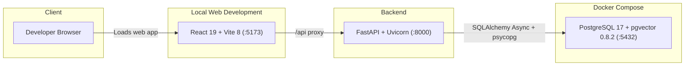
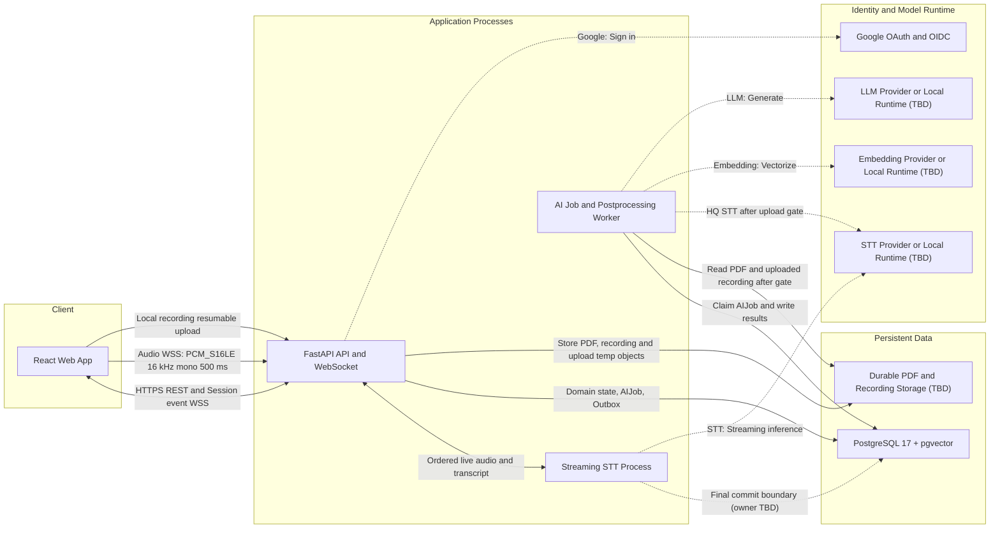
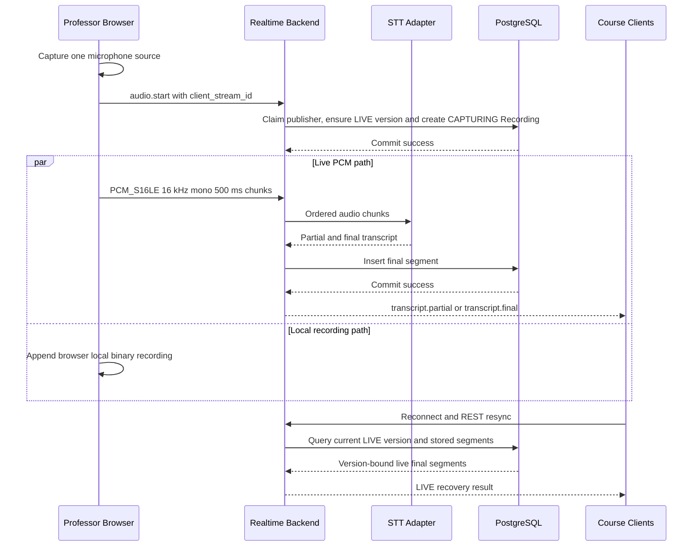
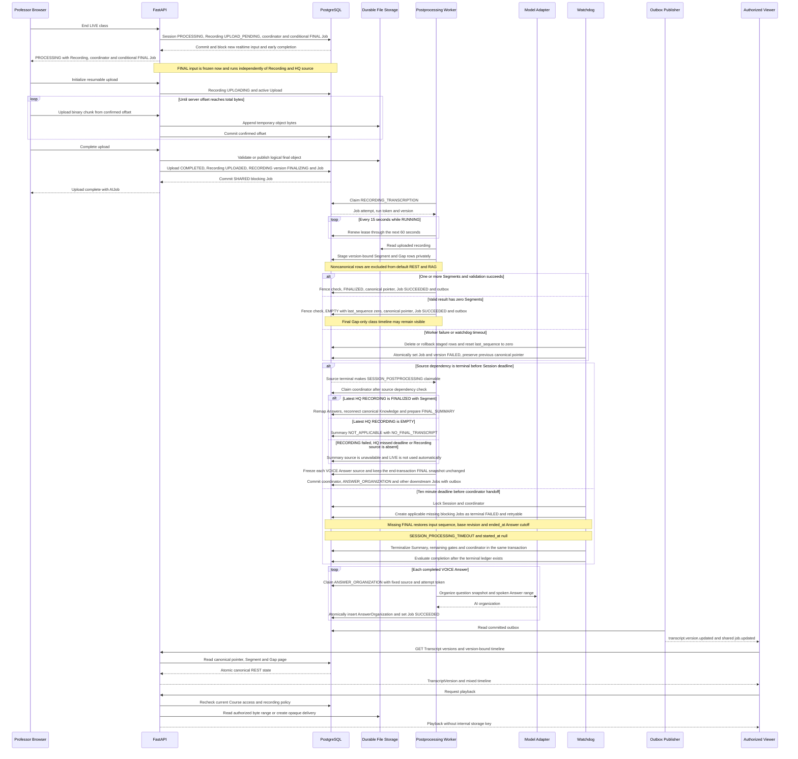
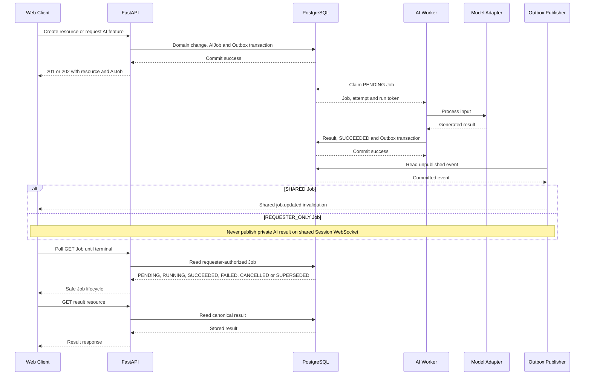
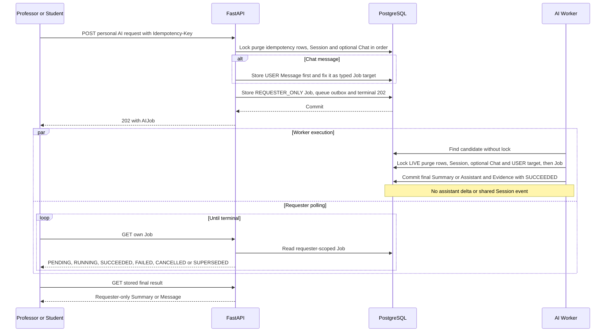
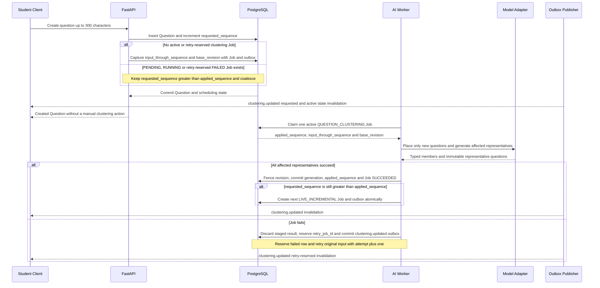
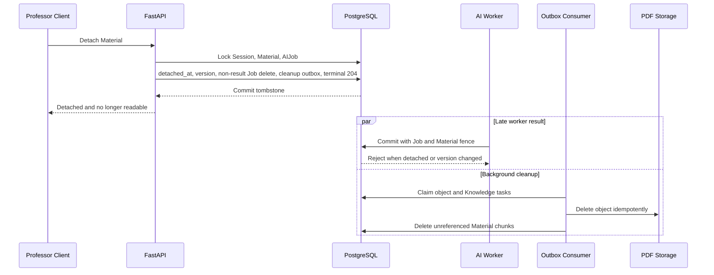
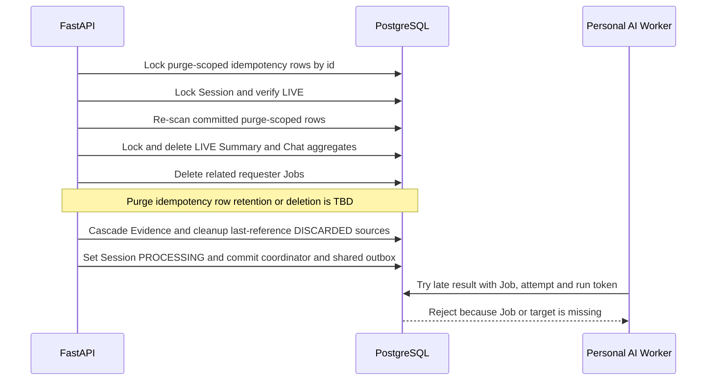

# GOAL 시스템 구성도

> 상태: Draft v0.1
>
> 작성 기준일: 2026-07-12
>
> 이 문서는 현재 구현과 MVP 목표 구성을 구분해 설명한다.

## 1. 문서 목적과 범위

본 문서는 GOAL MVP를 구성하는 클라이언트, API 서버, 실시간 처리, AI 작업, 데이터 저장소와 외부 모델의 경계를 한눈에 설명한다. 구성요소 사이의 통신 방향, 영구·임시 데이터 경계, 주요 처리 흐름과 장애 복구 원칙을 정의한다.

세부 계약은 다음 문서를 기준으로 한다.

- 사용자 기능과 우선순위: [기획안](../product/기획안.md), [기능명세서](../product/기능명세서.md)
- 화면과 접근 구조: [IA](../product/IA.md), [화면설계서](../product/화면설계서.md)
- 기술 원칙: [기술명세서](./기술명세서.md)
- HTTP·WebSocket 계약: [API 명세서](../api/API_명세서.md), [OpenAPI](../api/openapi.yaml)
- 테이블·제약·트랜잭션: [DB 스키마](../database/DB_스키마.md), [ERD](../database/ERD.md)
- 서버 하드웨어: [KCloud VM 사양](./KCLOUD_VM_사양.md)

이 문서는 다음 내용을 반복하지 않는다.

- 전체 endpoint와 request·response field
- 테이블별 전체 column과 index
- 화면별 UI component와 사용자 이동 경로
- 구체적인 모델 prompt와 clustering threshold

## 2. 구성 상태 구분

아키텍처를 읽을 때 현재 저장소에 존재하는 코드와 앞으로 구현할 MVP 설계를 혼동하지 않도록 상태를 구분한다.

| 상태      | 의미                                                         |
| --------- | ------------------------------------------------------------ |
| 현재 구현 | 저장소에서 실제 실행하거나 test할 수 있음                    |
| 준비됨    | dependency, 환경 변수, directory 또는 migration 기반만 있음  |
| MVP 목표  | API·DB·제품 문서에서 계약이 정의됐으나 실행 코드는 아직 없음 |
| 미정      | 구현 전에 기술이나 운영 방식을 선택해야 함                   |

### 2.1 현재 구현 범위

| 영역        | 현재 상태                                                                               |
| ----------- | --------------------------------------------------------------------------------------- |
| React 웹    | React 19, TypeScript 6, Vite 8 scaffold와 API health 확인 화면                          |
| FastAPI     | app factory·versioned router, **GET /api/health**, **GET /api/health/db**, request ID·공통 오류 handler |
| 데이터 접근 | SQLAlchemy Async, psycopg, app별 engine·session factory와 request-scoped AsyncSession 기반 |
| PostgreSQL  | Docker Compose의 PostgreSQL 17과 pgvector 0.8.2                                         |
| Migration   | Alembic으로 pgvector·pgcrypto, 31개 domain table, 공통 trigger·관계형 제약까지 구현       |
| 파일 저장   | **STORAGE_ROOT=data/uploads** 설정과 directory만 구성, 녹음 저장·upload·playback 미구현 |
| PDF 처리    | PyMuPDF dependency만 구성, upload·extract pipeline 미구현                               |
| API 계약    | HTTP·WebSocket·STT Draft v0.1 작성, health runtime contract와 공통 오류 handler만 구현, business handler 미구현 |
| DB 계약     | 31개 table Draft v0.1과 SQLAlchemy model·table migration 구현; service·worker 미구현    |
| 외부 서비스 | 실제 OAuth·STT·Embedding·LLM 연동 없음                                                  |

현재 **compose.yaml**은 PostgreSQL만 container로 실행한다. React/Vite와 FastAPI/Uvicorn은 개발 host에서 별도 process로 실행한다.

현재 DB migration은 **vector·pgcrypto extension**, 31개 domain table, 공통 `updated_at` trigger, 확정된 partial UNIQUE·조회 index·복합 FK와 핵심 constraint trigger를 생성한다. embedding 차원과 HNSW index는 미정이므로 아직 생성하지 않았고, DB 행을 사용하는 API·service·worker도 이후 기능 PR 범위다.

## 3. 현재 로컬 개발 구성

다음 그림은 지금 저장소에서 실제로 실행할 수 있는 최소 구성이다.

### 3.1 실행 경로

1. **make db-up**이 PostgreSQL container를 실행하고 health check를 기다린다.
2. **make migrate**가 Alembic migration을 적용한다.
3. **make dev-api**가 FastAPI를 기본 **127.0.0.1:8000**에서 실행한다.
4. **make dev-web**이 Vite를 기본 **127.0.0.1:5173**에서 실행한다.
5. Vite 개발 server가 **/api** 요청을 FastAPI로 proxy한다.

PostgreSQL port는 기본적으로 host의 **127.0.0.1:5432**에만 bind한다. 현재 구성에는 Nginx, Redis, 별도 작업 queue와 외부 Object Storage가 없다.

## 4. MVP 목표 논리 구성

다음 그림은 제품·API·DB 문서에서 합의된 MVP 목표 구조다. 실시간 STT process와 AI Job worker는 논리적 실행 경계이며, 하나의 process로 합칠지 별도 process로 배포할지는 아직 확정하지 않았다.

### 4.1 구성요소별 책임

| 구성요소                 | 책임                                                                                                                    | 상태                        |
| ------------------------ | ----------------------------------------------------------------------------------------------------------------------- | --------------------------- |
| React Web App            | 교수자·학생 화면, microphone의 live PCM·로컬 녹음 분기, resumable upload·playback, event 수신                           | scaffold만 구현             |
| FastAPI API              | 인증·Course 권한, `/record` manifest·cursor resource API, 상태 전이, Recording upload·playback 권한, AIJob 생성         | health API, request ID·공통 오류 경계만 구현 |
| WebSocket 처리           | 별도 ticket의 session event·audio 채널, publisher claim, PCM frame, ack·flow control·resume                             | MVP 목표                    |
| Streaming STT Process    | PCM chunk 처리, partial/final 판정, STT adapter 호출                                                                    | MVP 목표, process 분리 미정 |
| AI·Postprocessing Worker | upload 완료 뒤 HQ STT·version staging·canonical 전환, PDF 전처리, embedding, clustering, summary, RAG Chat, retry·lease | MVP 목표                    |
| PostgreSQL               | 최종 domain state, Recording·upload offset, TranscriptVersion·version별 Segment·Gap, AIJob, outbox, vector              | engine·pgvector만 구성      |
| Durable File Storage     | PDF·녹음 final object와 upload temporary object를 비공개 논리 key로 저장                                                | backend·provider 미정       |
| Model Adapter            | STT·Embedding·LLM runtime을 교체하는 application 내부 경계                                                              | model 미정                  |
| Outbox Publisher         | commit된 shared event와 내부 정리 작업을 publish                                                                        | 논리 구성, 실행 위치 미정   |

### 4.2 핵심 처리 경계

- FastAPI는 인증, 권한, 입력 검증, 짧은 transaction과 상태 전이를 담당한다.
- 오래 걸리는 PDF·Embedding·Clustering·Summary·LLM 작업은 request 처리와 분리한다.
- streaming STT는 낮은 지연이 필요하므로 일반 batch AIJob과 실행 경계를 나눌 수 있어야 한다.
- PostgreSQL과 REST 조회 결과가 최종 진실이며 WebSocket은 변경 알림과 임시 stream을 전달한다.
- AI 기능 실패가 Course 입장, 질문 생성과 저장된 기록 조회를 막아서는 안 된다.
- 모델은 adapter 뒤에 두고 외부 API와 local GPU runtime을 교체할 수 있게 한다.
- 하나의 교수자 microphone source를 audio WS live PCM과 브라우저 로컬 녹음으로 분기하고 각 경로의 실패를 격리한다. live WS frame은 영구 녹음 원본이 아니며 로컬 녹음은 Session 종료 뒤 resumable HTTP upload로 저장한다.
- Session 종료는 upload나 audio drain을 기다리지 않고 즉시 `PROCESSING`으로 전이한다. Recording upload complete가 commit된 뒤에만 HQ STT를 시작한다.
- HQ 결과는 noncanonical version 아래 비공개로 조립한다. PostgreSQL의 Session canonical 포인터와 REST 조회가 최종 진실이며, WebSocket은 canonical 변경을 알린 뒤 REST 재조회만 유도한다.
- `/record`는 대형 하위 배열을 조립하지 않고 같은 DB snapshot의 Session·처리 상태·resource count와 전용 REST path만 반환한다. 클라이언트는 Material·Transcript·Question·Cluster·Answer·공용 Job을 각 cursor API에서 읽는다.
- `/record`의 질문 path는 반응 수가 변하는 `POPULAR` 대신 종료 뒤 불변인 `sort=RECENT`, `(created_at DESC, id DESC)`를 고정한다. count와 각 page는 서로 다른 요청 시점에 바뀔 수 있으므로 page 응답을 실제 목록의 최종 진실로 사용한다.

### 4.3 Course·class 일관성 경계

- Course 생성자는 해당 Course의 불변 owner이자 유일한 `PROFESSOR`다. Course와 owner membership을 한 transaction에서 만들고 DB의 partial UNIQUE·deferred invariant로 정확히 한 명인지 검증한다. 추가 교수자와 owner 이전은 제공하지 않는다.
- Course에는 종료·보관 상태가 없다. owner 삭제만 제공하되 active class가 있을 때의 삭제 허용 여부와 삭제 후 복구 유예는 아직 미정이다.
- 참여 코드는 trim·대문자 정규화 후 `[A-Z]{6}`이고 자동 만료하지 않는다. owner 회전 transaction이 commit되면 이전 코드는 즉시 무효이며 회전 이력은 저장하지 않는다.
- Course당 `READY`, `LIVE`, `PROCESSING` class 합계는 최대 하나다. 이 행을 `current_session`으로 반환하고 없으면 `null`이다. 동시 생성 경쟁은 partial UNIQUE가 최종 차단하며 `ACTIVE_SESSION_EXISTS`로 변환한다.
- active class가 `COMPLETED`가 된 뒤에만 다음 class를 생성한다. 같은 `lecture_date`의 완료 class는 여러 개 허용하고 `lecture_date DESC, started_at DESC, id DESC`로 조회한다.
- class 제목은 모든 상태에서 owner가 수정할 수 있다. 빈 제목은 Course 제목·class 날짜·시각을 포함한 서버 자동 제목으로 치환한다. 정확한 문자열 형식, `READY`에서 사용할 시각 원장과 timezone은 미정이며 `lecture_date`와 이미 기록된 lifecycle 시각은 수정하지 않는다.
- class 시작은 Session과 `detached_at IS NULL`인 Material을 잠근 뒤 연결된 `PROCESSING`이 있으면 `MATERIAL_PROCESSING_ACTIVE`로 거부한다. PDF가 0개이거나 연결된 상태가 `READY`, `UPLOADED`, `FAILED`뿐이면 시작할 수 있다.
- class 삭제는 `READY`, `COMPLETED`에서만 허용하고 `LIVE`, `PROCESSING`은 `SESSION_STATE_CONFLICT`로 거부한다.
- 일반 멱등성 terminal 응답은 terminal 전이 시각부터 정확히 24시간 보관한다. 도메인 변경과 `completed_at`, `expires_at = completed_at + 24 hours`를 같은 transaction에 기록한다. 개인 LIVE Summary·Chat 생성·Message와 관련 Job retry write는 nullable `session_id`와 `purge_on_session_end=true`를 기록한다. LIVE 종료 transaction은 결과·Job을 삭제하지만 멱등성 행의 조기 삭제와 purge 뒤 polling·재요청 응답은 미정이다. FINAL·REVIEW 요청과 retry는 false다.

### 4.4 Material 수명주기 경계

- `detached_at IS NULL`인 행만 class에 연결된 Material이다. Session당 최대 10개, 파일당 decimal `100000000` bytes를 허용하며 같은 내용과 같은 원본 파일명의 업로드는 허용한다.
- 업로드는 Session `READY`, `LIVE`, `COMPLETED`에서 허용하고 `PROCESSING`에서는 `SESSION_STATE_CONFLICT`로 거부한다. 연결된 개수 경쟁은 Session 잠금과 DB trigger가 직렬화하고 초과는 `MATERIAL_LIMIT_EXCEEDED`로 변환한다.
- 업로드 원본명과 공개 `display_name`을 분리한다. 충돌하면 확장자 앞에 ` (1)`, ` (2)` suffix를 붙이고 기존 이름은 바꾸거나 재번호를 매기지 않는다.
- `PROFESSOR`의 연결 해제도 `READY`, `LIVE`, `COMPLETED`에서 허용하고 `PROCESSING`에서는 거부한다. tombstone commit 직후 목록·상세·content·RAG에서 제외한다.
- Material 흐름의 잠금 순서는 `Session → Material → AIJob`이다. Worker claim·결과 commit도 이 순서와 Material version·`detached_at IS NULL` fence를 따라 늦은 결과를 폐기한다.
- server-generated `storage_key`는 API·공유 event·로그에 노출하지 않고 object 정리용 내부 outbox payload에서만 사용한다.

### 4.5 Recording·upload 수명주기 경계

- 첫 성공 `audio.start`는 `client_stream_id`의 목적별 HMAC claim, 논리 SessionRecording 생성과 `CAPTURING` 전이를 원자적으로 commit한다. Session당 publisher와 논리 Recording은 하나다.
- 다른 `client_stream_id`는 `AUDIO_PUBLISHER_CONFLICT`와 close code `4409`로 audio 연결만 거부한다. 같은 stream ID는 새 ticket으로 reconnect·sequence resume할 수 있지만 lease 만료·재획득·takeover는 미정이다.
- 공개 Recording 전이는 `CAPTURING → UPLOAD_PENDING → UPLOADING → UPLOADED | FAILED`다. 종료 transaction이 `PROCESSING`과 `UPLOAD_PENDING`을 함께 확정하고 새 실시간 입력을 즉시 차단한다.
- RecordingUpload은 `ACTIVE → COMPLETED | EXPIRED | FAILED`이고 Recording당 active upload는 최대 하나다. init·offset·chunk·complete resource는 재시작 후에도 서버가 commit한 offset을 복구하는 provisional 경계이며 method·header·chunk·checksum·expiry·최대 크기는 미정이다.
- complete transaction은 final metadata, `UPLOADED`, `source=RECORDING`·`status=FINALIZING`인 TranscriptVersion, `RECORDING_TRANSCRIPTION` Job과 안전한 outbox를 함께 commit한다. 이 Job은 `SHARED`, `blocks_session_completion=true`다.
- SessionRecording은 외부에 하나인 논리 aggregate이고 storage locator·temporary handle은 물리 파일 수를 뜻하지 않는다. 단일 파일 또는 fragment·manifest 구성은 미정이며 key·경로·manifest를 외부에 노출하지 않는다.
- playback은 `UPLOADED`에만 제공하고 매 요청에서 현재 인증·Course 접근과 향후 녹음 정책을 다시 확인한다. 녹음 동의·역할별 접근·보관·삭제 정책은 미정이다.

### 4.6 Transcript version·canonical 경계

- `TranscriptVersion.source`는 `LIVE`, `RECORDING`, 영구 상태는 `FINALIZING`, `FINALIZED`, `FAILED`, `EMPTY`다. 실시간 WebSocket 연결·STT 표시 상태와 이 원장을 같은 상태 축으로 해석하지 않는다.
- class 시작 transaction은 LIVE version을 만들고 실시간 REST·RAG 기본 source용 canonical 포인터로 설정한다. 정상 RECORDING `FINALIZED` 또는 `EMPTY` version이 이후 이 포인터를 원자적으로 교체한다.
- LIVE final Segment와 HQ Segment·Gap은 모두 한 `transcript_version_id`에 귀속한다. Gap의 `start_ms`, `end_ms`는 class(Session) timeline의 누락 구간만 뜻하고 녹음 playback offset으로 사용하지 않는다. Segment의 class 시간축과 nullable `recording_start_ms`, `recording_end_ms` 녹음 seek 위치를 분리하고, HQ 재처리 뒤에도 남은 Gap만 `is_final=true`로 둔다.
- Transcript REST는 선택 version과 `(start_ms ASC, SEGMENT 우선, id ASC)`를 고정한 union cursor page 하나를 만든 뒤 그 page만 `segments[]`와 `gaps[]`로 분리한다. 두 배열 길이 합은 limit 이하고 별도 cursor를 발급하지 않는다.
- `lecture_sessions.canonical_transcript_version_id`가 기본 Transcript 조회와 Transcript source KnowledgeChunk 검색의 기준이다. 조립 중 version의 Segment·Gap은 이 포인터가 가리키기 전까지 공개 결과에서 제외한다.
- HQ Worker는 Segment·Gap을 비canonical version 아래 준비한다. 현재 Job ID·attempt·run token·`RUNNING`, version `FINALIZING`과 Session 범위를 검증한 짧은 transaction만 version terminal 상태, canonical 포인터, Job 결과와 outbox를 함께 바꾼다.
- Session 종료 transaction은 `SESSION_POSTPROCESSING`을 `SHARED`, `blocks_session_completion=true`, `PENDING` coordinator로 먼저 만든다. Recording·Upload·HQ source가 terminal이 되기 전에는 claim할 수 없다.
- source terminal 뒤 coordinator가 Answer mapping과 Transcript KnowledgeChunk 재연결을 수행한다. Answer는 원본 `source_transcript_version_id`와 LIVE Segment 범위를 유지하고, `answer_transcript_mappings`가 RECORDING version별 `PENDING`, `SUCCEEDED`, `FAILED`와 새 Segment 범위를 저장한다. 일부 mapping 실패가 HQ Transcript 자체를 자동 실패시키지 않는다.
- coordinator는 완료 음성 Answer마다 성공한 HQ mapping 또는 원본 LIVE fallback 범위를 고정한 `ANSWER_ORGANIZATION` `SHARED` blocking Job 하나를 만든다. 성공 정리문은 교수자 text와 별도 `AnswerOrganization` 원장에 저장한다.
- coordinator terminal, mapping·Knowledge와 Summary 상태, 완료 음성 Answer별 `ANSWER_ORGANIZATION`, 적용 가능한 `FINAL_SUMMARY` `SHARED` blocking Job과 outbox는 하나의 transaction이다. `FINAL` `QUESTION_CLUSTERING`과 attempt별 input snapshot은 LIVE→PROCESSING 종료 transaction에서 대상이 있으면 먼저 만들고 Recording·HQ source와 독립 실행한다. 자동 `FINAL_SUMMARY`는 latest HQ source가 RECORDING `FINALIZED`이고 Segment가 하나 이상일 때만 만들며 completion 판정은 종료·coordinator 두 transaction의 blocking 원장을 모두 확인해 조기 완료를 막는다.
- `COMPLETED` 뒤 같은 `RECORDING_TRANSCRIPTION` 행의 retry가 성공하면 같은 `SESSION_POSTPROCESSING` 행을 `attempt + 1`로 자동 requeue한다. Session 상태·`completed_at`은 유지하고, recovery coordinator가 새 canonical version의 Answer mapping·KnowledgeChunk 연결을 멱등 재조정한 뒤 새로 생성 자격을 얻은 FINAL Summary Job을 만든다. 기존 `ANSWER_ORGANIZATION` source·결과는 바꾸거나 자동 재생성하지 않는다.
- `knowledge_chunks.source_transcript_version_id`와 Session canonical 포인터를 같은 SQL에서 비교한다. 재연결 전에는 이전 LIVE Transcript Chunk를 새 canonical 근거로 대신 사용하지 않으며 기존 Chat Evidence는 당시 version provenance를 유지한다.
- 성공한 RECORDING version은 Segment가 있으면 `FINALIZED`, 0개면 `last_sequence=0`인 `EMPTY`로 확정한다. `EMPTY`에도 final Gap이 있으면 class timeline에서 Gap-only 결과를 조회할 수 있다. 처리 실패·lease timeout·확정될 HQ Job timeout은 현재 attempt가 staged한 Segment·Gap을 삭제하거나 rollback하고 `last_sequence=0`, version·Job `FAILED`를 원자적으로 commit한다. 일반 후처리 5분을 HQ에도 적용할지 별도 상한을 둘지는 미정이며 Session 전체 10분 deadline은 항상 적용한다. 기존 canonical 포인터는 바꾸지 않으며 `is_canonical`과 latest status를 독립적으로 해석한다.
- HQ `FAILED` 또는 HQ 결과 없이 10분 timeout이 된 뒤 보존된 LIVE 포인터를 완료 기록의 final source로 인정할지는 미정이다. status만 보고 final source를 확정하지 않는다.
- 자동 Summary source는 latest HQ RECORDING 결과만 사용한다. RECORDING `EMPTY`는 `NOT_APPLICABLE`·`NO_FINAL_TRANSCRIPT`, RECORDING `FAILED`·HQ 무결과 deadline·Recording source 없음은 `SUMMARY_SOURCE_UNAVAILABLE`이며, 보존된 LIVE 포인터는 자동 `FINAL_SUMMARY` 입력으로 사용하지 않는다.
- Final Summary 상태는 source·Job·결과 원장을 함께 대조한다. source gate가 비terminal이면 Job 없는 `PENDING`, RECORDING `EMPTY`면 Job 없는 `NOT_APPLICABLE/NO_FINAL_TRANSCRIPT`, source 없음·`FAILED`·deadline이면 Job 없는 `FAILED/SUMMARY_SOURCE_UNAVAILABLE`다. RECORDING `FINALIZED` Segment가 1건 이상이면 coordinator가 Session당 하나인 FINAL Summary Job을 downstream outbox와 원자 생성한다. Session `PROCESSING`의 active Job, `COMPLETED`의 명시적 Summary retry, 또는 HQ retry 성공 뒤 `SESSION_POSTPROCESSING attempt>1` 복구가 만든 active Job은 `PENDING`이다. 현재 attempt 결과까지 원자 commit한 성공 Job은 `AVAILABLE`, 결과 없는 실패 Job은 `FAILED`다. recovery coordinator가 terminal인데도 유효 source의 Job이 없거나 성공 Job 결과·source·attempt가 불일치하면 `DATA_INTEGRITY_ERROR`로 표시하며 watchdog 합성 실패 Job으로 숨기지 않는다.

### 4.7 질문·clustering·Answer 일관성 경계

- 실제 학생 질문 등록은 Question `clustering_sequence`와 `QuestionClusteringState.requested_sequence` 증가를 한 transaction에 commit한다. Session당 `PENDING`·`RUNNING` `QUESTION_CLUSTERING` Job은 최대 하나다.
- active Job과 retry-reserved Job이 모두 없으면 현재 `requested_sequence`를 `input_through_sequence`로, `current_revision`을 `base_revision`으로 capture한 `LIVE_INCREMENTAL` Job과 queue outbox를 자동 생성한다. `PENDING`·`RUNNING` 또는 미적용 구간을 소유한 retryable `FAILED` Job이 있으면 새 Job 없이 `requested_sequence > applied_sequence`만 남겨 실행·재시도 중 등록된 질문을 다음 배치로 coalesce한다. retry-reserved는 새 status가 아니라 공개 `clustering_state.retry_job_id`로 식별하는 논리 예약이다.
- LIVE Worker는 captured watermark까지의 새 질문만 기존 Cluster에 배치하고 기존 질문을 이동시키지 않는다. 영향받은 Cluster의 immutable `AIRepresentativeQuestion` 생성까지 포함해야 Job이 성공한다.
- generation별 물리 Cluster row와 별도로 공개 `logical_cluster_id`를 둔다. 같은 semantic LIVE Cluster는 이 ID를 계승하고 기존 질문의 logical ID 불변을 결과 fence가 검증하며, FINAL full rebuild는 새 logical ID를 할당한다.
- Cluster member는 내부적으로 학생 질문 또는 AI 대표 질문 typed FK를 사용하고, 공개 discriminator는 `source_kind=STUDENT_QUESTION|AI_REPRESENTATIVE`다. AI 대표질문은 immutable `created_in_generation`을 가진다. Answer target은 내부 두 타입 중 하나이며 대표질문의 Answer가 하위 학생 질문을 답변 완료로 바꾸지 않는다.
- LIVE generation 교체 시 미답변 과거 대표질문은 Cluster·공개 조회·UI·RAG에서 즉시 폐기한다. 관련 KnowledgeChunk Evidence가 없으면 대표질문을 hard delete해 Chunk를 cascade하고, 있으면 `status=OPEN`, 내부 `lifecycle_status=DISCARDED`, `discarded_at` tombstone과 Chunk를 유지한다. `CAPTURING`·`COMPLETED` Answer target은 `lifecycle_status=PRESERVED`로 바꿔 새 대표질문의 typed member 자식으로 둔다. `status=OPEN|SELECTED|ANSWERED`는 lifecycle과 독립적으로 Answer 시작·완료·취소에 따라 전이한다.
- `PRESERVED` Answer 취소로 membership을 직접 삭제할 때는 Evidence 부재 시 대표질문 hard delete, 존재 시 `PRESERVED → DISCARDED`로 분기하되 기존 `current_revision + 1`과 `answer.deleted`·`clustering.updated` outbox를 그대로 함께 commit한다. 이전 revision의 active·retry-reserved LIVE Job은 `CLUSTER_REVISION_CHANGED`, `retryable=false`로 fence하고 backlog은 현재 revision의 fresh Job으로 넘긴다.
- deferred integrity는 `DISCARDED`가 Answer·Cluster 중앙·membership 0건, 관련 Evidence 최소 1건인지 검증한다. 마지막 Evidence 삭제 transaction은 tombstone 대표질문과 Chunk를 함께 hard delete해 orphan을 막고 공개 clustering revision은 다시 바꾸지 않는다. Course·Session aggregate 삭제는 Evidence·대표질문·Chunk를 같은 transaction에서 cascade하며 보관 기간은 Evidence 정책을 따른다.
- Session 종료 transaction은 active 또는 retry-reserved LIVE clustering의 run token·retry 예약을 폐기하고 Session 상태·revision fence로 LIVE 재실행과 늦은 결과를 막는다. 종료 transaction의 FINAL clustering이 해당 입력을 대체하므로 LIVE Job은 `SUPERSEDED`, `retryable=false`로 terminal 처리한다. 대체 작업 없이 명시 중단한 Job만 `CANCELLED`이며, timeout·lease 만료는 재시도 가능한 `FAILED`다. 같은 transaction은 대상이 있으면 종료 시점 `requested_sequence`와 `ended_at`을 학생 질문·완료 Answer 대표질문의 최초 attempt input 상한으로 저장해 전체를 재배치하고 final Cluster별 immutable 대표질문까지 생성하는 `FINAL` blocking Job을 즉시 만든다. 성공 결과는 eligible input 각각을 정확히 한 Cluster에 포함하고 분류할 수 없는 입력도 `기타` Cluster에 넣는다. 이 Job은 Recording·HQ source·coordinator와 독립 실행한다. 학생 질문 상한은 모든 attempt에서 유지하고, 실패한 FINAL을 교수가 명시적으로 재시도할 때만 `base_revision`과 Answer 상한을 현재 값으로 다시 캡처한다.
- LIVE에서는 교수자 `VOICE` Answer를 `CAPTURING → COMPLETED`로 저장하고 취소는 Answer를 hard delete하여 `CANCELLED` 원장을 남기지 않는다. Session `COMPLETED`에서는 교수자가 미답변 학생 질문에만 즉시 `COMPLETED`인 `TEXT` Answer를 만들 수 있다. 학생 질문 또는 Answer 때문에 보존된 AI 대표질문의 기존 완료 Answer에는 text를 보충할 수 있지만 최종 복습용·미답변 대표질문에 새 text-only Answer를 만들 수 없다.
- 완료 음성 Answer의 AI 정리는 별도 `ANSWER_ORGANIZATION` Job·결과 원장으로 관리한다. 교수자 text를 우선 표시하되 AI 정리문과 원본 음성 범위를 별도 유지하며, 실패·재시도 Worker는 교수자 text를 덮어쓰지 않는다.

### 4.8 개인 AI 수명주기 경계

- `PROFESSOR`, `STUDENT`는 Course 멤버라는 동일한 경계에서 개인 AI를 사용한다. `LIVE` Summary·Chat은 Session `LIVE`, `REVIEW` Chat은 Session `COMPLETED`에서만 허용하고 `READY`, `PROCESSING`에서는 Chat을 생성하거나 계속 사용하지 않는다.
- 개인 Summary·Chat Job은 `REQUESTER_ONLY`, non-blocking이며 `202 + AIJob → 요청자 Job polling → 저장된 결과 REST 조회`만 제공한다. token delta, SSE, streaming HTTP, private WebSocket과 shared Session event 전송은 제공하지 않는다.
- Chat USER Message는 trim·Unicode NFC 정규화 뒤 Unicode code point 1~2,000자다. 위반은 절단·저장 없이 `422 VALIDATION_ERROR`다. 정규화한 USER Message와 이 행을 immutable typed target으로 가진 Job·queue outbox·terminal `202`는 요청 transaction에 저장하고, 성공한 최종 Assistant Message·Evidence와 Job 성공은 결과 transaction에 저장한다. `CHAT_RESPONSE`는 `target_chat_id`와 `target_user_message_id`를 둘 다 요구하고 같은 Chat·Session의 USER role·owner를 검증하며 다른 Job 유형에는 두 target을 금지한다. target은 생성 뒤 바꿀 수 없어 같은 행의 `attempt + 1` retry도 동일 입력을 사용한다. Assistant에는 2,000자 상한을 적용하지 않고 생성 중 delta·실패 attempt 본문은 저장하지 않는다.
- LIVE 종료는 purge-scoped idempotency 행을 Session보다 먼저 잠근다. 그 다음 Session, LIVE Summary, LIVE Chat·Message·Evidence, 관련 `LIVE_SUMMARY`·`CHAT_RESPONSE` Job을 잠그고 한 deferred transaction에서 삭제한 뒤 `PROCESSING`으로 전이한다. FINAL Summary와 REVIEW Chat은 유지한다.
- LIVE Chat Evidence cascade가 `DISCARDED` 대표질문의 마지막 Evidence를 없애면 기존 deferred cleanup이 tombstone·KnowledgeChunk를 같은 transaction에서 hard delete한다. 다른 Evidence가 남으면 tombstone을 유지한다.
- purge된 Job의 Worker 결과는 Job·target 부재와 attempt·run token·`RUNNING` fence를 통과하지 못한다. Session 종료 뒤 이전 Summary·Chat·Job 단건·polling과 purge-scoped 멱등 재요청의 응답 표현은 미정이다.

## 5. 주요 통신 인터페이스

| 연결                           | 방식                                          | 주요 데이터                                     | 상태         |
| ------------------------------ | --------------------------------------------- | ----------------------------------------------- | ------------ |
| Browser → Vite                 | HTTP                                          | 개발용 frontend asset                           | 현재 구현    |
| Vite → FastAPI                 | HTTP proxy                                    | **/api** 요청                                   | 현재 구현    |
| Browser ↔ FastAPI             | HTTPS REST                                    | resource 조회·상태 변경·AIJob 접수              | MVP 목표     |
| Browser ↔ FastAPI             | HTTPS polling                                 | requester-only Job 상태와 저장된 최종 결과      | MVP 목표     |
| Browser ↔ FastAPI             | **WS /api/v1/ws/sessions/{session_id}**       | Course member용 session event                   | MVP 목표     |
| Browser ↔ FastAPI             | **WS /api/v1/ws/sessions/{session_id}/audio** | 교수자 PCM audio, publisher claim·ack·resume    | MVP 목표     |
| Browser → FastAPI              | provisional resumable HTTPS upload            | 브라우저 로컬 녹음 init·offset·chunk·complete   | MVP 목표     |
| Browser ← FastAPI              | 권한 재검증 HTTPS playback                    | `UPLOADED` 녹음 byte range 또는 opaque delivery | MVP 목표     |
| FastAPI ↔ PostgreSQL          | SQLAlchemy Async + psycopg                    | connection pool, SELECT 1 readiness             | 현재 구현    |
| FastAPI → PostgreSQL           | SQL transaction                               | domain state, auth, AIJob, outbox               | MVP 목표     |
| Worker ↔ PostgreSQL           | SQL transaction                               | Job claim, lease, result, vector query          | MVP 목표     |
| FastAPI·Worker ↔ File Storage | backend SDK 또는 filesystem                   | PDF·녹음 final, upload temp와 논리 key          | backend 미정 |
| FastAPI ↔ Google              | OAuth 2.0·OIDC                                | authorization code, identity claim              | MVP 목표     |
| STT·Worker ↔ STT Model        | provider별 streaming·batch protocol           | live PCM, uploaded recording, Transcript        | 미정         |
| Worker ↔ Embedding·LLM        | provider별 API 또는 local inference           | text, vector, generated output                  | 미정         |

운영 환경의 TLS 종료, reverse proxy, frontend static hosting과 process supervisor는 아직 선택하지 않았다.

## 6. 실시간 STT 흐름

실시간 STT와 브라우저 원본 녹음은 MVP 필수 기능이다. 교수자의 같은 microphone source를 두 경로로 분기한다. audio WS는 `PCM_S16LE`, 16 kHz, mono, 500 ms live chunk만 전달하고 브라우저 로컬 경로는 Session 전체 녹음을 binary로 유지한다. 두 경로는 독립 상태이므로 하나가 실패해도 다른 경로와 질문·기존 기록을 자동 실패 처리하지 않는다.

### 6.1 저장·복구 규칙

- Session event WS와 audio WS는 별도 ticket·권한·연결 상태를 사용한다. event WS에는 audio frame·recording upload chunk를 보내지 않고 audio WS에는 공용 Session event를 broadcast하지 않는다.
- 첫 성공 `audio.start`의 `client_stream_id`가 단독 publisher를 claim한다. 다른 ID는 `4409 AUDIO_PUBLISHER_CONFLICT`로 거부하고 같은 ID만 reconnect·수락된 sequence 다음부터 resume한다.
- audio replay buffer의 크기·window, publisher lease·재획득·takeover, `DEGRADED`와 stop timeout·강제 종료는 미정이다.
- partial Transcript는 server memory와 client 화면에서만 사용하며 DB에 저장하지 않는다.
- live final Segment는 **transcript_version_id + utterance_id**로 중복 저장을 막고 LIVE version별 sequence를 원자적으로 할당한다.
- **transcript.final** event는 DB commit 이후에만 전파한다.
- 재연결 때 기존 partial 표시를 제거하고 현재 LIVE version의 저장 Segment는 REST로 다시 조회한다.
- replay가 불가능하면 **resync.required**를 전송하고 REST 복구를 강제한다.
- audio WS PCM frame은 영구 녹음 원본이 아니다. 원본은 같은 microphone source의 브라우저 로컬 branch를 Session 종료 뒤 resumable upload해 저장한다.

실제 live final Segment transaction을 FastAPI와 별도 STT process 중 어느 process가 소유할지는 미정이지만, commit 이후에만 final event를 발행한다는 경계는 유지한다. 수업 후 HQ 결과는 `transcript.final`로 중간 Segment를 전파하지 않고 atomic canonical 전환 뒤 `transcript.version.updated`로 REST 재조회를 유도한다.

### 6.2 Recording upload·HQ STT gate·playback

- 공개 Recording 전이는 `CAPTURING → UPLOAD_PENDING → UPLOADING → UPLOADED | FAILED`다. `UPLOADED`는 upload 저장 gate의 terminal 성공이며 HQ STT·Transcript 상태를 뜻하지 않는다.
- init·offset·chunk·complete는 process 재시작 뒤에도 서버가 commit한 연속 offset을 복구해야 하는 provisional resource 경계다. exact method·header·chunk 크기·checksum·expiry·최대 크기는 미정이다.
- SessionRecording은 외부에 하나인 논리 aggregate다. final·temporary storage locator는 물리 단일 파일, 여러 fragment·part 또는 manifest 중 무엇에도 매핑될 수 있고 정확한 cardinality는 미정이다.
- final key, temporary key, 서버 경로, fragment key와 manifest는 API·공유 event·로그에 노출하지 않는다.
- playback은 `UPLOADED`에만 허용하고 매 요청에서 현재 인증·Course 접근과 추후 확정할 녹음 정책을 다시 확인한다. proxy streaming과 짧은 opaque delivery URL 중 최종 방식은 미정이다.
- `RECORDING_TRANSCRIPTION`은 전체 녹음 재처리, version별 Segment·Gap 저장, Segment의 class·recording 시간축과 Gap의 class timeline 검증, atomic canonical 전환을 책임진다. `FINALIZED`는 Segment가 하나 이상, `EMPTY`는 정상 0건이며 `last_sequence=0`, `FAILED`는 처리 실패다. `EMPTY`에도 final Gap이 있으면 Gap-only class timeline을 조회할 수 있다.
- Segment와 Gap은 version별 union cursor로 한 page를 고른 뒤 `segments[]`, `gaps[]`로 분리해 조회한다. Gap의 `start_ms`, `end_ms`는 class(Session) timeline만 사용하고 녹음 playback offset을 갖지 않는다. Segment의 nullable `recording_start_ms`, `recording_end_ms`가 있을 때만 playback seek에 사용하며 화면이 class 시각에서 녹음 위치를 추정하지 않는다.
- 처리 실패·lease timeout·확정될 HQ Job timeout은 현재 attempt가 staged한 Segment·Gap을 삭제하거나 rollback하고 `last_sequence=0`, version·Job `FAILED`를 같은 transaction에 commit한다. 일반 5분을 HQ에도 적용할지 별도 상한을 둘지는 미정이며 timeout 뒤 늦게 도착한 Worker 결과는 fence에서 폐기한다.
- 종료 때 미리 만든 `SESSION_POSTPROCESSING` blocking coordinator는 Recording·HQ source terminal 뒤에만 claim한다. latest HQ source가 RECORDING `FINALIZED`일 때만 Answer mapping과 KnowledgeChunk 재연결을 수행하고, mapping 실패는 원본 LIVE Answer 범위를 유지한 별도 실패이며 HQ Transcript를 되돌리지 않는다.
- 자동 `FINAL_SUMMARY`는 latest HQ RECORDING `FINALIZED`와 Segment 1개 이상일 때만 만든다. RECORDING `EMPTY`는 `NOT_APPLICABLE`·`NO_FINAL_TRANSCRIPT`, RECORDING `FAILED`·HQ 무결과 deadline·Recording source 없음은 `SUMMARY_SOURCE_UNAVAILABLE`다. 보존된 LIVE 포인터는 final source 인정 여부가 미정이며 자동 Summary 입력으로 사용하지 않는다.
- coordinator terminal, Summary 상태, 완료 음성 Answer별 `ANSWER_ORGANIZATION`, 적용 가능한 `FINAL_SUMMARY` blocking Job과 outbox를 한 transaction에 commit해 source 의존 downstream 생성 전 Session 완료를 막는다. Transcript 독립 `FINAL` `QUESTION_CLUSTERING`은 종료 transaction에서 이미 예약해 `EMPTY`·`FAILED` source를 기다리지 않는다.
- `COMPLETED` 뒤 HQ retry 성공은 같은 coordinator 행을 `attempt + 1`로 자동 requeue한다. Session은 완료 상태를 유지하고 새 canonical Answer mapping·KnowledgeChunk·새롭게 생성 자격을 얻은 FINAL Summary를 멱등 재조정하되 기존 `ANSWER_ORGANIZATION` source·결과는 변경하지 않는다.
- 10분 deadline이 정상 coordinator handoff보다 먼저 오면 watchdog은 Session·coordinator를 잠그고 적용 대상 Answer별 누락 `ANSWER_ORGANIZATION`을 포함하되 `FINAL_SUMMARY`는 제외한 downstream blocking Job을 `FAILED`, `retryable=true`, `error_code=SESSION_PROCESSING_TIMEOUT`, `started_at=NULL`인 terminal 행으로 만든다. 누락된 FINAL clustering은 `input_through_sequence=requested_sequence`, `base_revision=current_revision`, `final_answered_through_at=lecture_sessions.ended_at`으로 종료 시점 입력을 복원한다. eligible source의 FINAL Summary Job이 빠졌으면 합성하지 않고 `DATA_INTEGRITY_ERROR`로 관측한다. Summary 상태·남은 gate·기존 Job·coordinator terminal도 같은 transaction에 확정한 뒤에만 completion을 평가한다.
- `transcript.version.updated`는 invalidation event다. 클라이언트는 cache·기존 canonical cursor를 폐기하고 version 목록과 canonical timeline을 REST로 다시 조회한다.

## 7. 비동기 AIJob 흐름

PDF 처리, 질문 clustering, 음성 Answer 정리, summary, Chat response, `RECORDING_TRANSCRIPTION`과 `SESSION_POSTPROCESSING`은 요청과 분리된 AIJob으로 실행한다. 단, 앞뒤 공백 trim 뒤 Unicode NFC로 정규화한 값이 1~500 code point인 질문 초안을 300자 이하 NFC 질문 후보로 다듬는 작성 도움은 `200` 동기 응답이고 초안·후보를 저장하거나 AIJob을 만들지 않는다. 공개 질문은 같은 기준 1~300자, LIVE·REVIEW Chat USER Message는 1~2,000자이며 초과 입력을 잘라 저장하지 않고 `422 VALIDATION_ERROR`로 거부한다. Assistant에는 이 상한을 적용하지 않는다.

개인 Summary·Chat은 다음 polling-only 경계를 사용한다.

### 7.1 Job 일관성 규칙

- Worker는 **FOR UPDATE SKIP LOCKED** 방식으로 실행 가능한 Job을 claim한다. `MATERIAL_PROCESSING`은 잠금 없는 후보 탐색 뒤 `Session → Material → AIJob` 순서로 잠그고 `PENDING`과 `detached_at IS NULL`을 다시 검증한다.
- 개인 AI Job은 generic Job-first claim에서 제외하고 후보 ID만 잠금 없이 찾는다. LIVE Summary claim·result·retry는 `purge-scoped IdempotencyRecord → Session → AIJob`, LIVE Chat은 `purge-scoped IdempotencyRecord → Session → Chat → target USER Message → AIJob` 순서로 잠근다. REVIEW Chat은 purge prefix 없이 같은 suffix를 사용한다. 잠금 뒤 status·available time·attempt·run token·requester·target·Session mode를 다시 확인해 종료 purge와 Worker의 Chat↔Job 역순 교착을 막는다.
- 재시도는 새 Job을 만들지 않고 같은 **ai_jobs** row의 **attempt**와 **version**을 증가시켜 PENDING으로 바꾸고 progress·error·실행 시각·run token을 초기화한다.
- 실행마다 새 **run_token**과 lease를 발급한다.
- Worker는 RUNNING 동안 15초마다 현재 run token으로 lease를 갱신해 만료 시각을 현재부터 60초 뒤로 둔다. 60초 동안 갱신되지 않으면 watchdog이 Job을 FAILED로 끝낸다. 이 heartbeat는 Browser WebSocket ping/pong과 별개다.
- 결과 commit은 Job ID, attempt, run token과 RUNNING 상태가 모두 일치할 때만 허용한다. Material 처리 결과는 Material 현재 version과 `detached_at IS NULL`도 일치해야 한다.
- 결과 row 저장과 Job의 SUCCEEDED 전환은 하나의 transaction이다.
- `CHAT_RESPONSE`는 같은 Chat·Session의 `role=USER` Message를 `target_user_message_id`로 고정한다. target Chat·Message는 둘 다 필수이고 다른 Job 유형에서는 둘 다 null이며, requester=Chat owner와 target 불변을 검증한다. retry는 같은 Job 행·target Message를 사용한다.
- 개인 LIVE Job은 결과 target과 Session `LIVE`도 commit fence에 포함한다. 종료 purge 뒤 Job·Summary·Chat이 없으면 늦은 결과를 저장하지 않는다.
- 재시도 queue outbox와 멱등성 202 terminal 응답도 같은 transaction에 저장한다.
- API와 `job.updated` event는 visibility, attempt, version, 안전한 progress, retryable, blocks_session_completion, result와 nullable `result_unavailable_reason`, updated_at을 공개하고 provider 내부 단계·오류 원문은 제외한다.
- 질문 commit은 `requested_sequence`를 증가시키고 active Job과 retry-reserved Job이 모두 없을 때만 captured `input_through_sequence`·`base_revision`의 `LIVE_INCREMENTAL`, `SHARED`, `blocks_session_completion=false` Job과 outbox를 만든다. partial UNIQUE는 Session당 `PENDING`·`RUNNING` `QUESTION_CLUSTERING` 하나를 최종 보장하고 공개 `clustering_state.retry_job_id`는 미적용 구간을 소유한 retryable `FAILED` 행을 식별한다.
- LIVE 성공은 `base_revision = current_revision`을 확인한 뒤 generation·typed member·immutable 대표질문, `applied_sequence = input_through_sequence`, `current_revision + 1`, Job terminal을 같이 commit한다. `requested_sequence > applied_sequence`면 다음 Job·outbox도 동일 transaction에서 만들고, 실패는 기존 generation·applied·revision을 유지한다.
- LIVE 시스템 재시도는 실패 Job을 대체하지 않는다. scheduler transaction은 같은 **ai_jobs** row를 원래 `input_through_sequence`·`base_revision` 그대로 `attempt + 1`, `PENDING`으로 바꾸고 queue outbox를 기록하면서 `retry_job_id`를 비운다. 예약 중에는 새 질문 commit이 `requested_sequence`만 올리고, requeue 뒤에는 active Job 제약이 fresh Job을 막는다. 이 Job 성공 후 `requested_sequence > applied_sequence`이면 그때 추가 질문용 새 Job을 만든다. backoff·최대 횟수는 미정이다.
- 질문 watermark, active/retry ID, revision·generation, last Job snapshot이 바뀌는 transaction은 queue outbox와 별도로 Course 멤버용 `clustering.updated` event outbox를 원자 기록한다.
- `ANSWER_ORGANIZATION`은 완료 음성 Answer당 하나인 `SHARED`, `blocks_session_completion=true` Job이다. immutable target 질문 snapshot과 최초 생성 때 고정한 Transcript version·Segment 범위만 재시도에도 쓰며, 수정 가능한 교수자 `text_content`는 모델 입력에서 제외한다. `AnswerOrganization` 결과와 Job 성공을 원자 commit하고 두 본문을 서로 덮어쓰지 않는다.
- Cluster member와 Answer target은 내부적으로 학생 질문 또는 AI 대표 질문 typed FK를 사용한다. Cluster member의 공개 discriminator는 `source_kind=STUDENT_QUESTION|AI_REPRESENTATIVE`이고 AI 대표질문 exact text·`created_in_generation`은 immutable resource와 Answer snapshot에 보존한다.
- unchanged Cluster는 기존 대표질문 ID·membership을 유지한 새 generation snapshot으로 복사한다. 새 generation을 공개한 뒤 직전 Cluster·membership은 삭제하되 `PRESERVED` 대표질문과 Answer target은 보존한다. 미답변 old 대표질문은 Evidence가 없으면 hard delete하고, 있으면 공개·RAG에서 제외되는 `DISCARDED` tombstone으로 전이한다.
- 폐기된 generation을 생성한 과거 Job은 `SUCCEEDED`를 유지하지만 공개 `result`는 `null`, `result_unavailable_reason=SUPERSEDED`로 계산한다. 현재 generation의 결과와 Job 실패를 혼동하지 않는다.
- final Cluster는 `ordinal ASC, id ASC`, child는 generation 안에서 유일한 `ordinal ASC`로 정렬하며 공개 ordinal은 DB membership `position` projection이다. 공개 `clustering_state`는 `requested_through_sequence`·`applied_through_sequence`, current revision, active·retry Job ID와 마지막 clustering Job ID·attempt·mode·상태를 결과와 따로 저장·조회한다.
- 모델 실패, timeout과 retry는 해당 Job으로 격리하고 핵심 Course 기능을 유지한다.
- 일반 후처리 Job의 실행 상한은 `started_at`부터 5분이다. HQ STT에도 이를 적용할지 별도 상한을 둘지는 미정이다. `RECORDING_TRANSCRIPTION` 실패·확정된 timeout은 현재 attempt의 staged Segment·Gap을 삭제하거나 rollback하고 `last_sequence=0`, 소유 version·Job `FAILED`를 원자적으로 확정한다.
- Recording upload complete는 HQ STT 시작의 선행 gate다. 같은 transaction에서 `RECORDING_TRANSCRIPTION`, `SHARED`, `blocks_session_completion=true` Job과 RECORDING TranscriptVersion을 생성한다.
- 종료 transaction에서 만든 `SESSION_POSTPROCESSING` `SHARED` blocking coordinator는 Recording·HQ source가 terminal이기 전에는 claim하지 않는다. `FINALIZED`, `EMPTY`, `FAILED`와 source unavailable terminal이 모두 wakeup 조건이다.
- coordinator는 latest HQ RECORDING `FINALIZED`와 Segment 1개 이상일 때만 `FINAL_SUMMARY`를 만든다. RECORDING `EMPTY`는 `NOT_APPLICABLE`·`NO_FINAL_TRANSCRIPT`, RECORDING `FAILED`·HQ 무결과 deadline·Recording source 없음은 `SUMMARY_SOURCE_UNAVAILABLE`로 끝내며 보존된 LIVE 포인터를 자동 Summary에 사용하지 않는다.
- coordinator의 mapping·Knowledge·Summary 상태와 terminal 전이, 완료 음성 Answer별 `ANSWER_ORGANIZATION`, 적용 가능한 `FINAL_SUMMARY` `SHARED` blocking Job과 outbox 생성은 같은 transaction이다. `FINAL` `QUESTION_CLUSTERING`과 attempt별 input snapshot은 종료 transaction에서 먼저 생성되며, completion reconciliation은 두 transaction의 blocking 원장을 모두 확인한다.
- Session 전체 `PROCESSING` 상한은 `ended_at`부터 10분이다. watchdog은 Session·coordinator를 잠근 transaction에서 완료 음성 Answer별 누락 `ANSWER_ORGANIZATION`을 포함하되 `FINAL_SUMMARY`는 제외한 적용 가능 downstream blocking Job을 `FAILED`, `retryable=true`, `error_code=SESSION_PROCESSING_TIMEOUT`, `started_at=NULL`인 terminal 행으로 생성한다. 누락된 FINAL clustering은 `input_through_sequence=requested_sequence`, `base_revision=current_revision`, `final_answered_through_at=lecture_sessions.ended_at`으로 종료 시점 입력을 복원한다. eligible source의 FINAL Summary Job 누락은 `DATA_INTEGRITY_ERROR`로 남긴다. Summary 상태·남은 Recording·Upload·source gate·기존 blocking Job·coordinator도 terminal로 바꾼 뒤 completion을 평가한다.
- coordinator와 downstream을 포함한 모든 완료 차단 Job·gate가 `SUCCEEDED` 또는 `FAILED` terminal이면 실패가 있어도 Session을 `COMPLETED`로 바꾼다. watchdog이 합성한 FINAL Summary 이외의 실패 Job은 나중에 같은 행의 attempt를 증가시켜 재시도할 수 있지만 Session을 `PROCESSING`으로 되돌리지 않는다.
- watchdog이 run token과 lease를 제거한 뒤 도착한 이전 Worker 결과는 현재 fence를 통과하지 못해 저장되지 않는다.

현재 별도 message broker는 확정하지 않았다. MVP 초기 구현은 PostgreSQL 기반 Job claim으로 시작할 수 있으며, queue 도입 여부는 부하 시험 후 결정한다.

개인 LIVE Summary·Chat, REVIEW Chat과 `REQUESTER_ONLY` Job은 polling-only다. API는 `202 + AIJob`을 반환하고 요청자는 Job을 terminal까지 polling한 뒤 저장된 최종 결과를 REST로 조회한다. 생성 중 delta는 저장·공유하지 않고, 공용 Summary 완료 event나 개인 결과를 Session WebSocket으로 보내지 않는다.

### 7.2 질문 commit·LIVE incremental clustering

- Worker는 `(applied_sequence, input_through_sequence]`의 새 질문만 배치하며 기존 member를 다른 Cluster로 이동시키지 않는다. 영향 Cluster의 대표질문 생성까지 완료되어야 성공한다.
- retryable `FAILED` LIVE Job은 원래 captured 구간을 소유한 retry-reserved Job이다. 공개 `clustering_state.retry_job_id`가 그 행을 가리키며, 예약 동안 새 질문은 `requested_sequence`에만 합친다. scheduler가 같은 행을 `attempt + 1`, `PENDING`으로 requeue할 때 예약을 비우고 active Job으로 전환한다. 이 Job 성공 후에도 `requested_sequence > applied_sequence`이면 성공 transaction이 현재 requested·revision을 capture한 다음 Job을 만든다.
- Session 종료 transaction은 active 또는 retry-reserved LIVE Job의 run token과 retry 예약을 폐기한다. 이후 도착한 결과는 revision·run token·Session 상태 fence에서 폐기하며 LIVE Job을 다시 만들지 않는다. Job terminal 표현은 `CANCELLED/SUPERSEDED`와 비재시도 `FAILED` 중 미정이다.
- 질문 watermark 증가, active·retry Job 생성·예약·requeue, generation 성공, Session 종료 예약 해제와 FINAL Job 생성·terminal처럼 공개 `QuestionClusteringState`가 바뀌는 모든 transaction은 최신 state projection의 `clustering.updated` outbox를 함께 commit한다.

## 8. PDF·Knowledge·RAG 흐름

### 8.1 PDF 전처리

1. FastAPI가 Course의 `PROFESSOR` 권한, PDF MIME·parsing 가능 여부와 `1..100000000` bytes 크기를 검사한다.
2. PDF를 **STORAGE_ROOT** 아래 server-generated storage key로 저장한다.
3. Session을 잠그고 `READY`, `LIVE`, `COMPLETED` 상태와 연결된 Material 10개 미만 조건을 다시 확인한다. 실패하면 저장 object를 보상 삭제한다.
4. 안정적인 `display_name`을 할당하고 Material, MATERIAL_PROCESSING Job, queue outbox와 제공된 멱등성 키의 terminal 응답을 같은 transaction에서 생성한다.
5. Worker가 PDF text와 page metadata를 추출하고 text를 검색 단위로 나눠 embedding을 생성한다.
6. Worker가 Job attempt·run token·상태와 Material version·`detached_at IS NULL`을 재검증한다.
7. **knowledge_chunks** 저장, Material READY와 Job SUCCEEDED를 같은 transaction으로 확정한다.

정확한 크기 상한 `100000000` bytes와 위 upload pipeline은 MVP 목표다. 현재 구현은 `STORAGE_ROOT` directory와 PyMuPDF dependency만 준비되어 있고 upload·제한 검증·전처리 코드는 없다.

### 8.2 Material 연결 해제·정리

- 연결 해제 transaction은 Session `READY`, `LIVE`, `COMPLETED`에서만 `Session → Material → AIJob` 순서로 잠근다. `PROCESSING`에서는 거부한다. 결과가 없는 `PENDING`·`RUNNING`·`FAILED` Material Job은 함께 제거하고 결과 provenance로 참조되는 `SUCCEEDED` Job은 보존한다.
- API 조회와 Worker claim, RAG SQL이 tombstone을 즉시 제외하므로 object·Chunk 정리가 지연되거나 재시도 중이어도 자료가 다시 노출되지 않는다.
- 원본 content API는 연결된 `UPLOADED`, `PROCESSING`, `READY` Material만 반환한다. `FAILED`, detached, 권한 밖 자료는 `404 MATERIAL_NOT_FOUND`로 존재를 숨기고, 새 RAG 검색은 연결된 `READY`만 사용한다.
- Object 삭제는 not-found도 성공으로 처리하고, Knowledge 정리는 Evidence가 참조하지 않는 Material source Chunk부터 실행한다.
- 연결 해제 Material의 원문 content link는 제공하지 않는다. 기존 Evidence는 생성 시 저장한 안전한 label을 계속 표시하고 공개 link를 `null`로 반환한다. 참조 Chunk 보관 기간, 별도 source snapshot으로의 FK 전환과 Material·Chunk 최종 hard delete 시점은 미정이다. 정책 확정 전에는 deferred `NO ACTION` FK와 Material tombstone을 유지한다.

### 8.3 RAG Chat

1. FastAPI가 User의 Course·Session membership과 Chat owner를 확인한다. 역할은 구분하지 않고 LIVE Chat은 Session `LIVE`, REVIEW Chat은 `COMPLETED`인지 검증한다.
2. USER Message를 trim·Unicode NFC 정규화한 뒤 Unicode code point 1~2,000자로 검증한다. 위반은 `422 VALIDATION_ERROR`다. 정규화한 USER Message를 먼저 insert한 뒤 이 행을 immutable `target_user_message_id`로 가진 `CHAT_RESPONSE` requester-only Job, queue outbox와 terminal `202` 멱등성 응답을 같은 transaction에 저장한다. Job의 `target_chat_id`·target Message는 같은 Chat·Session이고 requester는 owner다. USER Message 자체의 producer Job·attempt·model·prompt metadata는 모두 `null`이다.
3. Worker가 SQL 단계에서 **course_id**와 **session_id**를 강제해 KnowledgeChunk를 검색한다. Material source는 `processing_status = 'READY' AND detached_at IS NULL`, Transcript source는 `source_transcript_version_id = lecture_sessions.canonical_transcript_version_id`, AI 대표질문 source는 `lifecycle_status IN ('ACTIVE', 'PRESERVED')`도 같은 SQL에서 적용해 `DISCARDED` Chunk를 제외한다.
4. PDF, version-bound canonical Transcript, Question과 Answer source를 실제 typed FK로 추적한다. canonical 재연결 전에는 이전 LIVE Transcript Chunk를 새 source처럼 대신 사용하지 않는다.
5. 검색 결과와 제한된 Chat history로 LLM context를 구성한다.
6. Worker와 same-row retry는 immutable target USER Message를 입력 turn으로 사용한다. 최종 Assistant Message의 필수 producer Job·attempt, 사용한 내부 KnowledgeChunk ID·rank·non-null 안전 `label_snapshot` Evidence, nullable model·prompt metadata와 Job 성공을 같은 transaction으로 저장한다. 생성 중 delta와 실패 attempt의 Assistant 본문은 저장하지 않는다.
7. 결과는 owner 전용 Job polling 뒤 저장된 REST Message 조회로 전달하고 shared Session WebSocket에는 발행하지 않는다. USER Message의 `response_job_id`는 자신을 immutable target으로 가진 유일한 Job에서 계산하며, Assistant는 producer `job_id`를 공개하고 `response_job_id=null`이다. 이 projection은 Message 중복 컬럼이 아니다.

Chat Evidence는 generic **source_type + source_id**를 사용하지 않고 내부 공통
**knowledge_chunk_id**와 안전한 **label_snapshot**을 저장한다. API는 typed source를
`MATERIAL|TRANSCRIPT|QUESTION|ANSWER`로
projection하고, `label_snapshot`을 공개 `label`로 반환한다. 현재 권한이 허용하는 Material
content와 nullable page anchor, Session·TranscriptVersion·stable sequence/time range, 학생/대표 질문 또는 Answer의 공개 ID로
API root 기준 단건 상대 `link`를 계산한다. 내부 Chunk ID, cursor, `/record` 배열 위치, storage key와 signed
storage URL은 노출하지 않는다. 접근 가능한 source의 link는 non-null이며, 안전한 단건
경로가 없거나 source가 분리되면 label은 유지하고 link만 `null`이다. `DISCARDED` AI
대표질문도 공개 `source_kind=QUESTION`과 label은 유지하고 link만
`null`이다.

## 9. class 종료 흐름

1. 교수자가 종료를 확인하면 client는 종료 HTTP를 즉시 호출하고 **audio.stop** 전송과 로컬 녹음 마감을 best-effort 병행한다. **audio.stopped**·drain 완료는 종료 HTTP의 선행조건이 아니다.
2. 종료 transaction은 해당 Session의 `purge_on_session_end=true` 멱등성 행을 ID 순서로 먼저 잠근 뒤 Session row를 잠근다. `LIVE` 상태와 진행 중인 Answer가 없는지 확인하고, LIVE Summary·Chat·Message·Evidence와 관련 requester-only `LIVE_SUMMARY`·`CHAT_RESPONSE` Job을 삭제한다. Session 잠금 직후 purge scope를 다시 조회해 첫 조회와 잠금 사이 먼저 commit한 LIVE 요청 결과도 포함한다. 멱등성 행의 조기 삭제와 종료 뒤 polling·재요청 응답은 미정이다. FINAL Summary와 REVIEW Chat은 유지한다. 그 뒤 즉시 `PROCESSING`으로 변경해 새 audio·질문·반응·Answer·개인 LIVE AI 입력과 audio resume을 차단한다. active 또는 retry-reserved LIVE clustering Job의 run token과 retry 예약을 폐기하고 Session 상태·revision fence로 늦은 결과를 막는다. terminal 표현은 `CANCELLED/SUPERSEDED`와 비재시도 `FAILED` 중 미정이다. 같은 transaction에서 `SESSION_POSTPROCESSING`, `SHARED`, `blocks_session_completion=true`, `PENDING` coordinator를 만들며 audio stop·drain 성공 여부로 이 전이를 늦추지 않는다.
3. 첫 `audio.start`로 Recording이 있으면 같은 transaction에서 `CAPTURING → UPLOAD_PENDING`과 capture 종료 시각을 기록한다. Recording이 없어도 Session 종료와 `PROCESSING` 전이는 허용하고, 10분 deadline에 남은 Recording·Upload gate를 `FAILED`로 끝낸다. 이때 보존된 LIVE 포인터를 완료 기록의 final source로 인정할지는 미정이다.
4. 교수자 browser가 로컬 binary 녹음을 resumable upload한다. 서버는 commit된 offset부터 재개하고 complete 전에는 HQ STT를 시작하지 않는다.
5. complete transaction이 Upload `COMPLETED`, Recording `UPLOADED`, final metadata, RECORDING TranscriptVersion과 `RECORDING_TRANSCRIPTION` Job을 함께 commit한 뒤에만 전체 녹음 기반 HQ STT를 시작한다.
6. Worker는 새 version 아래 Segment·Gap을 비공개로 만들고 Segment의 class·recording 시간축과 Gap의 class timeline을 검증한다. 현재 Job fence가 모두 일치하는 transaction이 Segment가 있으면 RECORDING version을 `FINALIZED`, 없으면 `last_sequence=0`인 `EMPTY`로 끝내고 Session canonical 포인터, Job `SUCCEEDED`와 `transcript.version.updated` outbox를 함께 commit한다. `EMPTY`에도 final Gap은 Gap-only timeline으로 남을 수 있다. 실패·lease timeout·확정될 HQ Job timeout은 staged Segment·Gap을 삭제하거나 rollback하고 `last_sequence=0`, version·Job `FAILED`를 원자적으로 확정하며 기존 포인터를 유지한다. HQ에 일반 5분을 적용할지 별도 상한을 둘지는 미정이다.
7. Recording·Upload·HQ source가 terminal이 된 뒤에만 coordinator를 claim한다. latest HQ source가 RECORDING `FINALIZED`일 때만 원본 LIVE Answer 범위를 RECORDING Segment에 재매핑하고 canonical Transcript KnowledgeChunk를 다시 만든다. RECORDING `EMPTY`·`FAILED`·HQ 무결과 deadline·Recording source 없음도 coordinator를 깨워 mapping·Knowledge와 Summary 상태를 terminal로 만든다.
8. coordinator는 latest HQ source가 RECORDING `FINALIZED`이고 Segment가 하나 이상일 때만 해당 `source_transcript_version_id`를 보존하는 `FINAL_SUMMARY`를 준비한다. RECORDING `EMPTY`는 `NOT_APPLICABLE`·`NO_FINAL_TRANSCRIPT`, RECORDING `FAILED`·HQ 무결과 deadline·Recording source 없음은 `SUMMARY_SOURCE_UNAVAILABLE`로 확정하고 보존된 LIVE 포인터를 자동 Summary 입력으로 사용하지 않는다.
9. LIVE→PROCESSING 종료 transaction은 Transcript 상태와 무관하게 `input_through_sequence=requested_sequence`, `final_answered_through_at=ended_at`을 최초 final input 상한으로 저장한다. 대상이 있으면 현재 중앙 여부와 무관하게 sequence 이하 학생 질문과 상한까지 완료 Answer가 있는 AI 대표질문 전체를 처음부터 재배치하고 final Cluster별 immutable 대표질문까지 생성하는 `FINAL` `QUESTION_CLUSTERING` `SHARED` blocking Job을 즉시 준비한다. eligible input 각각을 정확히 하나의 Cluster에 넣고 분류 불가 입력도 `기타` Cluster에 포함한다. 실패한 FINAL을 교수가 명시 재시도하면 학생 watermark는 유지하고 Answer 상한만 재시도 수락 시각으로 갱신한다. 모든 대표질문과 membership 완전성 검증이 끝나기 전에는 Job을 성공 처리하지 않는다.
10. 완료 음성 Answer마다 성공 HQ mapping 또는 원본 LIVE fallback 범위를 고정한 `ANSWER_ORGANIZATION` blocking Job을 준비한다. mapping·Knowledge와 Summary 상태, coordinator `SUCCEEDED` 또는 `FAILED`, 적용 가능한 source 의존 downstream Job과 queue·event outbox를 같은 transaction에 commit한다. 종료 transaction에서 만든 FINAL clustering을 포함한 모든 blocking 원장을 확인한 뒤 completion predicate를 다시 계산하므로 coordinator terminal과 child Job 생성 사이의 조기 `COMPLETED` race를 막는다.
11. 각 Job과 녹음 경로는 독립적으로 결과와 실패 상태를 저장한다. 실패가 기존 PDF·질문·Answer와 조회 가능한 Transcript version을 가리지 않는다.
12. Worker lease 미갱신 60초와 일반 개별 Job 5분 제한은 해당 Job을 `FAILED`로 끝낸다. HQ STT의 개별 상한은 미정이다. Session `ended_at` 기준 10분 watchdog은 Session·coordinator를 잠그고 완료 음성 Answer별 누락 `ANSWER_ORGANIZATION`을 포함하되 `FINAL_SUMMARY`는 제외한 적용 가능 downstream blocking Job을 `FAILED`, `retryable=true`, `error_code=SESSION_PROCESSING_TIMEOUT`, `started_at=NULL`인 terminal 행으로 만든다. 누락된 FINAL clustering은 `input_through_sequence=requested_sequence`, `base_revision=current_revision`, `final_answered_through_at=lecture_sessions.ended_at`으로 종료 시점 입력을 복원한다. eligible source의 FINAL Summary Job 누락은 합성하지 않고 `DATA_INTEGRITY_ERROR`로 표시한다. 같은 transaction에서 Summary 상태·남은 source gate·기존 blocking Job·coordinator를 terminal 처리한 뒤 completion을 평가한다. 모두 `SUCCEEDED` 또는 `FAILED`면 부분 실패가 있어도 Session을 `COMPLETED`로 전환하고, 완료 후 재시도해도 Session을 다시 `PROCESSING`으로 돌리지 않는다.
13. `COMPLETED` 뒤 같은 HQ Job의 retry가 성공하면 같은 `SESSION_POSTPROCESSING` 행을 `attempt + 1`로 자동 requeue한다. Session은 `COMPLETED`를 유지하며 recovery coordinator가 새 canonical Answer mapping·KnowledgeChunk 연결과 새로 생성 자격을 얻은 FINAL Summary를 멱등 재조정한다. 기존 `ANSWER_ORGANIZATION` source·결과는 변경하거나 자동 재생성하지 않는다.

LIVE purge의 잠금·삭제 순서는 다음과 같다.

### 9.1 Aggregate 삭제 흐름

1. API가 불변 Course owner와 필수 `Idempotency-Key`를 확인한다.
2. class 삭제는 `purge-scoped IdempotencyRecord → Session → Material → Recording → Upload → TranscriptVersion → AIJob`, Course 삭제는 `Course → purge-scoped IdempotencyRecord → Session → Material → Recording → Upload → TranscriptVersion → AIJob` 순서로 행을 잠근다. purge-scoped 행도 먼저 잠가 race를 막고 Session 삭제 뒤 FK를 `NULL`로 둘 수 있으며, 조기 삭제·재응답 의미는 미정이다.
3. class는 `READY`, `COMPLETED`인지 검증한다. Course에 active class가 있을 때의 허용 여부는 정책 확정 전까지 구현 계약으로 추가하지 않는다.
4. DB 행 삭제 전에 PDF, Recording final object와 active Upload temporary object의 내부 key를 모으고 멱등 cleanup outbox task를 같은 transaction에 만든다.
5. aggregate cascade 삭제와 멱등성 `204` terminal 응답을 함께 commit한다.
6. 삭제된 Job을 처리하던 worker는 Job ID·attempt·run token·RUNNING과 target 존재 조건을 만족할 수 없어 늦은 결과를 commit하지 못한다. Chat Evidence cascade가 마지막 참조를 지운 `DISCARDED` 대표질문·Chunk는 같은 deferred transaction에서 cleanup한다.
7. Outbox Publisher가 commit 뒤 storage object를 멱등 삭제하고 not-found를 성공으로 취급하며 실패 시 재시도한다. DB cascade만으로 물리 object가 삭제됐다고 간주하지 않는다.

Course owner 탈퇴 때 Course·membership을 유지·삭제할지는 미정이다. 현재 DB 경계는 공유 참조를 보존하기 위해 User tombstone을 유지한다.

## 10. 데이터 저장 경계

10~13절은 MVP 목표 정책이다. 현재 저장소에는 health check, app별 DB resource·기본 설정과 HTTP request ID·공통 오류 경계만 구현되어 있다.

| 영구 저장                                                                                          | 임시 또는 미저장                      | 이유                                                                        |
| -------------------------------------------------------------------------------------------------- | ------------------------------------- | --------------------------------------------------------------------------- |
| User, Course, membership                                                                           | OAuth authorization code 원문         | 최소 권한과 재사용 방지                                                     |
| 암호화된 참여 코드와 HMAC lookup                                                                   | 참여 코드 평문                        | 유출과 offline 대입 위험 완화                                               |
| 연결된 PDF 원본과 metadata                                                                         | upload 중 임시 파일                   | 검증 실패·transaction 실패 시 정리                                          |
| 연결 해제 Material tombstone                                                                       | 삭제된 PDF object                     | 즉시 비노출, outbox로 비동기 정리                                           |
| SessionRecording metadata와 검증된 녹음 원본                                                       | audio WS PCM·publisher stream ID 원문 | live frame과 소유권 비밀을 영구 원장과 분리                                 |
| active RecordingUpload offset                                                                      | 만료·실패한 temporary object          | 재개 상태 복구 후 outbox로 멱등 정리                                        |
| TranscriptVersion 상태·canonical 포인터                                                            | partial Transcript                    | live 표시 상태와 영구 version 원장을 분리                                   |
| version별 final Segment·Gap, Segment 녹음 offset                                                   | HQ model 중간 buffer·replay buffer    | canonical 전까지 비공개, REST는 version 고정                                |
| Question, Reaction, typed Cluster member·AI representative, Answer 원본·mapping·AnswerOrganization | 질문 작성 도움 draft·suggestion       | clustering provenance·Answer target·원본 LIVE 범위·별도 AI 정리 결과를 복구 |
| FINAL Summary, REVIEW Chat·내부 KnowledgeChunk Evidence와 안전 label snapshot                      | model streaming delta                 | 완료 결과와 근거 provenance를 DB와 REST로 복구                              |
| LIVE Summary·Chat·Message·Evidence                                                                 | 종료 뒤 개인 LIVE 결과                | LIVE 중 새로고침 복구, `LIVE → PROCESSING`에서 원자 삭제                    |
| version source가 있는 KnowledgeChunk·embedding                                                     | 범위 밖·noncanonical 검색 결과        | Course·Session·canonical 보안 경계                                          |
| AIJob, idempotency, outbox                                                                         | token·ticket·storage key 원문         | hash·짧은 수명 metadata와 내부 task만 저장                                  |

일반 `idempotency_records` terminal 응답은 `completed_at`부터 정확히 24시간 유지하고, `PROCESSING` lease 복구와 terminal cleanup을 분리한다. `purge_on_session_end=true`인 개인 LIVE 요청의 결과·Job은 Session 종료 transaction에서 삭제하지만 멱등성 행 조기 삭제와 종료 뒤 polling·재요청 응답 의미는 미정이다.

LIVE Summary·Chat·Message·Evidence와 관련 requester-only Job은 Session 종료까지만 저장한다. FINAL Summary와 REVIEW Chat은 Course·Session aggregate 또는 사용자 개인 데이터 삭제 전까지 유지하며 LIVE 종료 purge 대상에 포함하지 않는다.

## 11. 보안과 신뢰 경계

- Google OAuth/OIDC 완료 후 HttpOnly server Session Cookie를 사용한다.
- 상태 변경 HTTP 요청은 허용된 Origin과 Course membership을 확인한다.
- Browser WebSocket은 access token 대신 60초 만료·1회용·scope 제한 ticket을 사용한다.
- audio write는 해당 Course의 PROFESSOR와 LIVE Session에서만 허용한다.
- Session event WS와 audio WS의 ticket·scope를 분리한다. event WS는 audio frame을 받지 않고 audio WS는 Course 공용 event를 broadcast하지 않는다.
- 첫 audio publisher의 `client_stream_id`는 목적별 HMAC만 저장하고 원문·publisher 개인정보를 충돌 응답에 포함하지 않는다.
- 녹음 metadata·upload·playback은 매 요청에서 현재 인증·Course 접근을 다시 확인한다. 정확한 역할별 playback 권한과 녹음 동의는 미정이며 default 공개를 가정하지 않는다.
- 참여 코드는 AES-256-GCM 암호문과 HMAC-SHA-256 lookup을 분리해 저장한다.
- 암호화 key와 HMAC key는 DB·repository 밖의 secret 또는 KMS에서 관리한다.
- 제품의 참여 코드 회전은 현재 `[A-Z]{6}` 값을 바꾸는 owner 기능이고, HMAC·암호화 key 회전은 별도 운영 절차다. 코드 회전 이력과 이전 코드는 보관하지 않는다.
- Question 작성자 ID는 public API와 shared event에 포함하지 않는다.
- LIVE Summary·Chat, REVIEW Chat과 REQUESTER_ONLY Job은 Course 역할과 무관하게 요청자에게만 노출한다.
- 모든 vector 검색은 SQL에서 Course·Session 범위를 먼저 적용한다. Material source는 연결된 `READY` 행만 허용한다.
- PDF·Recording final·Upload temporary `storage_key`, 서버 경로, fragment key와 manifest는 API 응답, 공유 event와 application log에 기록하지 않는다.
- Evidence API에는 내부 `knowledge_chunk_id`, Chunk content와 storage locator를 포함하지 않는다. `link`는 현재 권한을 다시 확인하는 상대 REST 경로 또는 `null`이고 label은 생성 시 안전한 snapshot이다. `DISCARDED` 대표질문은 공개 source가 아니므로 kind·label만 유지하고 link는 `null`이다.
- 인증 token, 참여 코드, WebSocket ticket, 질문·prompt 원문은 application log에 기록하지 않는다.

## 12. 장애와 복구

| 장애                       | 처리 원칙                                                                                                                                                                                |
| -------------------------- | ---------------------------------------------------------------------------------------------------------------------------------------------------------------------------------------- |
| WebSocket 연결 종료        | backoff 재접속 후 REST로 canonical state 복구                                                                                                                                            |
| event 중복·역순            | event ID, resource version과 last final sequence로 무시·재조회                                                                                                                           |
| STT partial 손실           | 복구하지 않고 다음 partial 또는 final을 기다림                                                                                                                                           |
| audio publisher 충돌       | 다른 stream은 `4409 AUDIO_PUBLISHER_CONFLICT`, 같은 stream만 resume                                                                                                                      |
| audio sequence gap         | 같은 stream의 수락 offset부터 resume하며 replay·gap 확정 정책은 TBD                                                                                                                      |
| live PCM 경로 실패         | 로컬 녹음을 계속하고 질문·기존 기록을 유지                                                                                                                                               |
| 브라우저 녹음 경로 실패    | live STT를 계속하고 10분 deadline에 남은 녹음 gate를 FAILED로 끝냄; 보존된 LIVE 포인터의 final source 인정 여부는 TBD                                                                    |
| Recording upload 중단      | DB에 commit된 offset을 조회해 재개, exact protocol·expiry는 TBD                                                                                                                          |
| Recording finalize 불일치  | `UPLOADED`를 commit하지 않으며 temporary object 정리·재시도 전이는 TBD                                                                                                                   |
| HQ STT·model timeout       | 현재 attempt의 staged Segment·Gap을 삭제·rollback하고 `last_sequence=0`, AIJob·소유 version `FAILED`를 원자 확정                                                                         |
| Worker 종료                | 15초 heartbeat, 60초 lease 미갱신 뒤 watchdog이 FAILED terminal 처리                                                                                                                     |
| Session 처리 지연          | `ended_at + 10분`에 Session·coordinator를 잠그고 FINAL Summary 외 누락 downstream은 timeout 실패 원장으로 생성, eligible FINAL Summary 누락은 DATA_INTEGRITY_ERROR로 분리한 뒤 완료 판정 |
| coordinator 조기 claim     | Recording·HQ source terminal 조건을 claim transaction에서 재검증해 PENDING 유지                                                                                                          |
| downstream 생성 경쟁       | coordinator terminal·child blocking Job·outbox를 한 transaction으로 commit                                                                                                               |
| canonical 전환 전 실패     | staged Segment·Gap을 삭제·rollback하고 `last_sequence=0`, version·Job `FAILED`를 함께 확정하며 기존 canonical 포인터를 유지                                                              |
| Answer 재매핑 실패         | mapping만 FAILED로 격리하고 원본 LIVE Answer 범위와 canonical Transcript를 유지                                                                                                          |
| Answer AI 정리 실패        | `ANSWER_ORGANIZATION`만 FAILED로 격리하고 원본 음성 범위·교수자 text를 유지; 같은 source·Job 행 `attempt + 1` 재시도                                                                     |
| LIVE clustering 실패       | staged generation을 폐기하고 generation·applied·revision과 pending을 유지; `retry_job_id`가 소유한 같은 Job을 원래 input·revision으로 `attempt + 1` 재시도                               |
| LIVE clustering 종료 경쟁  | Session 종료 transaction이 active·retry-reserved Job의 run token·예약을 폐기하고 Session·revision fence로 late result를 차단; terminal 표현은 미정                                         |
| 늦은 Worker 결과           | attempt·run token·RUNNING·target version fence 불일치로 commit 폐기                                                                                                                      |
| LIVE 개인 AI 종료 경쟁     | purge idempotency를 Session보다 먼저 잠그고 결과·Job을 원자 삭제; 늦은 Worker는 Job·target 부재 fence로 폐기, 이전 polling·재요청 응답은 미정                                            |
| API commit 후 publish 실패 | transactional outbox를 다시 publish                                                                                                                                                      |
| PDF DB commit 실패         | 저장된 object를 보상 삭제                                                                                                                                                                |
| Material cleanup 실패      | tombstone은 유지하고 object·Knowledge 내부 task를 멱등 재시도                                                                                                                            |
| Recording object orphan    | cleanup outbox 또는 보상 삭제 후 orphan reconciliation                                                                                                                                   |
| Recording cleanup 실패     | DB 삭제·비노출 상태를 되돌리지 않고 final·temporary object 삭제 재시도                                                                                                                   |
| 일부 종료 후처리 실패      | 모든 blocking Job·gate가 terminal이면 실패를 노출한 채 Session COMPLETED                                                                                                                 |
| DB 장애                    | readiness를 503으로 응답하고 write·final event를 성공으로 처리하지 않음                                                                                                                  |

## 13. 관측성

### 13.1 공통 식별자

- HTTP request ID
- AIJob ID, attempt와 run token
- WebSocket event ID, cursor와 correlation ID
- Session ID와 resource version
- Transcript version ID, source, status, utterance ID와 version별 sequence

### 13.2 주요 지표

| 영역         | 지표                                                                                                                                                                                                                                                                                          |
| ------------ | --------------------------------------------------------------------------------------------------------------------------------------------------------------------------------------------------------------------------------------------------------------------------------------------- |
| API          | request rate, latency, status별 error rate                                                                                                                                                                                                                                                    |
| WebSocket    | active connection, reconnect, ticket failure, resync rate                                                                                                                                                                                                                                     |
| Audio        | publisher conflict, same-stream resume, sequence gap, stop state                                                                                                                                                                                                                              |
| Recording    | 상태 체류, upload offset·재개·완료·실패, playback 권한 거부                                                                                                                                                                                                                                   |
| STT          | partial latency, live final latency, HQ duration, queue depth·oldest age, staged row rollback·삭제와 `last_sequence` reset failure                                                                                                                                                            |
| Transcript   | version 상태 체류, Segment·Gap 수, `EMPTY` final Gap-only timeline 수, canonical switch duration·failure, invalidation                                                                                                                                                                        |
| Mapping      | Answer mapping PENDING·SUCCEEDED·FAILED, canonical Knowledge reconnect failure                                                                                                                                                                                                                |
| Clustering   | requested·applied·input sequence lag, current/base revision 불일치, coalesced 질문 수, active Job 중복 차단, generation 적용 지연·실패·재시도, 종료 fence·late-result 폐기                                                                                                                      |
| AIJob        | queue depth, claim delay, processing time, retry·failure, 60초 lease·일반 Job 5분 timeout, HQ duration                                                                                                                                                                                         |
| Processing   | coordinator dependency wait·claim delay, downstream atomic create·reconcile failure, handoff invariant 위반, `SESSION_PROCESSING_TIMEOUT` 합성 Job 수, eligible FINAL Summary 누락 `DATA_INTEGRITY_ERROR`, `ended_at` 기준 age, 10분 watchdog terminal 처리, 부분 실패 완료, late result 폐기 |
| PostgreSQL   | connection pool, slow query, lock wait, storage, vector query latency                                                                                                                                                                                                                         |
| Record API   | manifest latency, resource별 count query, cursor page latency·invalid cursor; 시점이 다른 count·page의 정상 변화는 무결성 오류에서 제외                                                                                                                                                       |
| GPU·Model    | utilization, memory, concurrency, provider timeout                                                                                                                                                                                                                                            |
| File Storage | PDF·녹음·temporary bytes, 증가율, root disk 여유·소진 예상, orphan·cleanup failure                                                                                                                                                                                                            |

민감한 본문 대신 ID, 상태, duration과 안전한 error code를 구조화 log에 남긴다.

## 14. 배포 구성

### 14.1 현재 로컬 개발

| 위치           | Process·data                                         |
| -------------- | ---------------------------------------------------- |
| 개발 host      | Vite, FastAPI/Uvicorn, source code, **data/uploads** |
| Docker Compose | PostgreSQL 17 + pgvector, named volume               |

현재 `data/uploads`는 directory 설정뿐이며 PDF·녹음 upload handler와 녹음 playback을 구현한 상태가 아니다. 로컬 개발 storage를 운영 녹음 원장의 내구성 보장으로 해석하지 않는다.

### 14.2 MVP 운영 배포 경계

KCloud VM은 x86_64 CPU, memory, local disk와 GPU를 제공한다. 다음 자원은 확인된 사실이지만 아직 배포 코드나 운영 설정으로 확정되지 않았다.

| 확인된 자원 | 사양                                 |
| ----------- | ------------------------------------ |
| CPU         | Intel Xeon, 40 vCPU                  |
| Memory      | 49 GiB                               |
| GPU         | NVIDIA GeForce RTX 3090, 24 GiB VRAM |
| Root Disk   | 97 GiB                               |

확인 당시 GPU에서 실행 중인 process는 없었다. 이 사양은 사용 가능한 자원이며 STT·LLM이 이미 GPU에 배포됐다는 의미가 아니다. 97 GiB 루트 디스크는 OS·application·log·DB·임시 upload와 경쟁하므로 장시간 수업 녹음의 영구 원장을 수용한다고 가정하지 않는다.

녹음 원본 저장·playback이 MVP이므로 운영 MVP에는 외부 Object Storage 또는 동등한 내구성·용량 경계가 필요하다. KCloud local disk는 개발, 제한된 staging·cache·temporary upload와 HQ STT 입력 staging 용도로만 검토하고, final recording의 유일한 사본으로 사용하지 않는다. provider·region·암호화·전송 방식은 미정이다.

- React production build 제공 방식
- TLS 종료와 reverse proxy
- FastAPI process 수와 process supervisor
- Streaming STT와 AI Worker의 process·GPU 분리
- PostgreSQL을 같은 VM에 둘지 관리형·별도 host로 분리할지
- 외부 PDF·녹음 Object Storage provider와 KCloud temporary staging 경계
- DB metadata와 object 사이 backup·restore·orphan reconciliation
- root disk·Object Storage capacity, 증가율과 소진 예상 monitoring
- HQ STT queue depth·oldest age·실행 duration, GPU memory·utilization과 timeout monitoring
- HQ input staging bytes·최고 사용량·free space, fetch latency·cleanup age·failure·orphan monitoring
- secret manager 또는 KMS
- log·metric 수집 backend

운영 배포도를 확정할 때 single point of failure, GPU memory 격리, DB·PDF·녹음 backup, storage quota와 복구 시간 목표를 함께 정의한다. HQ STT model, GPU concurrency와 처리 SLO, alert threshold, backup·restore RPO/RTO는 아직 미정이다.

## 15. 확장 도입 기준

MVP는 현재 repository 구성을 우선하되 녹음 원본의 운영 저장에는 외부 Object Storage 또는 동등한 경계를 요구한다. 나머지 기술은 다음 도입 조건이 충족될 때 추가한다.

| 후보             | 도입 조건                                                                          |
| ---------------- | ---------------------------------------------------------------------------------- |
| Redis            | API instance가 여러 개가 되어 WebSocket fan-out·짧은 replay·분산 lease가 필요할 때 |
| 전용 Job Queue   | PostgreSQL Job claim의 처리량·우선순위·지연이 목표를 만족하지 못할 때              |
| Object Storage   | 운영 MVP 녹음 원본·playback의 내구성·용량 경계로 필요, provider·구성은 미정        |
| 별도 Vector DB   | pgvector가 실제 corpus의 latency·recall 목표를 만족하지 못할 때                    |
| CDN              | production static asset·PDF delivery 부하가 확인될 때                              |
| 별도 STT Gateway | 동시 audio stream과 provider switching이 FastAPI 안정성에 영향을 줄 때             |

확장 구성은 현재 구성도와 섞지 않고 별도 target architecture로 갱신한다.

## 16. 미정 사항

- 사용할 Google OAuth client와 redirect domain
- STT, Embedding과 LLM model·provider
- streaming STT process와 FastAPI 사이의 transport
- AI Worker 개수, queue 도입 여부와 priority 정책
- 질문 clustering 유사도·embedding·model·prompt의 정확한 version과 평가 방법
- LIVE clustering 시스템 재시도 backoff·최대 횟수
- 수업 후 text Answer 최대 길이·삭제·수정 후 재색인 정책
- FINAL 입력 0건의 Job·빈 generation 표현, Cluster·member cursor의 generation 교체 중 만료·재시작 정책과 대규모 mind map preload·점진 loading·layout 전송 방식
- class 자동 제목의 정확한 문자열 형식, `READY` 시각 원장과 timezone
- active class가 있는 Course 삭제 허용 여부와 삭제 후 복구 유예
- Course owner 탈퇴 시 Course·membership 처리
- 무기한 참여 코드에 대한 시도 제한·잠금 정책
- production frontend hosting, TLS와 reverse proxy
- embedding dimension과 HNSW parameter
- 예상 동시 Course·audio stream·WebSocket 수와 latency SLO
- event replay와 outbox retention 기간
- 저장 녹음 codec·container와 브라우저 local storage 방식
- resumable upload method·header·chunk·checksum·expiry·최대 크기와 fragment manifest
- publisher lease 만료·재획득·takeover
- `DEGRADED` 전환, audio stop timeout·강제 종료, replay window와 gap 처리
- 녹음 동의, 역할별 접근, 보관·삭제와 playback 전달 방식
- Recording 미생성·`FAILED`·Upload `EXPIRED` 뒤 deadline 전 upload 재시도 방식
- 물리 단일 녹음 파일 또는 fragment·manifest 구성과 orphan reconciliation
- HQ `FAILED` 또는 HQ 결과 없는 Session timeout 뒤 보존된 LIVE TranscriptVersion을 final canonical source로 인정할지 여부
- Answer 재매핑 tolerance·겹침률·동률 해소 방식
- PDF data의 최종 보관 기간
- 연결 해제 Material을 인용한 Evidence·KnowledgeChunk의 보관 기간, 별도 source snapshot으로의 FK 전환과 최종 hard delete 시점. 안전한 label 유지와 공개 link `null`은 확정이다.
- `DISCARDED` 대표질문·Chunk의 실제 보관 기간은 관련 Evidence 정책을 따른다. 관련 Evidence 최소 1건 invariant와 마지막 Evidence 삭제 transaction의 원자 hard delete는 확정이다.
- KCloud HQ STT model 배치, GPU concurrency limit와 처리 SLO
- KCloud root disk·Object Storage quota와 capacity alert threshold
- monitoring·alert backend와 DB·PDF·녹음 backup·restore RPO/RTO

## 17. 문서 정합성 원칙

구현 중 구조가 바뀌면 시스템 구성도만 단독으로 수정하지 않는다.

| 변경                           | 함께 검토할 문서          |
| ------------------------------ | ------------------------- |
| endpoint·event·인증 흐름       | API 명세서, OpenAPI       |
| table·FK·index·보관 정책       | DB 스키마, ERD            |
| framework·process·storage 변경 | 기술명세서, 시스템 구성도 |
| 사용자 흐름·MVP 범위 변경      | 기획안, 기능명세서, IA    |
| VM·GPU·network 변경            | KCloud VM 사양, 배포 구성 |

현재 시스템 구성도는 최신 API·DB 결정을 우선 반영한다. Recording upload·storage·playback, TranscriptVersion·canonical 전환과 watchdog은 MVP 목표이며 현재 실행 코드가 아니다. 녹음 동의·역할별 접근·보관·삭제, wire 밖 저장 형식과 resumable protocol, publisher 복구, HQ 실패·무결과 deadline 뒤 보존된 LIVE 포인터의 완료 기록 final source 인정 여부와 Answer 재매핑 알고리즘은 결정 전까지 구현이 임의로 확정하지 않는다.
