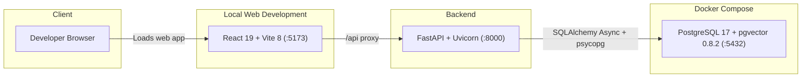
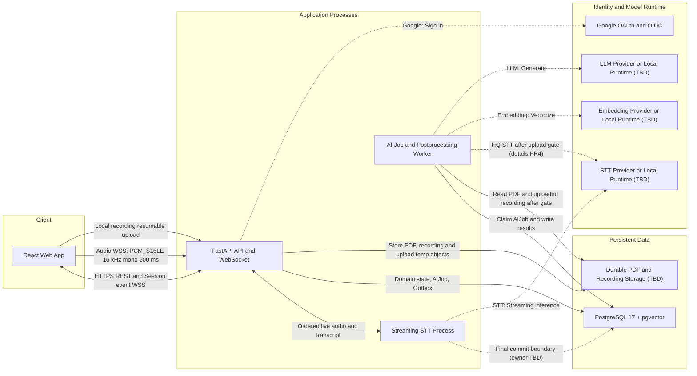
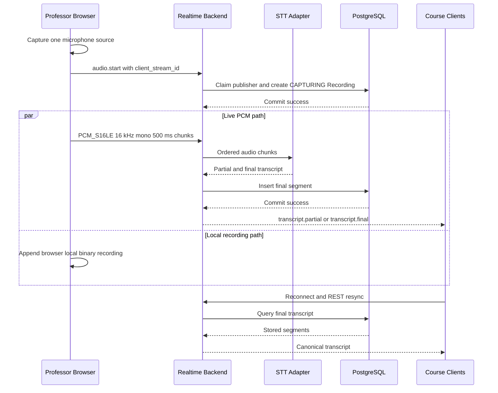
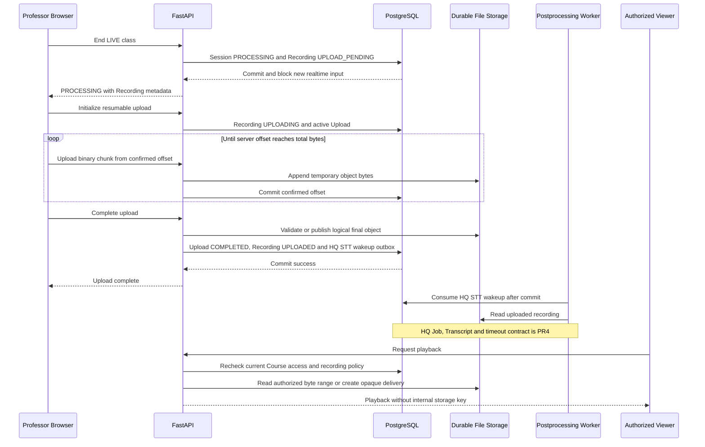
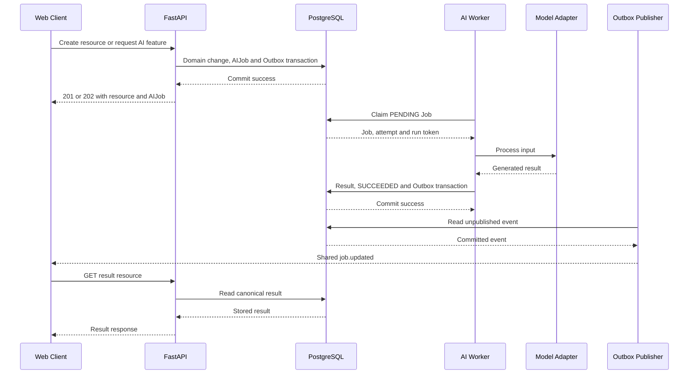
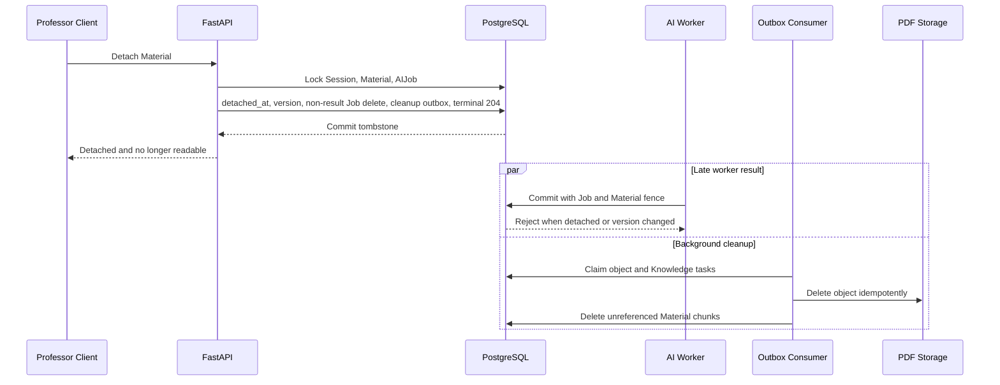

# GOAL 시스템 구성도

> 상태: Draft v0.1
>
> 작성 기준일: 2026-07-12
>
> 이 문서는 현재 구현과 MVP 목표 구성을 구분해 설명한다.

## 1. 문서 목적과 범위

본 문서는 GOAL MVP를 구성하는 클라이언트, API 서버, 실시간 처리, AI 작업, 데이터 저장소와 외부 모델의 경계를 한눈에 설명한다. 구성요소 사이의 통신 방향, 영구·임시 데이터 경계, 주요 처리 흐름과 장애 복구 원칙을 정의한다.

세부 계약은 다음 문서를 기준으로 한다.

- 사용자 기능과 우선순위: [기획안](../product/기획안.md), [기능명세서](../product/기능명세서.md)
- 화면과 접근 구조: [IA](../product/IA.md), [화면설계서](../product/화면설계서.md)
- 기술 원칙: [기술명세서](./기술명세서.md)
- HTTP·WebSocket 계약: [API 명세서](../api/API_명세서.md), [OpenAPI](../api/openapi.yaml)
- 테이블·제약·트랜잭션: [DB 스키마](../database/DB_스키마.md), [ERD](../database/ERD.md)
- 서버 하드웨어: [KCloud VM 사양](./KCLOUD_VM_사양.md)

이 문서는 다음 내용을 반복하지 않는다.

- 전체 endpoint와 request·response field
- 테이블별 전체 column과 index
- 화면별 UI component와 사용자 이동 경로
- 구체적인 모델 prompt와 clustering threshold

## 2. 구성 상태 구분

아키텍처를 읽을 때 현재 저장소에 존재하는 코드와 앞으로 구현할 MVP 설계를 혼동하지 않도록 상태를 구분한다.

| 상태      | 의미                                                         |
| --------- | ------------------------------------------------------------ |
| 현재 구현 | 저장소에서 실제 실행하거나 test할 수 있음                    |
| 준비됨    | dependency, 환경 변수, directory 또는 migration 기반만 있음  |
| MVP 목표  | API·DB·제품 문서에서 계약이 정의됐으나 실행 코드는 아직 없음 |
| 미정      | 구현 전에 기술이나 운영 방식을 선택해야 함                   |

### 2.1 현재 구현 범위

| 영역        | 현재 상태                                                                               |
| ----------- | --------------------------------------------------------------------------------------- |
| React 웹    | React 19, TypeScript 6, Vite 8 scaffold와 API health 확인 화면                          |
| FastAPI     | Uvicorn 실행, **GET /api/health**, **GET /api/health/db**                               |
| 데이터 접근 | SQLAlchemy Async, psycopg, request-scoped AsyncSession 기반                             |
| PostgreSQL  | Docker Compose의 PostgreSQL 17과 pgvector 0.8.2                                         |
| Migration   | Alembic과 pgvector extension 활성화 migration만 구현                                    |
| 파일 저장   | **STORAGE_ROOT=data/uploads** 설정과 directory만 구성, 녹음 저장·upload·playback 미구현 |
| PDF 처리    | PyMuPDF dependency만 구성, upload·extract pipeline 미구현                               |
| API 계약    | HTTP·WebSocket·STT Draft v0.1 작성, business handler 미구현                             |
| DB 계약     | 26개 table Draft v0.1 작성, model과 table migration 미생성                              |
| 외부 서비스 | 실제 OAuth·STT·Embedding·LLM 연동 없음                                                  |

현재 **compose.yaml**은 PostgreSQL만 container로 실행한다. React/Vite와 FastAPI/Uvicorn은 개발 host에서 별도 process로 실행한다.

현재 DB migration은 **vector extension**만 활성화한다. DB 스키마 문서의 24개 domain table, pgcrypto, HNSW index와 constraint trigger는 아직 실제 DB에 생성되지 않았다.

## 3. 현재 로컬 개발 구성

다음 그림은 지금 저장소에서 실제로 실행할 수 있는 최소 구성이다.

### 3.1 실행 경로

1. **make db-up**이 PostgreSQL container를 실행하고 health check를 기다린다.
2. **make migrate**가 Alembic migration을 적용한다.
3. **make dev-api**가 FastAPI를 기본 **127.0.0.1:8000**에서 실행한다.
4. **make dev-web**이 Vite를 기본 **127.0.0.1:5173**에서 실행한다.
5. Vite 개발 server가 **/api** 요청을 FastAPI로 proxy한다.

PostgreSQL port는 기본적으로 host의 **127.0.0.1:5432**에만 bind한다. 현재 구성에는 Nginx, Redis, 별도 작업 queue와 외부 Object Storage가 없다.

## 4. MVP 목표 논리 구성

다음 그림은 제품·API·DB 문서에서 합의된 MVP 목표 구조다. 실시간 STT process와 AI Job worker는 논리적 실행 경계이며, 하나의 process로 합칠지 별도 process로 배포할지는 아직 확정하지 않았다.

### 4.1 구성요소별 책임

| 구성요소                 | 책임                                                                                          | 상태                        |
| ------------------------ | --------------------------------------------------------------------------------------------- | --------------------------- |
| React Web App            | 교수자·학생 화면, microphone의 live PCM·로컬 녹음 분기, resumable upload·playback, event 수신 | scaffold만 구현             |
| FastAPI API              | 인증·Course 권한, resource API, 상태 전이, Recording upload·playback 권한, AIJob 생성         | health API만 구현           |
| WebSocket 처리           | 별도 ticket의 session event·audio 채널, publisher claim, PCM frame, ack·flow control·resume   | MVP 목표                    |
| Streaming STT Process    | PCM chunk 처리, partial/final 판정, STT adapter 호출                                          | MVP 목표, process 분리 미정 |
| AI·Postprocessing Worker | upload 완료 뒤 HQ STT gate, PDF 전처리, embedding, clustering, summary, RAG Chat, retry·lease | MVP 목표, HQ 계약은 PR4     |
| PostgreSQL               | 최종 domain state, Recording·upload offset, final Transcript, AIJob, outbox, vector           | engine·pgvector만 구성      |
| Durable File Storage     | PDF·녹음 final object와 upload temporary object를 비공개 논리 key로 저장                      | backend·provider 미정       |
| Model Adapter            | STT·Embedding·LLM runtime을 교체하는 application 내부 경계                                    | model 미정                  |
| Outbox Publisher         | commit된 shared event와 내부 정리 작업을 publish                                              | 논리 구성, 실행 위치 미정   |

### 4.2 핵심 처리 경계

- FastAPI는 인증, 권한, 입력 검증, 짧은 transaction과 상태 전이를 담당한다.
- 오래 걸리는 PDF·Embedding·Clustering·Summary·LLM 작업은 request 처리와 분리한다.
- streaming STT는 낮은 지연이 필요하므로 일반 batch AIJob과 실행 경계를 나눌 수 있어야 한다.
- PostgreSQL과 REST 조회 결과가 최종 진실이며 WebSocket은 변경 알림과 임시 stream을 전달한다.
- AI 기능 실패가 Course 입장, 질문 생성과 저장된 기록 조회를 막아서는 안 된다.
- 모델은 adapter 뒤에 두고 외부 API와 local GPU runtime을 교체할 수 있게 한다.
- 하나의 교수자 microphone source를 audio WS live PCM과 브라우저 로컬 녹음으로 분기하고 각 경로의 실패를 격리한다. live WS frame은 영구 녹음 원본이 아니며 로컬 녹음은 Session 종료 뒤 resumable HTTP upload로 저장한다.
- Session 종료는 upload나 audio drain을 기다리지 않고 즉시 `PROCESSING`으로 전이한다. Recording upload complete가 commit된 뒤에만 HQ STT를 시작한다.

### 4.3 Course·class 일관성 경계

- Course 생성자는 해당 Course의 불변 owner이자 유일한 `PROFESSOR`다. Course와 owner membership을 한 transaction에서 만들고 DB의 partial UNIQUE·deferred invariant로 정확히 한 명인지 검증한다. 추가 교수자와 owner 이전은 제공하지 않는다.
- Course에는 종료·보관 상태가 없다. owner 삭제만 제공하되 active class가 있을 때의 삭제 허용 여부와 삭제 후 복구 유예는 아직 미정이다.
- 참여 코드는 trim·대문자 정규화 후 `[A-Z]{6}`이고 자동 만료하지 않는다. owner 회전 transaction이 commit되면 이전 코드는 즉시 무효이며 회전 이력은 저장하지 않는다.
- Course당 `READY`, `LIVE`, `PROCESSING` class 합계는 최대 하나다. 이 행을 `current_session`으로 반환하고 없으면 `null`이다. 동시 생성 경쟁은 partial UNIQUE가 최종 차단하며 `ACTIVE_SESSION_EXISTS`로 변환한다.
- active class가 `COMPLETED`가 된 뒤에만 다음 class를 생성한다. 같은 `lecture_date`의 완료 class는 여러 개 허용하고 `lecture_date DESC, started_at DESC, id DESC`로 조회한다.
- class 제목은 모든 상태에서 owner가 수정할 수 있다. 빈 제목은 Course 제목·class 날짜·시각을 포함한 서버 자동 제목으로 치환한다. 정확한 문자열 형식, `READY`에서 사용할 시각 원장과 timezone은 미정이며 `lecture_date`와 이미 기록된 lifecycle 시각은 수정하지 않는다.
- class 시작은 Session과 `detached_at IS NULL`인 Material을 잠근 뒤 연결된 `PROCESSING`이 있으면 `MATERIAL_PROCESSING_ACTIVE`로 거부한다. PDF가 0개이거나 연결된 상태가 `READY`, `UPLOADED`, `FAILED`뿐이면 시작할 수 있다.
- class 삭제는 `READY`, `COMPLETED`에서만 허용하고 `LIVE`, `PROCESSING`은 `SESSION_STATE_CONFLICT`로 거부한다.
- 멱등성 terminal 응답은 terminal 전이 시각부터 정확히 24시간 보관한다. 도메인 변경과 `completed_at`, `expires_at = completed_at + 24 hours`를 같은 transaction에 기록한다.

### 4.4 Material 수명주기 경계

- `detached_at IS NULL`인 행만 class에 연결된 Material이다. Session당 최대 10개, 파일당 decimal `100000000` bytes를 허용하며 같은 내용과 같은 원본 파일명의 업로드는 허용한다.
- 업로드는 Session `READY`, `LIVE`, `COMPLETED`에서 허용하고 `PROCESSING`에서는 `SESSION_STATE_CONFLICT`로 거부한다. 연결된 개수 경쟁은 Session 잠금과 DB trigger가 직렬화하고 초과는 `MATERIAL_LIMIT_EXCEEDED`로 변환한다.
- 업로드 원본명과 공개 `display_name`을 분리한다. 충돌하면 확장자 앞에 ` (1)`, ` (2)` suffix를 붙이고 기존 이름은 바꾸거나 재번호를 매기지 않는다.
- `PROFESSOR`의 연결 해제도 `READY`, `LIVE`, `COMPLETED`에서 허용하고 `PROCESSING`에서는 거부한다. tombstone commit 직후 목록·상세·content·RAG에서 제외한다.
- Material 흐름의 잠금 순서는 `Session → Material → AIJob`이다. Worker claim·결과 commit도 이 순서와 Material version·`detached_at IS NULL` fence를 따라 늦은 결과를 폐기한다.
- server-generated `storage_key`는 API·공유 event·로그에 노출하지 않고 object 정리용 내부 outbox payload에서만 사용한다.

### 4.5 Recording·upload 수명주기 경계

- 첫 성공 `audio.start`는 `client_stream_id`의 목적별 HMAC claim, 논리 SessionRecording 생성과 `CAPTURING` 전이를 원자적으로 commit한다. Session당 publisher와 논리 Recording은 하나다.
- 다른 `client_stream_id`는 `AUDIO_PUBLISHER_CONFLICT`와 close code `4409`로 audio 연결만 거부한다. 같은 stream ID는 새 ticket으로 reconnect·sequence resume할 수 있지만 lease 만료·재획득·takeover는 미정이다.
- 공개 Recording 전이는 `CAPTURING → UPLOAD_PENDING → UPLOADING → UPLOADED | FAILED`다. 종료 transaction이 `PROCESSING`과 `UPLOAD_PENDING`을 함께 확정하고 새 실시간 입력을 즉시 차단한다.
- RecordingUpload은 `ACTIVE → COMPLETED | EXPIRED | FAILED`이고 Recording당 active upload는 최대 하나다. init·offset·chunk·complete resource는 재시작 후에도 서버가 commit한 offset을 복구하는 provisional 경계이며 method·header·chunk·checksum·expiry·최대 크기는 미정이다.
- complete transaction은 final metadata, `UPLOADED`, 안전한 `recording.updated`와 HQ STT wakeup outbox를 함께 commit한다. HQ STT Job·Transcript version·canonical·timeout·Segment offset·Answer 재매핑은 PR4 범위다.
- SessionRecording은 외부에 하나인 논리 aggregate이고 storage locator·temporary handle은 물리 파일 수를 뜻하지 않는다. 단일 파일 또는 fragment·manifest 구성은 미정이며 key·경로·manifest를 외부에 노출하지 않는다.
- playback은 `UPLOADED`에만 제공하고 매 요청에서 현재 인증·Course 접근과 향후 녹음 정책을 다시 확인한다. 녹음 동의·역할별 접근·보관·삭제 정책은 미정이다.

## 5. 주요 통신 인터페이스

| 연결                           | 방식                                          | 주요 데이터                                     | 상태         |
| ------------------------------ | --------------------------------------------- | ----------------------------------------------- | ------------ |
| Browser → Vite                 | HTTP                                          | 개발용 frontend asset                           | 현재 구현    |
| Vite → FastAPI                 | HTTP proxy                                    | **/api** 요청                                   | 현재 구현    |
| Browser ↔ FastAPI             | HTTPS REST                                    | resource 조회·상태 변경·AIJob 접수              | MVP 목표     |
| Browser ↔ FastAPI             | **WS /api/v1/ws/sessions/{session_id}**       | Course member용 session event                   | MVP 목표     |
| Browser ↔ FastAPI             | **WS /api/v1/ws/sessions/{session_id}/audio** | 교수자 PCM audio, publisher claim·ack·resume    | MVP 목표     |
| Browser → FastAPI              | provisional resumable HTTPS upload            | 브라우저 로컬 녹음 init·offset·chunk·complete   | MVP 목표     |
| Browser ← FastAPI              | 권한 재검증 HTTPS playback                    | `UPLOADED` 녹음 byte range 또는 opaque delivery | MVP 목표     |
| FastAPI ↔ PostgreSQL          | SQLAlchemy Async + psycopg                    | connection pool, SELECT 1 readiness             | 현재 구현    |
| FastAPI → PostgreSQL           | SQL transaction                               | domain state, auth, AIJob, outbox               | MVP 목표     |
| Worker ↔ PostgreSQL           | SQL transaction                               | Job claim, lease, result, vector query          | MVP 목표     |
| FastAPI·Worker ↔ File Storage | backend SDK 또는 filesystem                   | PDF·녹음 final, upload temp와 논리 key          | backend 미정 |
| FastAPI ↔ Google              | OAuth 2.0·OIDC                                | authorization code, identity claim              | MVP 목표     |
| STT·Worker ↔ STT Model        | provider별 streaming·batch protocol           | live PCM, uploaded recording, Transcript        | 미정         |
| Worker ↔ Embedding·LLM        | provider별 API 또는 local inference           | text, vector, generated output                  | 미정         |

운영 환경의 TLS 종료, reverse proxy, frontend static hosting과 process supervisor는 아직 선택하지 않았다.

## 6. 실시간 STT 흐름

실시간 STT와 브라우저 원본 녹음은 MVP 필수 기능이다. 교수자의 같은 microphone source를 두 경로로 분기한다. audio WS는 `PCM_S16LE`, 16 kHz, mono, 500 ms live chunk만 전달하고 브라우저 로컬 경로는 Session 전체 녹음을 binary로 유지한다. 두 경로는 독립 상태이므로 하나가 실패해도 다른 경로와 질문·기존 기록을 자동 실패 처리하지 않는다.

### 6.1 저장·복구 규칙

- Session event WS와 audio WS는 별도 ticket·권한·연결 상태를 사용한다. event WS에는 audio frame·recording upload chunk를 보내지 않고 audio WS에는 공용 Session event를 broadcast하지 않는다.
- 첫 성공 `audio.start`의 `client_stream_id`가 단독 publisher를 claim한다. 다른 ID는 `4409 AUDIO_PUBLISHER_CONFLICT`로 거부하고 같은 ID만 reconnect·수락된 sequence 다음부터 resume한다.
- audio replay buffer의 크기·window, publisher lease·재획득·takeover, `DEGRADED`와 stop timeout·강제 종료는 미정이다.
- partial Transcript는 server memory와 client 화면에서만 사용하며 DB에 저장하지 않는다.
- final Transcript는 **session_id + utterance_id**로 중복 저장을 막고 Session별 sequence를 원자적으로 할당한다.
- **transcript.final** event는 DB commit 이후에만 전파한다.
- 재연결 때 기존 partial 표시를 제거하고 final Transcript는 REST로 다시 조회한다.
- replay가 불가능하면 **resync.required**를 전송하고 REST 복구를 강제한다.
- audio WS PCM frame은 영구 녹음 원본이 아니다. 원본은 같은 microphone source의 브라우저 로컬 branch를 Session 종료 뒤 resumable upload해 저장한다.

실제 final Transcript transaction을 FastAPI와 별도 STT process 중 어느 process가 소유할지는 미정이지만, commit 이후에만 final event를 발행한다는 경계는 유지한다.

### 6.2 Recording upload·HQ STT gate·playback

- 공개 Recording 전이는 `CAPTURING → UPLOAD_PENDING → UPLOADING → UPLOADED | FAILED`다. `UPLOADED`는 upload 저장 gate의 terminal 성공이며 HQ STT·Transcript 상태를 뜻하지 않는다.
- init·offset·chunk·complete는 process 재시작 뒤에도 서버가 commit한 연속 offset을 복구해야 하는 provisional resource 경계다. exact method·header·chunk 크기·checksum·expiry·최대 크기는 미정이다.
- SessionRecording은 외부에 하나인 논리 aggregate다. final·temporary storage locator는 물리 단일 파일, 여러 fragment·part 또는 manifest 중 무엇에도 매핑될 수 있고 정확한 cardinality는 미정이다.
- final key, temporary key, 서버 경로, fragment key와 manifest는 API·공유 event·로그에 노출하지 않는다.
- playback은 `UPLOADED`에만 허용하고 매 요청에서 현재 인증·Course 접근과 추후 확정할 녹음 정책을 다시 확인한다. proxy streaming과 짧은 opaque delivery URL 중 최종 방식은 미정이다.
- HQ STT Job·timeout, Transcript version·canonical 전환, Segment 녹음 offset과 Answer 재매핑은 PR4에서 확정한다.

## 7. 비동기 AIJob 흐름

PDF 처리, 질문 clustering, summary와 Chat response는 요청과 분리된 AIJob으로 실행한다.

### 7.1 Job 일관성 규칙

- Worker는 **FOR UPDATE SKIP LOCKED** 방식으로 실행 가능한 Job을 claim한다. `MATERIAL_PROCESSING`은 잠금 없는 후보 탐색 뒤 `Session → Material → AIJob` 순서로 잠그고 `PENDING`과 `detached_at IS NULL`을 다시 검증한다.
- 재시도는 새 Job을 만들지 않고 같은 **ai_jobs** row의 **attempt**와 **version**을 증가시켜 PENDING으로 바꾸고 progress·error·실행 시각·run token을 초기화한다.
- 실행마다 새 **run_token**과 lease를 발급한다.
- 결과 commit은 Job ID, attempt, run token과 RUNNING 상태가 모두 일치할 때만 허용한다. Material 처리 결과는 Material 현재 version과 `detached_at IS NULL`도 일치해야 한다.
- 결과 row 저장과 Job의 SUCCEEDED 전환은 하나의 transaction이다.
- 재시도 queue outbox와 멱등성 202 terminal 응답도 같은 transaction에 저장한다.
- API와 `job.updated` event는 visibility, attempt, version, 안전한 progress, retryable, blocks_session_completion, updated_at을 공개하고 provider 내부 단계·오류 원문은 제외한다.
- Cluster 결과는 Session별 증가 generation, ordinal, is_final, finalized_at, created_by_job_id와 created_by_job_attempt를 공개한다. 정확한 generation 원자 할당과 최신 watermark·late-result fence는 후속 계약이다.
- Cluster `title`은 AI 대표 질문의 정확한 text이고, Cluster에서 시작한 Answer는 선택 당시 ID와 title을 immutable snapshot으로 남긴다.
- 모델 실패, timeout과 retry는 해당 Job으로 격리하고 핵심 Course 기능을 유지한다.
- Recording upload complete는 HQ STT 시작의 선행 gate다. wakeup outbox는 `UPLOADED` commit 뒤에만 소비하며 구체 HQ STT Job type과 Transcript 결과·timeout은 PR4에서 확정한다.
- Recording이 있는 class의 최종 blocking predicate는 PR4에서 확정한다. 녹음 미생성·`FAILED`·upload 만료를 기존 “blocking Job 모두 terminal” 규칙만으로 임의 완료 처리하지 않는다.

현재 별도 message broker는 확정하지 않았다. MVP 초기 구현은 PostgreSQL 기반 Job claim으로 시작할 수 있으며, queue 도입 여부는 부하 시험 후 결정한다.

개인 Summary·Chat delta는 shared outbox event로 보내지 않는다. 요청자 전용 전송이 필요하면 SSE·streaming HTTP·target WebSocket 중 별도 transport를 선택하며, 선택 전에도 polling과 REST 결과 조회로 완료 상태를 복구한다.

## 8. PDF·Knowledge·RAG 흐름

### 8.1 PDF 전처리

1. FastAPI가 Course의 `PROFESSOR` 권한, PDF MIME·parsing 가능 여부와 `1..100000000` bytes 크기를 검사한다.
2. PDF를 **STORAGE_ROOT** 아래 server-generated storage key로 저장한다.
3. Session을 잠그고 `READY`, `LIVE`, `COMPLETED` 상태와 연결된 Material 10개 미만 조건을 다시 확인한다. 실패하면 저장 object를 보상 삭제한다.
4. 안정적인 `display_name`을 할당하고 Material, MATERIAL_PROCESSING Job, queue outbox와 제공된 멱등성 키의 terminal 응답을 같은 transaction에서 생성한다.
5. Worker가 PDF text와 page metadata를 추출하고 text를 검색 단위로 나눠 embedding을 생성한다.
6. Worker가 Job attempt·run token·상태와 Material version·`detached_at IS NULL`을 재검증한다.
7. **knowledge_chunks** 저장, Material READY와 Job SUCCEEDED를 같은 transaction으로 확정한다.

정확한 크기 상한 `100000000` bytes와 위 upload pipeline은 MVP 목표다. 현재 구현은 `STORAGE_ROOT` directory와 PyMuPDF dependency만 준비되어 있고 upload·제한 검증·전처리 코드는 없다.

### 8.2 Material 연결 해제·정리

- 연결 해제 transaction은 Session `READY`, `LIVE`, `COMPLETED`에서만 `Session → Material → AIJob` 순서로 잠근다. `PROCESSING`에서는 거부한다. 결과가 없는 `PENDING`·`RUNNING`·`FAILED` Material Job은 함께 제거하고 결과 provenance로 참조되는 `SUCCEEDED` Job은 보존한다.
- API 조회와 Worker claim, RAG SQL이 tombstone을 즉시 제외하므로 object·Chunk 정리가 지연되거나 재시도 중이어도 자료가 다시 노출되지 않는다.
- Object 삭제는 not-found도 성공으로 처리하고, Knowledge 정리는 Evidence가 참조하지 않는 Material source Chunk부터 실행한다.
- 연결 해제 Material의 원문 content link는 제공하지 않는다. 기존 Evidence가 참조하는 Chunk의 보관·snapshot·FK 변경·과거 표시 방식과 Material·Chunk 최종 hard delete 시점은 미정이다. 정책 확정 전에는 deferred `NO ACTION` FK와 Material tombstone을 유지한다.

### 8.3 RAG Chat

1. FastAPI가 User의 Course·Session membership과 Chat owner를 확인한다.
2. User Message와 CHAT_RESPONSE Job을 저장한다.
3. Worker가 SQL 단계에서 **course_id**와 **session_id**를 강제해 KnowledgeChunk를 검색한다. Material source는 `processing_status = 'READY' AND detached_at IS NULL`도 같은 SQL에서 적용한다.
4. PDF, final Transcript, Question과 Answer source를 실제 typed FK로 추적한다.
5. 검색 결과와 제한된 Chat history로 LLM context를 구성한다.
6. Assistant Message, 사용한 KnowledgeChunk Evidence와 Job 성공을 같은 transaction으로 저장한다.
7. 결과는 owner 전용 REST·polling 또는 향후 결정할 private streaming transport로 전달한다.

Chat Evidence는 generic **source_type + source_id**를 사용하지 않고 공통 **knowledge_chunk_id**를 참조한다.

## 9. class 종료 흐름

1. 정상 종료에서는 교수자 client가 먼저 **audio.stop**을 보내고 server의 **audio.stopped**를 확인한 뒤 종료 HTTP를 호출한다.
2. 종료 transaction은 Session row를 잠그고 `LIVE` 상태와 진행 중인 Answer가 없는지 확인한 뒤 즉시 `PROCESSING`으로 변경해 새 audio·질문·반응·Answer 입력과 audio resume을 차단한다. audio stop·drain 성공 여부로 이 전이를 늦추지 않는다.
3. 첫 `audio.start`로 Recording이 있으면 같은 transaction에서 `CAPTURING → UPLOAD_PENDING`과 capture 종료 시각을 기록한다. Recording이 없어도 Session 종료와 `PROCESSING` 전이는 허용하며, HQ source·fallback과 최종 완료 predicate는 PR4에서 정한다.
4. 교수자 browser가 로컬 binary 녹음을 resumable upload한다. 서버는 commit된 offset부터 재개하고 complete 전에는 HQ STT를 시작하지 않는다.
5. complete transaction이 Upload `COMPLETED`, Recording `UPLOADED`, final metadata와 HQ STT wakeup outbox를 함께 commit한 뒤에만 전체 녹음 기반 HQ STT를 시작한다.
6. Final Transcript가 준비된 뒤 FINAL Summary·final clustering을 실행해야 한다. HQ STT Job·Transcript generation·canonical·timeout·Answer 재매핑과 정확한 Session completion predicate는 PR4에서 정의한다.
7. 각 Job과 녹음 경로는 독립적으로 결과와 실패 상태를 저장한다. 실패가 기존 PDF·질문·Answer와 이미 저장된 Transcript 조회를 가리지 않는다.
8. PR4에서 정한 완료 조건을 만족한 뒤 Session을 `COMPLETED`로 전환한다. 완료 후 실패 Job을 같은 ID의 새 attempt로 재시도해도 Session을 다시 `PROCESSING`으로 돌리지 않는 공통 원칙은 유지한다.

### 9.1 Aggregate 삭제 흐름

1. API가 불변 Course owner와 필수 `Idempotency-Key`를 확인한다.
2. class 삭제는 `Session → Material → Recording → Upload → AIJob`, Course 삭제는 `Course → Session → Material → Recording → Upload → AIJob` 순서로 행을 잠근다.
3. class는 `READY`, `COMPLETED`인지 검증한다. Course에 active class가 있을 때의 허용 여부는 정책 확정 전까지 구현 계약으로 추가하지 않는다.
4. DB 행 삭제 전에 PDF, Recording final object와 active Upload temporary object의 내부 key를 모으고 멱등 cleanup outbox task를 같은 transaction에 만든다.
5. aggregate cascade 삭제와 멱등성 `204` terminal 응답을 함께 commit한다.
6. 삭제된 Job을 처리하던 worker는 Job ID·attempt·run token·RUNNING 조건을 만족할 수 없어 늦은 결과를 commit하지 못한다.
7. Outbox Publisher가 commit 뒤 storage object를 멱등 삭제하고 not-found를 성공으로 취급하며 실패 시 재시도한다. DB cascade만으로 물리 object가 삭제됐다고 간주하지 않는다.

Course owner 탈퇴 때 Course·membership을 유지·삭제할지는 미정이다. 현재 DB 경계는 공유 참조를 보존하기 위해 User tombstone을 유지한다.

## 10. 데이터 저장 경계

10~13절은 MVP 목표 정책이다. 현재 저장소에는 health check, DB 연결과 기본 설정만 구현되어 있다.

| 영구 저장                                    | 임시 또는 미저장                      | 이유                                        |
| -------------------------------------------- | ------------------------------------- | ------------------------------------------- |
| User, Course, membership                     | OAuth authorization code 원문         | 최소 권한과 재사용 방지                     |
| 암호화된 참여 코드와 HMAC lookup             | 참여 코드 평문                        | 유출과 offline 대입 위험 완화               |
| 연결된 PDF 원본과 metadata                   | upload 중 임시 파일                   | 검증 실패·transaction 실패 시 정리          |
| 연결 해제 Material tombstone                 | 삭제된 PDF object                     | 즉시 비노출, outbox로 비동기 정리           |
| SessionRecording metadata와 검증된 녹음 원본 | audio WS PCM·publisher stream ID 원문 | live frame과 소유권 비밀을 영구 원장과 분리 |
| active RecordingUpload offset                | 만료·실패한 temporary object          | 재개 상태 복구 후 outbox로 멱등 정리        |
| final Transcript                             | partial Transcript                    | partial은 revision 가능한 화면용 값         |
| Transcript gap metadata                      | replay buffer                         | gap·replay 세부 정책은 아직 미정            |
| Question, Reaction, Answer snapshot          | 질문 작성 도움 draft·suggestion       | 공개 질문 전 임시 사용자 입력               |
| LIVE·FINAL Summary, Chat                     | model streaming delta                 | 완료 결과를 DB와 REST로 복구                |
| KnowledgeChunk와 embedding                   | 범위 밖 검색 결과                     | Course·Session 보안 경계                    |
| AIJob, idempotency, outbox                   | token·ticket·storage key 원문         | hash·짧은 수명 metadata와 내부 task만 저장  |

`idempotency_records`의 terminal 응답은 `completed_at`부터 정확히 24시간 유지하고, `PROCESSING` lease 복구와 terminal cleanup을 분리한다.

## 11. 보안과 신뢰 경계

- Google OAuth/OIDC 완료 후 HttpOnly server Session Cookie를 사용한다.
- 상태 변경 HTTP 요청은 허용된 Origin과 Course membership을 확인한다.
- Browser WebSocket은 access token 대신 60초 만료·1회용·scope 제한 ticket을 사용한다.
- audio write는 해당 Course의 PROFESSOR와 LIVE Session에서만 허용한다.
- Session event WS와 audio WS의 ticket·scope를 분리한다. event WS는 audio frame을 받지 않고 audio WS는 Course 공용 event를 broadcast하지 않는다.
- 첫 audio publisher의 `client_stream_id`는 목적별 HMAC만 저장하고 원문·publisher 개인정보를 충돌 응답에 포함하지 않는다.
- 녹음 metadata·upload·playback은 매 요청에서 현재 인증·Course 접근을 다시 확인한다. 정확한 역할별 playback 권한과 녹음 동의는 미정이며 default 공개를 가정하지 않는다.
- 참여 코드는 AES-256-GCM 암호문과 HMAC-SHA-256 lookup을 분리해 저장한다.
- 암호화 key와 HMAC key는 DB·repository 밖의 secret 또는 KMS에서 관리한다.
- 제품의 참여 코드 회전은 현재 `[A-Z]{6}` 값을 바꾸는 owner 기능이고, HMAC·암호화 key 회전은 별도 운영 절차다. 코드 회전 이력과 이전 코드는 보관하지 않는다.
- Question 작성자 ID는 public API와 shared event에 포함하지 않는다.
- LIVE Summary, Chat과 REQUESTER_ONLY Job은 요청자에게만 노출한다.
- 모든 vector 검색은 SQL에서 Course·Session 범위를 먼저 적용한다. Material source는 연결된 `READY` 행만 허용한다.
- PDF·Recording final·Upload temporary `storage_key`, 서버 경로, fragment key와 manifest는 API 응답, 공유 event와 application log에 기록하지 않는다.
- 인증 token, 참여 코드, WebSocket ticket, 질문·prompt 원문은 application log에 기록하지 않는다.

## 12. 장애와 복구

| 장애                       | 처리 원칙                                                                             |
| -------------------------- | ------------------------------------------------------------------------------------- |
| WebSocket 연결 종료        | backoff 재접속 후 REST로 canonical state 복구                                         |
| event 중복·역순            | event ID, resource version과 last final sequence로 무시·재조회                        |
| STT partial 손실           | 복구하지 않고 다음 partial 또는 final을 기다림                                        |
| audio publisher 충돌       | 다른 stream은 `4409 AUDIO_PUBLISHER_CONFLICT`, 같은 stream만 resume                   |
| audio sequence gap         | 같은 stream의 수락 offset부터 resume하며 replay·gap 확정 정책은 TBD                   |
| live PCM 경로 실패         | 로컬 녹음을 계속하고 질문·기존 기록을 유지                                            |
| 브라우저 녹음 경로 실패    | live STT를 계속하고 Session 종료는 허용하되 HQ fallback·완료 predicate는 PR4에서 확정 |
| Recording upload 중단      | DB에 commit된 offset을 조회해 재개, exact protocol·expiry는 TBD                       |
| Recording finalize 불일치  | `UPLOADED`를 commit하지 않으며 temporary object 정리·재시도 전이는 TBD                |
| model timeout·오류         | 해당 AIJob을 FAILED로 전환하고 핵심 기능 유지                                         |
| Worker 종료                | lease 만료 후 watchdog 또는 다른 Worker가 실패·재시도 처리                            |
| API commit 후 publish 실패 | transactional outbox를 다시 publish                                                   |
| PDF DB commit 실패         | 저장된 object를 보상 삭제                                                             |
| Material cleanup 실패      | tombstone은 유지하고 object·Knowledge 내부 task를 멱등 재시도                         |
| Recording object orphan    | cleanup outbox 또는 보상 삭제 후 orphan reconciliation                                |
| Recording cleanup 실패     | DB 삭제·비노출 상태를 되돌리지 않고 final·temporary object 삭제 재시도                |
| 일부 종료 후처리 실패      | 실패를 노출하되 Session은 완료 가능                                                   |
| DB 장애                    | readiness를 503으로 응답하고 write·final event를 성공으로 처리하지 않음               |

## 13. 관측성

### 13.1 공통 식별자

- HTTP request ID
- AIJob ID, attempt와 run token
- WebSocket event ID, cursor와 correlation ID
- Session ID와 resource version
- Transcript utterance ID와 sequence

### 13.2 주요 지표

| 영역         | 지표                                                                               |
| ------------ | ---------------------------------------------------------------------------------- |
| API          | request rate, latency, status별 error rate                                         |
| WebSocket    | active connection, reconnect, ticket failure, resync rate                          |
| Audio        | publisher conflict, same-stream resume, sequence gap, stop state                   |
| Recording    | 상태 체류, upload offset·재개·완료·실패, playback 권한 거부                        |
| STT          | partial latency, final latency, HQ start gate·processing time                      |
| AIJob        | queue depth, claim delay, processing time, retry, failure rate                     |
| PostgreSQL   | connection pool, slow query, lock wait, storage, vector query latency              |
| GPU·Model    | utilization, memory, concurrency, provider timeout                                 |
| File Storage | PDF·녹음·temporary bytes, 증가율, root disk 여유·소진 예상, orphan·cleanup failure |

민감한 본문 대신 ID, 상태, duration과 안전한 error code를 구조화 log에 남긴다.

## 14. 배포 구성

### 14.1 현재 로컬 개발

| 위치           | Process·data                                         |
| -------------- | ---------------------------------------------------- |
| 개발 host      | Vite, FastAPI/Uvicorn, source code, **data/uploads** |
| Docker Compose | PostgreSQL 17 + pgvector, named volume               |

현재 `data/uploads`는 directory 설정뿐이며 PDF·녹음 upload handler와 녹음 playback을 구현한 상태가 아니다. 로컬 개발 storage를 운영 녹음 원장의 내구성 보장으로 해석하지 않는다.

### 14.2 MVP 운영 배포 경계

KCloud VM은 x86_64 CPU, memory, local disk와 GPU를 제공한다. 다음 자원은 확인된 사실이지만 아직 배포 코드나 운영 설정으로 확정되지 않았다.

| 확인된 자원 | 사양                                 |
| ----------- | ------------------------------------ |
| CPU         | Intel Xeon, 40 vCPU                  |
| Memory      | 49 GiB                               |
| GPU         | NVIDIA GeForce RTX 3090, 24 GiB VRAM |
| Root Disk   | 97 GiB                               |

확인 당시 GPU에서 실행 중인 process는 없었다. 이 사양은 사용 가능한 자원이며 STT·LLM이 이미 GPU에 배포됐다는 의미가 아니다. 97 GiB 루트 디스크는 OS·application·log·DB·임시 upload와 경쟁하므로 장시간 수업 녹음의 영구 원장을 수용한다고 가정하지 않는다.

녹음 원본 저장·playback이 MVP이므로 운영 MVP에는 외부 Object Storage 또는 동등한 내구성·용량 경계가 필요하다. KCloud local disk는 개발, 제한된 staging·cache·temporary upload 용도로만 검토하고, final recording의 유일한 사본으로 사용하지 않는다. provider·region·암호화·전송 방식은 미정이다.

- React production build 제공 방식
- TLS 종료와 reverse proxy
- FastAPI process 수와 process supervisor
- Streaming STT와 AI Worker의 process·GPU 분리
- PostgreSQL을 같은 VM에 둘지 관리형·별도 host로 분리할지
- 외부 PDF·녹음 Object Storage provider와 KCloud temporary staging 경계
- DB metadata와 object 사이 backup·restore·orphan reconciliation
- root disk·Object Storage capacity, 증가율과 소진 예상 monitoring
- secret manager 또는 KMS
- log·metric 수집 backend

운영 배포도를 확정할 때 single point of failure, GPU memory 격리, DB·PDF·녹음 backup, storage quota와 복구 시간 목표를 함께 정의한다. alert threshold, backup·restore RPO/RTO는 아직 미정이다.

## 15. 확장 도입 기준

MVP는 현재 repository 구성을 우선하되 녹음 원본의 운영 저장에는 외부 Object Storage 또는 동등한 경계를 요구한다. 나머지 기술은 다음 도입 조건이 충족될 때 추가한다.

| 후보             | 도입 조건                                                                          |
| ---------------- | ---------------------------------------------------------------------------------- |
| Redis            | API instance가 여러 개가 되어 WebSocket fan-out·짧은 replay·분산 lease가 필요할 때 |
| 전용 Job Queue   | PostgreSQL Job claim의 처리량·우선순위·지연이 목표를 만족하지 못할 때              |
| Object Storage   | 운영 MVP 녹음 원본·playback의 내구성·용량 경계로 필요, provider·구성은 미정        |
| 별도 Vector DB   | pgvector가 실제 corpus의 latency·recall 목표를 만족하지 못할 때                    |
| CDN              | production static asset·PDF delivery 부하가 확인될 때                              |
| 별도 STT Gateway | 동시 audio stream과 provider switching이 FastAPI 안정성에 영향을 줄 때             |

확장 구성은 현재 구성도와 섞지 않고 별도 target architecture로 갱신한다.

## 16. 미정 사항

- 사용할 Google OAuth client와 redirect domain
- STT, Embedding과 LLM model·provider
- streaming STT process와 FastAPI 사이의 transport
- AI Worker 개수, queue 도입 여부와 priority 정책
- Cluster generation 원자 할당과 최신 watermark·late-result fence
- class 자동 제목의 정확한 문자열 형식, `READY` 시각 원장과 timezone
- active class가 있는 Course 삭제 허용 여부와 삭제 후 복구 유예
- Course owner 탈퇴 시 Course·membership 처리
- 무기한 참여 코드에 대한 시도 제한·잠금 정책
- private AI delta의 SSE·streaming HTTP·target WebSocket 중 최종 방식
- production frontend hosting, TLS와 reverse proxy
- embedding dimension과 HNSW parameter
- 예상 동시 Course·audio stream·WebSocket 수와 latency SLO
- event replay와 outbox retention 기간
- 저장 녹음 codec·container와 브라우저 local storage 방식
- resumable upload method·header·chunk·checksum·expiry·최대 크기와 fragment manifest
- publisher lease 만료·재획득·takeover
- `DEGRADED` 전환, audio stop timeout·강제 종료, replay window와 gap 처리
- 녹음 동의, 역할별 접근, 보관·삭제와 playback 전달 방식
- Recording 미생성·`FAILED`·Upload `EXPIRED` 뒤 재시도와 Session 완료 규칙
- 물리 단일 녹음 파일 또는 fragment·manifest 구성과 orphan reconciliation
- HQ STT Job·timeout, Transcript version·canonical·Segment recording offset과 Answer 재매핑(PR4)
- PDF·개인 AI data의 최종 보관 기간
- 연결 해제 Material을 인용한 Evidence·KnowledgeChunk의 보관 기간, snapshot·FK 정책과 최종 hard delete 시점
- KCloud GPU model 배치와 concurrency limit
- KCloud root disk·Object Storage quota와 capacity alert threshold
- monitoring·alert backend와 DB·PDF·녹음 backup·restore RPO/RTO

## 17. 문서 정합성 원칙

구현 중 구조가 바뀌면 시스템 구성도만 단독으로 수정하지 않는다.

| 변경                           | 함께 검토할 문서          |
| ------------------------------ | ------------------------- |
| endpoint·event·인증 흐름       | API 명세서, OpenAPI       |
| table·FK·index·보관 정책       | DB 스키마, ERD            |
| framework·process·storage 변경 | 기술명세서, 시스템 구성도 |
| 사용자 흐름·MVP 범위 변경      | 기획안, 기능명세서, IA    |
| VM·GPU·network 변경            | KCloud VM 사양, 배포 구성 |

현재 시스템 구성도는 최신 API·DB 결정을 우선 반영한다. Recording upload·storage·playback 경계는 MVP 목표이며 현재 실행 코드가 아니다. 녹음 동의·역할별 접근·보관·삭제, wire 밖 저장 형식과 resumable protocol, publisher 복구와 PR4 후처리 계약은 결정 전까지 구현이 임의로 확정하지 않는다.
