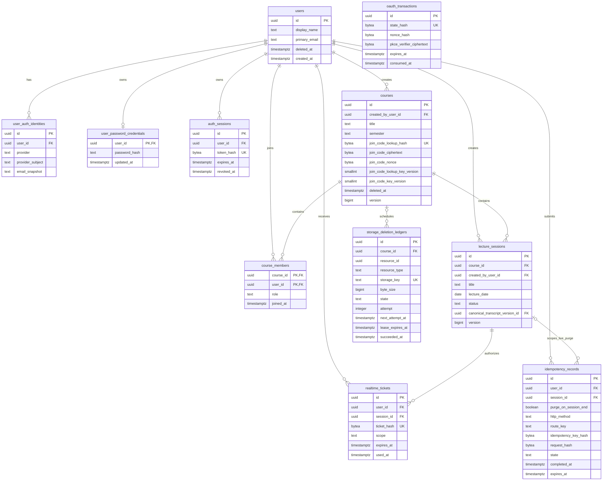
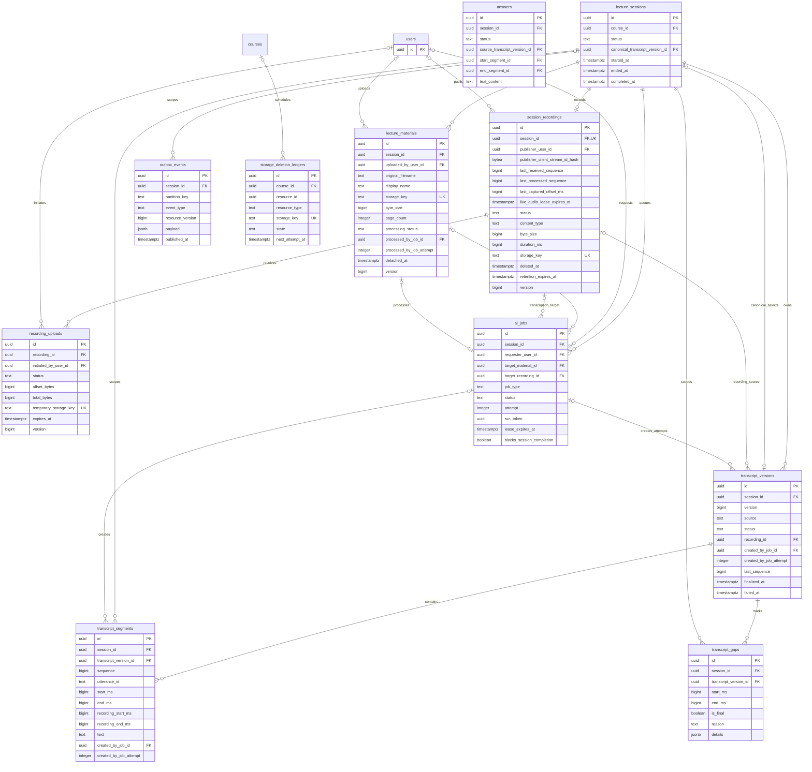
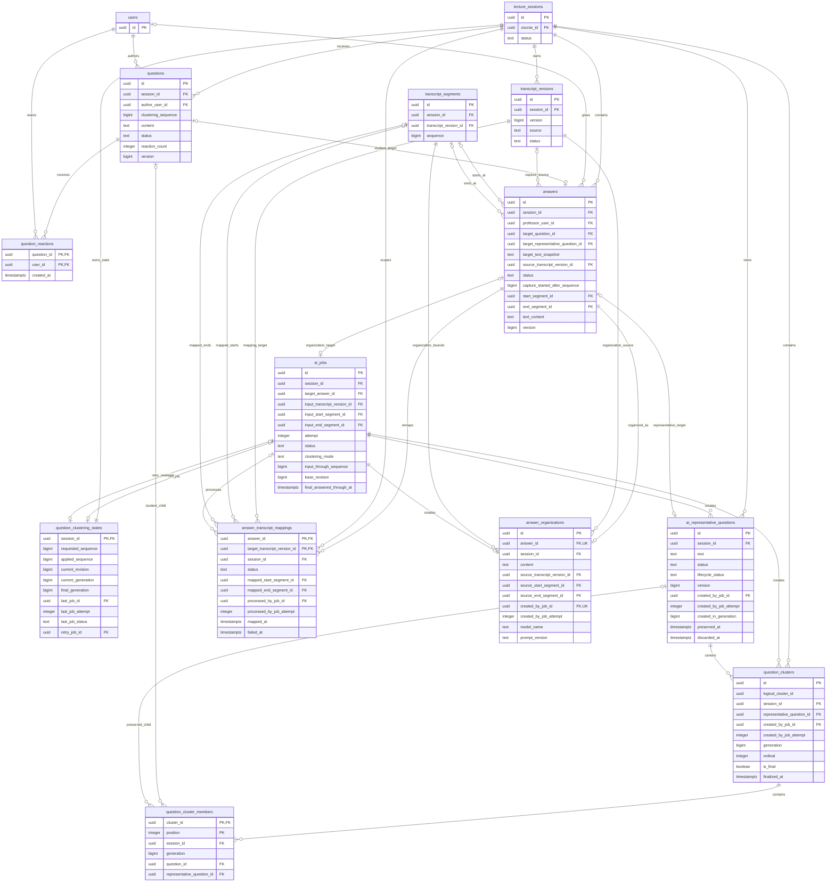
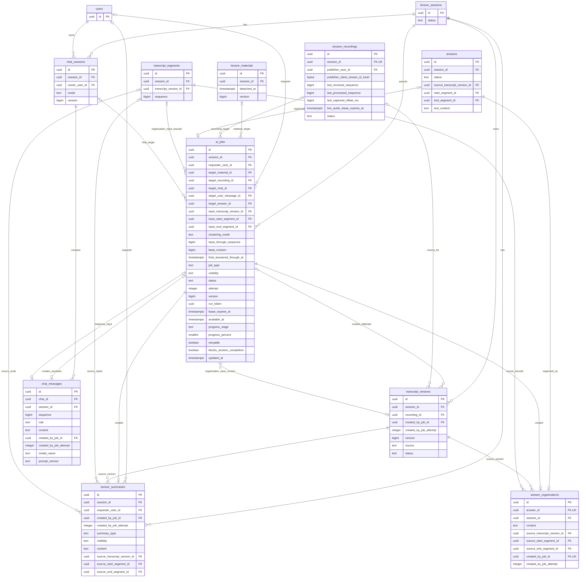
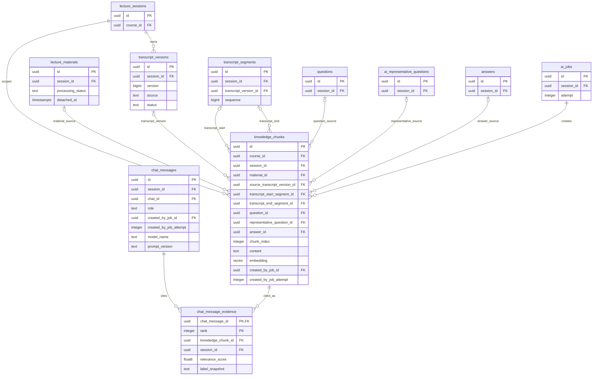

# GOAL 데이터베이스 ERD

> 상태: Draft v0.1
>
> 작성 기준일: 2026-07-11
>
> 상세 컬럼·제약·트랜잭션: [DB\_스키마.md](./DB_스키마.md)

## 1. 범위와 표기

전체 물리 모델은 33개 테이블로 구성된다. 한 그림에 모두 넣으면 핵심 관계가 흐려지므로 인증·Course, 수업 기록, 질문·답변, AI 요약·Chat, 공통 Knowledge의 다섯 도메인으로 나눴다. 같은 테이블이 여러 그림에 반복되며 모두 동일한 실제 테이블을 뜻한다.

- `PK`: Primary Key
- `FK`: Foreign Key
- `UK`: Unique Key
- `||`: 정확히 1개
- `o|`: 0개 또는 1개
- `o{`: 0개 이상

ERD는 관계와 핵심 컬럼을 빠르게 검토하기 위한 문서다. 전체 컬럼, `NULL`, 기본값, `CHECK`, partial UNIQUE, 복합 FK와 `ON DELETE` 정책은 [DB 스키마](./DB_스키마.md)를 기준으로 한다.

## 2. 사용자·인증·Course

사용자의 역할은 전역 속성이 아니라 Course membership에 저장한다. Course 생성자는 불변 owner이자 정확히 한 명인 `PROFESSOR`이며 추가 교수자와 owner 이전은 없다. 참여 코드는 Course에 AES-256-GCM 암호문과 조회용 HMAC을 함께 보관한다. 정규화 값은 `[A-Z]{6}`이고 자동 만료하지 않으며 owner 회전 시 이전 값을 즉시 교체하고 이력을 남기지 않는다.

`oauth_transactions`는 callback 성공 전에는 User가 확정되지 않으므로 의도적으로 User FK를 갖지 않는다. `course_members(course_id) WHERE role = 'PROFESSOR'` partial UNIQUE와 deferrable constraint trigger가 Course마다 owner와 일치하는 교수자 membership이 정확히 하나인지 transaction 종료 시 검증한다. 일반 `idempotency_records` terminal 행은 `expires_at = completed_at + interval '24 hours'`다. `purge_on_session_end=true`는 non-null `session_id`를 요구하고 개인 LIVE Summary·Chat 생성·Message와 관련 Job retry write의 원 리소스 purge scope를 표시한다. Session 종료 transaction은 결과·Job을 삭제하고 terminal record의 암호화 응답을 `410 LIVE_AI_RESULT_PURGED`로 재작성한다. Session FK는 `ON DELETE SET NULL`이다.

## 3. class·자료·녹음·Transcript·이벤트

한 class에 연결 상태인 PDF를 최대 10개까지 둘 수 있다. `detached_at IS NULL`인 Material만 현재 연결된 행이며 PDF가 0개여도 class를 시작할 수 있다. streaming STT의 partial 결과는 저장하지 않지만 첫 `audio.start`의 논리 Recording, publisher claim, 종료 후 resumable Upload은 영구 원장에 남긴다. LIVE STT와 녹음 전체 재처리는 서로 다른 `transcript_versions` 원장에 저장하며 Session의 `canonical_transcript_version_id`가 기본 조회 version을 선택한다.

`lecture_sessions(course_id) WHERE status IN ('READY', 'LIVE', 'PROCESSING')`의 partial UNIQUE가 Course당 active class를 합계 하나로 제한한다. 이 행이 API의 `current_session`이며 없으면 `null`이다. 같은 날짜의 완료 class는 `lecture_date DESC, started_at DESC, id DESC`로 구분한다. `lecture_materials.session_id`에는 UNIQUE를 두지 않되 Session 잠금과 trigger가 연결된 행을 최대 10개로 제한한다. `session_recordings.session_id` UNIQUE는 Session당 논리 Recording을 최대 하나로, `recording_uploads(recording_id) WHERE status = 'ACTIVE'` partial UNIQUE는 active Upload을 최대 하나로 제한한다. 첫 Recording insert는 publisher `client_stream_id` HMAC claim과 원자적으로 commit하고 같은 claim만 reconnect·resume한다. `last_received_sequence`·`last_processed_sequence`·`last_captured_offset_ms`는 process 재시작 뒤에도 duplicate PCM을 제거하고 Gap을 계산하는 내부 ACK watermark이며 원문 audio나 client stream ID는 아니다. 45초 liveness 만료는 다른 stream의 takeover를 허용하지 않는다. Material·Recording final·Upload temp storage key는 API·공유 event·로그에 노출하지 않는다. MVP에서 하나의 RecordingUpload는 temporary object 하나를 final object 하나로 promote하는 논리 manifest이며 physical key·fragment는 공개하지 않는다.

AIJob은 `PENDING`, `RUNNING`, `SUCCEEDED`, `FAILED`, `CANCELLED`, `SUPERSEDED` 상태를 사용한다. `FAILED`만 `retryable=true`일 때 같은 행의 `attempt + 1`로 재실행할 수 있다. `CANCELLED`는 대체 작업 없는 명시 중단이고 `SUPERSEDED`는 새 logical Job 또는 generation으로 대체된 terminal 상태다. LIVE→PROCESSING에서 FINAL clustering이 LIVE clustering을 대체하면 후자를 `SUPERSEDED`로 끝내며, timeout·lease 만료는 안전한 오류 code가 있는 `FAILED`다.

Transcript version 번호는 Session 안에서 증가하고 재사용하지 않는다. `source`는 `LIVE` 또는 `RECORDING`, 영구 상태는 `FINALIZING`, `FINALIZED`, `FAILED`, `EMPTY`다. `(session_id, source) WHERE status = 'FINALIZING'` partial UNIQUE가 source별 조립 중 version을 하나로 제한하고, `(created_by_job_id, created_by_job_attempt)` partial UNIQUE가 같은 HQ Job attempt의 version 중복을 막는다. Segment sequence와 `utterance_id`는 Session 전체가 아니라 version 안에서 유일하다. LIVE Segment에는 `utterance_id`, RECORDING Segment에는 `recording_start_ms`·`recording_end_ms`가 필수이며 source별 조건과 producer Job·attempt 일치는 deferred trigger가 검증한다. LIVE gap은 `is_final=false`, RECORDING 재처리 뒤에도 남은 gap만 `is_final=true`다. deferred trigger는 `FINALIZED`의 Segment가 1개 이상, `EMPTY`의 Segment가 0개, `FAILED`의 Segment·Gap이 모두 0개인지 확인한다.

Transcript 조회는 선택한 version의 Segment·Gap index range를 `UNION ALL`하고
`(start_ms ASC, SEGMENT 우선, id ASC)`의 cursor page 하나를 만든다. API가 그 page만
`segments[]`와 `gaps[]`로 나누므로 두 배열 길이의 합은 요청 limit 이하다. cursor는
version ID를 고정하며 두 배열에 독립 cursor를 발급하지 않는다.

class 시작 transaction은 LIVE version을 실시간 기본 조회·검색용 canonical 포인터로 설정한다. Recording upload 완료 transaction은 `RECORDING_TRANSCRIPTION`, `SHARED`, `blocks_session_completion=true` Job과 해당 attempt의 `FINALIZING` RECORDING version을 함께 만든다. HQ worker는 전체 결과와 class·recording 시간축 정렬을 비canonical version에서 검증한 뒤에만 version terminal 상태, Session canonical 포인터와 Job terminal을 함께 확정한다. 정상 `FINALIZED` 또는 `EMPTY` 결과는 LIVE 포인터를 교체한다. 실패·timeout transaction은 해당 attempt의 staged Segment·Gap을 삭제하거나 미commit으로 폐기하고 `last_sequence=0`, version·Job `FAILED`를 원자 확정한다. 같은 Job retry는 `attempt + 1`과 새 TranscriptVersion을 사용한다. HQ 실패 또는 HQ 결과 없이 10분 deadline에 도달하면 LIVE 포인터를 보존하되, 이를 완료 기록의 final source로 인정할지는 미정이다.

## 4. 질문·클러스터·Answer

학생 Question은 현재 Cluster FK 대신 Session별 `clustering_sequence`를 가진다. `question_clustering_states`가 요청·적용 sequence, 현재 revision, current/final generation과 마지막 Job 상태를 관리하고, `question_cluster_members`가 학생 질문 또는 보존된 과거 AI 대표 질문 중 정확히 한 child 종류를 Cluster에 연결한다. AI 대표 질문은 독립 리소스이며 Answer는 학생 질문 또는 대표 질문 중 정확히 하나를 target으로 가진다. 완료 voice Answer의 AI 정리 결과는 교수 수동 `text_content`와 분리된 `answer_organizations`에 최대 하나만 저장한다.

질문 insert는 state 행을 잠가 `requested_sequence + 1`을 Question과 state에 함께 기록한다. active `QUESTION_CLUSTERING` Job과 `retry_job_id`가 모두 없을 때만 fresh `LIVE_INCREMENTAL` Job을 자동 생성한다. active Job이나 retry 예약된 `FAILED`, `retryable=true` LIVE Job이 있으면 watermark만 갱신하고 기존 Job의 captured input은 바꾸지 않는다. `(session_id) WHERE job_type = 'QUESTION_CLUSTERING' AND status IN ('PENDING', 'RUNNING')` partial UNIQUE가 Session당 active Job을 하나로 제한하고, `(session_id) WHERE job_type='QUESTION_CLUSTERING' AND clustering_mode='FINAL'` UNIQUE가 terminal을 포함한 논리 FINAL Job을 하나로 제한한다. 자동 clustering Job의 `requester_user_id`는 항상 NULL이다. Job은 `clustering_mode`, `input_through_sequence`, `base_revision`을 모두 가지고 FINAL이면 `final_answered_through_at`도 필수이며, 결과 commit은 current revision, attempt, run token과 Session 상태가 모두 일치할 때만 가능하다.

LIVE 결과는 기존 학생·PRESERVED membership을 각각 정확히 한 번 유지하고 기존 학생의 `logical_cluster_id`를 바꾸지 않은 채 `(applied_sequence, input_through_sequence]`의 새 학생 질문을 각각 정확히 한 번만 배치한다. FINAL은 `input_through_sequence` 이하의 모든 학생 질문과 cutoff까지 `COMPLETED` Answer가 있는 AI 대표 질문을 각각 정확히 한 번, 미답변 대표 질문을 0번 포함하고 모든 logical ID를 새로 만든다. 분류할 수 없는 입력도 누락하지 않고 `기타` Cluster 하나에 넣는다. Job 성공 deferred trigger가 이 set equality를 검증하기 전에는 `applied_sequence`를 전진할 수 없다. 실패 FINAL을 교수가 명시적으로 retry하면 학생 질문 상한은 유지하고 `base_revision=current_revision`, `final_answered_through_at=now()`로 재캡처해 그 사이 답변된 대표 질문을 포함한 뒤 같은 Job의 `attempt + 1`을 사용한다. 성공 FINAL은 자동 재생성하지 않는다. FINAL 입력 0건의 Job 생략·성공 빈 원장과 `final_generation` 표현은 미정이다.

질문 commit, retry 예약, scheduler requeue·예약 해제, 성공·다음 Job, PRESERVED 취소와 Session 종료처럼 state의 공개 값이 바뀌는 모든 transaction은 `clustering.updated` outbox를 함께 기록한다. 새 generation·revision을 원자 공개한 뒤 이전 generation을 삭제하므로 일반 membership 이력은 남기지 않는다.

API `QuestionCluster.revision`은 선택된 current/final generation을 가리키는 `question_clustering_states.current_revision`에서 계산하며 Cluster 행에는 revision을 중복 저장하지 않는다.

`question_clusters.id`는 generation staging과 membership FK용 물리 row ID다. LIVE에서 기존 semantic Cluster는 새 generation에도 `logical_cluster_id`를 계승하고 새 Cluster만 새 logical ID를 받는다. FINAL full rebuild는 모든 logical ID를 새로 만든다. API `QuestionCluster.id`, Question의 현재 `cluster_id`, members URL은 현재 generation 부모의 `logical_cluster_id`를 사용하며 물리 ID는 노출하지 않는다.

`ai_representative_questions.text`, 생성 Job provenance와 `created_in_generation`은 immutable이다. 생성 generation은 이후 `PRESERVED` child로 이동해도 바뀌지 않는다. `status`는 학생 질문과 같은 `OPEN`, `SELECTED`, `ANSWERED` Answer 상태이며 `lifecycle_status`의 `ACTIVE`, `PRESERVED`, `DISCARDED`와 분리한다. old 대표 질문에 Answer가 없으면 관련 KnowledgeChunk를 참조하는 Evidence가 없을 때만 교체 transaction에서 hard delete한다. Evidence가 있으면 `status=OPEN`, `lifecycle_status=DISCARDED`, `discarded_at` tombstone으로 전이해 Chunk를 보존하되 공개 조회·Cluster·UI·RAG에서 즉시 제외한다. `CAPTURING` 또는 `COMPLETED` Answer target이면 lifecycle만 `ACTIVE → PRESERVED`로 전이하고 Answer status는 유지한 채 새 대표 질문 Cluster의 typed child membership으로 남긴다. 이 Answer는 해당 대표 질문 하나의 status만 바꾸며 같은 Cluster의 다른 질문 상태에는 영향을 주지 않는다. 상태를 바꾸는 transaction은 공개 `version + 1`도 같이 적용한다.

deferred invariant는 `ACTIVE`가 current generation 중앙으로 정확히 한 번, `PRESERVED`가 Answer target이자 current generation child로 정확히 한 번 연결되는지 검증한다. `DISCARDED`는 `status=OPEN`, `discarded_at IS NOT NULL`, Answer·Cluster 대표·membership 0건이고 관련 대표질문 KnowledgeChunk를 참조하는 Evidence가 최소 1건이어야 한다. 마지막 Evidence 삭제 transaction은 tombstone 대표질문을 함께 hard delete하고 Chunk를 cascade하므로 Evidence 없는 orphan tombstone을 commit할 수 없다. Course·Session aggregate 삭제는 Evidence·대표질문·Chunk를 같은 deferred transaction에서 함께 cascade한다.

Answer의 `num_nonnulls(target_question_id, target_representative_question_id) = 1` CHECK와 target별 partial UNIQUE가 학생 질문·대표 질문 각각에 Answer를 최대 하나로 제한한다. `target_text_snapshot`은 선택 당시 target exact text를 immutable하게 보관한다. Answer 시작·완료·취소는 선택한 target 하나의 status를 `OPEN → SELECTED → ANSWERED` 또는 `SELECTED → OPEN`으로 함께 전이한다. `CAPTURING` 취소는 Answer를 hard delete하고 `CANCELLED`·감사 snapshot을 남기지 않는다. 아직 `ACTIVE`인 대표 질문은 다음 교체 때 미답변 old 대표 질문의 Evidence-aware hard delete·`DISCARDED` 분기를 적용한다.

`PRESERVED` 대표 질문 취소는 Answer와 membership을 지워 current 결과를 바꾸므로 `Session → state → active/retry Job → Answer/target → representative KnowledgeChunk` 순서로 잠근다. 관련 Evidence가 없으면 대표질문을 hard delete하고, 있으면 `status=OPEN`, `PRESERVED → DISCARDED`, `discarded_at`으로 전이한다. 두 분기 모두 같은 transaction에서 `current_revision + 1`, 기존 active·retry-reserved Job의 nonretryable `FAILED/CLUSTER_REVISION_CHANGED` fence와 예약 해제, backlog가 있으면 새 revision을 캡처한 fresh LIVE Job, `clustering.updated`·`answer.deleted` outbox를 기록한다. 늦은 결과는 stale revision·run token으로 폐기하며 마지막 Evidence 삭제 transaction의 원자 hard delete는 이미 비공개인 tombstone만 지우므로 revision을 다시 바꾸지 않는다.

voice-backed `COMPLETED`는 LIVE source와 Segment 범위를 가지며, 수업 후 미답변 학생 질문에만 만드는 text-only `COMPLETED`는 Transcript FK 없이 `text_content`를 가진다. 학생 질문 또는 Answer 때문에 `PRESERVED`된 AI 대표질문의 기존 완료 Answer에는 text를 보충할 수 있지만 최종 복습용·미답변 `ACTIVE` 대표질문에 새 text-only Answer를 만들 수 없다. `text_content`는 trim·Unicode NFC 정규화 후 1~2,000자이며 version이 다른 수정은 충돌로 거부한다. text-only 철회는 Answer 행을 삭제하고 학생 질문을 `OPEN`으로 복귀시키며, voice-backed 철회는 target·음성 범위를 바꾸지 않고 text만 제거한다. 기존 완료 Answer의 text 보충은 target과 음성 범위를 바꾸지 않는다. API `answer_type`은 source Transcript FK가 있으면 `VOICE`, 없으면 `TEXT`로 계산하며 CHECK 때문에 두 형태를 모호하게 판별할 수 없다.

`answer_transcript_mappings`는 voice-backed 완료 Answer에만 만들며 PK는 `(answer_id, target_transcript_version_id)`다. `PENDING`에는 결과 Segment와 처리 Job이 없고, `SUCCEEDED`에는 같은 target version의 시작·끝 Segment, 처리 Job·attempt와 `mapped_at`이 모두 있으며, `FAILED`에는 처리 Job·attempt와 `failed_at`만 있다. 성공 mapping의 target이 RECORDING version이고 시작 sequence가 끝 sequence 이하인지 deferred trigger가 검증한다. `SESSION_POSTPROCESSING`이 mapping을 담당하며 일부 mapping 실패는 HQ Transcript를 되돌리거나 원본 LIVE Answer 범위를 덮어쓰지 않는다. 시간 범위 matching tolerance·겹침률·동률 해소 알고리즘은 미정이다.

`ANSWER_ORGANIZATION`은 완료 voice Answer당 논리 Job 하나인 `SHARED` blocking 작업이다. coordinator는 Job 생성 때 성공한 HQ mapping 범위를 우선하고 없으면 Answer의 원본 LIVE 범위를 선택해 typed 입력에 복사하며, 이 source는 retry에서도 바꾸지 않는다. 모델 입력은 immutable `target_text_snapshot`과 그 고정 Transcript 범위의 텍스트만 사용하고 교수 수동 `answers.text_content`는 읽거나 포함하거나 덮어쓰지 않는다. 성공 결과 `answer_organizations`는 Answer당·Job당 최대 하나이고 결과 삽입·Job 성공을 원자 commit한다. 실패만 같은 Job 행의 `attempt + 1`로 retry하고 성공 결과는 재생성하지 않는다. 성공 결과의 KnowledgeChunk 재색인은 미정이다.

API `organization_state`는 TEXT=`NOT_APPLICABLE`, Session `LIVE`의 voice `CAPTURING/COMPLETED`=정상적으로 Job 없는 `NOT_STARTED`로 계산한다. `WAITING_SOURCE`는 PROCESSING의 완료 voice에 Job이 없고 coordinator가 source terminal을 기다리는 `PENDING` 또는 source 선택 중인 `RUNNING`일 때만 사용한다. PROCESSING의 Job은 `PENDING/RUNNING/FAILED/SUCCEEDED`, COMPLETED의 Job은 `FAILED/SUCCEEDED`와 명시적 retry인 `attempt > 1`의 `PENDING/RUNNING`이 정상이다. non-SUCCEEDED에는 결과가 없어야 하고 SUCCEEDED에는 현재 attempt 결과가 정확히 하나 있어야 한다. `DATA_INTEGRITY_ERROR`는 coordinator terminal·Session COMPLETED 뒤 Job 누락, LIVE의 organization Job, COMPLETED에서 `attempt=1` active Job, Job 상태와 결과의 모순, READY voice Answer나 PROCESSING CAPTURING Answer 같은 원장 오류에만 사용한다.

이번 질문·클러스터링 결정에서 별도로 남은 미정은 similarity 기준과 모델·prompt, LIVE retry backoff·최대 횟수, 수업 후 text Answer 수정 뒤 성공 FINAL Cluster rebuild, Answer organization 형식·모델·prompt·content 최대 길이·품질·재색인 기준, generation 교체 시 이전 cursor의 만료 오류·재시작, preload page 수와 대규모 Cluster·member 목록 UI loading, FINAL 입력 0건의 Job·빈 generation 표현이다. HQ STT 개별 timeout도 별도 미정이다. Cluster 목록은 고정 generation 안에서 `ordinal ASC, logical_cluster_id ASC`, child는 `position ASC`이고 공개 child `ordinal=position`이다. 공개 child discriminator는 `source_kind=STUDENT_QUESTION|AI_REPRESENTATIVE`다. 두 endpoint의 기본 limit는 20, 최대는 100이다.

## 5. AIJob·요약·Chat

AIJob은 재시도마다 새 행을 만들지 않고 같은 행의 `attempt`를 증가시킨다. AI가 생성한 결과는 Job이 generic result ID를 들고 있지 않으며, 각 결과 테이블의 `created_by_job_id`가 원인 Job을 가리킨다.

`created_by_job_attempt`는 변경되는 Job 행에 FK로 걸지 않고 생성 당시 attempt snapshot으로 보관한다. 재시도는 같은 Job 행을 `attempt + 1`, `version + 1`, `PENDING`으로 바꾸고 현재 progress·error·실행 시각·run token을 초기화한다. 결과 삽입과 Job `SUCCEEDED` 전환은 같은 transaction이며, `(job_id, attempt, run_token, RUNNING)`이 현재 실행과 일치할 때만 commit해 이전 attempt의 늦은 결과를 차단한다. Material 처리 결과는 여기에 Material 현재 `version`과 `detached_at IS NULL` 조건을 더해 연결 해제 뒤의 늦은 결과도 폐기한다. API는 `visibility`, `attempt`, `version`, progress, `retryable`, `blocks_session_completion`, `updated_at`을 안전한 lifecycle로 공개한다.

개인 AI는 Course membership만 확인하고 `PROFESSOR`, `STUDENT`를 구분하지 않는다. `LIVE_SUMMARY`와 `mode=LIVE` Chat은 Session `LIVE`, `mode=REVIEW` Chat은 Session `COMPLETED`에서만 허용한다. mode는 생성 뒤 바꾸지 않고 Message·Job 생성 때에도 Session 상태와 Chat owner를 deferred trigger·서비스가 다시 검증한다. `LIVE_SUMMARY`, `CHAT_RESPONSE`는 requester가 필수인 `REQUESTER_ONLY`, non-blocking Job이며 FINAL Summary는 requester 없는 `SHARED`, blocking Job이다.

Chat `USER` Message는 서비스가 `trim → Unicode NFC`로 정규화해 저장하고 DB는 `content = btrim(content)`, `content IS NFC NORMALIZED`, `char_length(content) BETWEEN 1 AND 2000`으로 서비스 우회 insert까지 trim·NFC·code point 길이를 방어한다. 위반은 절단·저장 없이 `422 VALIDATION_ERROR`이며 Assistant에는 NFC·2,000자 상한을 적용하지 않는다. 유효한 USER Message와 이 행을 immutable `target_user_message_id`로 가진 `CHAT_RESPONSE` Job·terminal `202` 멱등성 응답을 같은 요청 transaction에 commit해 Worker 전에 복구 가능하게 한다. requester-only Job은 공용 queue/event outbox를 만들지 않는다. `(target_user_message_id, target_chat_id, session_id)` 복합 FK와 USER role deferred trigger, USER Message당 Job UNIQUE가 turn을 고정하며 target update를 금지한다. API `USER.response_job_id`는 이 유일한 target 역참조 Job ID이고, `ASSISTANT.response_job_id`는 null이며 producer `created_by_job_id`가 공개 `job_id`다. 이 projection은 Message 중복 컬럼으로 저장하지 않는다. 최종 Assistant Message·Evidence와 Job `SUCCEEDED`만 결과 transaction에 저장하고 delta·실패 attempt 본문은 저장하지 않는다. retry는 같은 target turn을 사용하고 개인 Job은 요청자 polling으로만 전달하며 shared Session event에 싣지 않는다.

`ai_jobs_one_final_summary_uq (session_id) WHERE job_type='FINAL_SUMMARY'`는 Session당 논리 FINAL Summary Job을 하나로 제한한다. Final Summary 상태는 latest HQ RECORDING source·이 Job·현재 attempt의 Summary 결과를 함께 대조해 계산한다. source gate 미해결이면 Job 없이 `PENDING`, `EMPTY`이면 Job 없이 `NOT_APPLICABLE/NO_FINAL_TRANSCRIPT`, source 없음·`FAILED`·HQ deadline이면 Job 없이 `FAILED/SUMMARY_SOURCE_UNAVAILABLE`다. RECORDING `FINALIZED` Segment가 1건 이상이면 coordinator가 Job을 원자 생성한다. Session `PROCESSING`의 active Job, `COMPLETED`의 명시적 Summary retry, 또는 HQ retry 성공 뒤 `SESSION_POSTPROCESSING attempt>1` 복구가 새로 만든 active FINAL Summary Job은 `PENDING`이다. 실패 Job은 `FAILED`, 현재 attempt의 호환 결과가 정확히 한 건인 성공 Job만 `AVAILABLE`이다. recovery coordinator가 terminal인데도 유효 source의 Job이 없거나 성공 Job의 결과·source·attempt가 불일치하면 `DATA_INTEGRITY_ERROR`다. watchdog도 eligible source의 누락 FINAL Summary Job을 합성 실패 원장으로 정상화하지 않는다.

`LIVE → PROCESSING`은 purge-scoped idempotency 행을 Session보다 먼저 잠근 뒤 Session, LIVE Summary, LIVE Chat·Message·Evidence, 관련 requester-only Job 순서로 잠그고 원 리소스·Job을 삭제한다. terminal idempotency 행은 삭제하지 않고 encrypted response를 `410 LIVE_AI_RESULT_PURGED`로 바꾸며 삭제된 ID polling·단건은 `404`다. FINAL Summary와 REVIEW Chat은 유지한다. LIVE Chat Evidence cascade가 `DISCARDED` 대표질문의 마지막 Evidence를 없애면 기존 deferred cleanup이 tombstone과 Chunk를 같은 transaction에서 hard delete한다. purge된 Job의 늦은 Worker 결과는 Job·target 부재와 attempt·run token·상태 fence 때문에 commit할 수 없다.

개인 Job은 generic `AIJob first` claim에서 제외한다. 후보 ID를 잠금 없이 읽은 뒤 LIVE Summary는 `purge-scoped IdempotencyRecord → Session → AIJob`, LIVE Chat은 `purge-scoped IdempotencyRecord → Session → Chat → target USER Message → AIJob` 순서로 claim·result·retry한다. REVIEW Chat은 purge prefix 없이 같은 suffix를 사용한다. 각 행을 잠근 뒤 status·available time·attempt·run token·requester·immutable target·Session mode를 다시 확인한다. 따라서 purge와 Worker가 Chat·Job을 반대 순서로 잡는 교착을 만들지 않는다.

`QUESTION_CLUSTERING` 성공 result는 단일 Cluster가 아니라 같은 Job attempt의 generation/list aggregate다. 현재 generation이면 `resource_type=QUESTION_CLUSTER_GENERATION`, `resource_id=generation::text`, `resource_url=/api/v1/sessions/{session_id}/question-clusters`로 projection한다. 새 generation 공개와 함께 삭제된 과거 성공 결과만 `result=null`, `result_unavailable_reason=SUPERSEDED`를 허용한다. 현재 generation producer 또는 다른 종류의 `SUCCEEDED` Job 결과 누락은 데이터 무결성 오류다.

`QUESTION_CLUSTERING`은 requester 없는 자동 공유 Job이며 Question typed target 대신 Session 범위의 `clustering_mode`, `input_through_sequence`, `base_revision`을 조건부 필수로 가지고 FINAL에는 `final_answered_through_at`도 필수다. Session당 active clustering Job은 하나, terminal을 포함한 논리 FINAL Job은 하나고 retryable FAILED LIVE Job은 state에 하나만 예약한다. 수업 종료 transaction은 active `LIVE_INCREMENTAL` Job과 retry 예약의 token·lease·예약을 지우고 Session 상태·revision fence로 late result와 재실행을 막는다. 같은 종료 transaction의 FINAL Job이 LIVE input을 대체하므로 기존 LIVE Job은 `SUPERSEDED`, `JOB_SUPERSEDED`, `retryable=false`로 끝내며 `SESSION_ENDED` 같은 별도 상태를 만들지 않는다. 같은 transaction은 대상이 있으면 `FINAL`, `SHARED`, `blocks_session_completion=true` Job을 만들며 이 Job은 Recording·HQ source·PROCESSING coordinator와 독립 실행하고 성공 또는 실패 terminal 전까지 완료 판정에 포함된다. LIVE retry의 captured watermark·revision은 고정하지만, 실패 FINAL을 교수가 명시적으로 retry할 때는 학생 질문 상한만 유지하고 `base_revision=current_revision`, `final_answered_through_at=now()`로 재캡처한 뒤 같은 행의 `attempt + 1`을 사용한다. 종료된 LIVE Job과 stale revision·attempt의 늦은 결과는 commit할 수 없다.

`RECORDING_TRANSCRIPTION`은 실제 `target_recording_id` FK를 갖는 `SHARED` blocking Job이다. `(target_recording_id) WHERE job_type = 'RECORDING_TRANSCRIPTION'` UNIQUE로 Recording당 논리 HQ Job을 하나만 두고 같은 행에서 retry한다. 각 attempt는 새 TranscriptVersion을 만들며 Job의 성공 `result`는 현재 attempt와 같은 `(created_by_job_id, created_by_job_attempt)` version이다. `SESSION_POSTPROCESSING`도 Session당 하나인 `SHARED` blocking coordinator이며 source terminal 전에는 claim하지 않는다. Recording source 자체가 없으면 즉시 claim해 `SUMMARY_SOURCE_UNAVAILABLE`를 확정한다. coordinator가 terminal이 되는 transaction은 먼저 FINAL Summary·Answer organization 등 source 의존 downstream blocking Job을 생성해 완료 판정의 빈 구간을 막는다. `COMPLETED` 뒤 HQ retry가 성공하면 같은 coordinator 행을 `attempt + 1`로 자동 requeue해 새 canonical version의 Answer mapping·KnowledgeChunk 연결을 멱등 재조정하고 새로 생성 자격을 얻은 FINAL Summary Job을 생성한다. Session은 `COMPLETED`를 유지하며 기존 `ANSWER_ORGANIZATION` source·결과는 바꾸거나 자동 재생성하지 않는다. FINAL clustering은 LIVE→PROCESSING 종료 transaction에서 독립 생성된다. LIVE·FINAL Summary는 모두 `source_transcript_version_id`와 같은 version의 시작·끝 Segment를 보관한다. FINAL Summary는 최신 `RECORDING FINALIZED` version의 Segment가 1개 이상일 때만 만들며, `EMPTY`는 `NO_FINAL_TRANSCRIPT`, HQ 실패·무결과 deadline은 `SUMMARY_SOURCE_UNAVAILABLE`다. 보존된 LIVE 포인터는 정책 확정 전 자동 FINAL Summary에 쓰지 않는다.

`ANSWER_ORGANIZATION`은 실제 `target_answer_id`와 immutable Transcript version·시작·종료 Segment 입력을 갖는 `SHARED` blocking Job이다. Answer당 전체 상태를 합쳐 Job 하나만 허용하고 실패 retry는 같은 행의 `attempt + 1`을 사용한다. coordinator는 성공 HQ mapping을 우선하고 없으면 원본 LIVE 범위를 고정한다. watchdog은 Session deadline 전에 Job이 빠진 모든 적용 가능한 voice Answer에 동일 source 선택 규칙으로 `FAILED`, retryable Job을 합성한다. 개별 실패는 다른 결과와 Session 완료를 막지 않으며 완료 뒤 retry도 Session을 `PROCESSING`으로 되돌리지 않는다.

RUNNING Worker는 15초마다 lease를 `now() + 60 seconds`로 갱신한다. 60초 heartbeat 누락이나 `started_at + 5 minutes`를 넘긴 일반 후처리 Job은 watchdog이 `FAILED`로 종료한다. HQ STT에도 이 기본 5분을 적용할지 별도 상한을 둘지는 미정이며 Session `ended_at + 10 minutes` deadline은 항상 적용한다. Session deadline에는 Session·coordinator를 먼저 잠그고 `FINAL_SUMMARY`를 제외한 아직 없는 적용 가능한 downstream blocking Job을 `FAILED`, retryable terminal로 만든 뒤 coordinator, 남은 blocking Job과 비terminal Recording·Upload를 `FAILED`로 바꾸고 완료 predicate를 다시 계산한다. 누락된 FINAL clustering 원장은 `input_through_sequence=requested_sequence`, `base_revision=current_revision`, `final_answered_through_at=lecture_sessions.ended_at`으로 종료 상한을 복원한다. eligible HQ source인데 FINAL Summary Job이 빠진 경우에는 합성하지 않고 `DATA_INTEGRITY_ERROR`로 관측한다. 따라서 실행 전 timeout된 `PENDING` Job의 `FAILED` 상태는 `started_at=NULL`을 허용한다. 모든 blocking Job과 Recording gate가 성공 또는 실패 terminal이면 Session은 `COMPLETED`가 되고, 이후 retry도 Session을 `PROCESSING`으로 되돌리지 않는다. 정상 coordinator는 child Job 원장을 먼저 생성하며 watchdog은 누락 FINAL Summary를 정상 failure ledger로 가장하지 않는다.

## 6. 공통 KnowledgeChunk·Chat 근거

PDF, final Transcript, 학생 Question, AI 대표 질문과 교수 수동 Answer text를 `knowledge_chunks`로 통합한다. source별 nullable 컬럼은 모두 실제 FK이고, generic `source_type + source_id` 관계는 없다. Transcript Chunk는 source version을 명시하며 Chat 근거는 오직 KnowledgeChunk를 참조한다. Answer organization 재색인은 미정이며 현재 source에 포함하지 않는다.

`knowledge_chunks`에는 다음 무결성 규칙을 둔다.

- `material_id`, `source_transcript_version_id`, `question_id`, `representative_question_id`, `answer_id` 중 정확히 하나만 값이 있다.
- `page_number`가 있으면 Material source여야 하며, Material의 문서 단위 Chunk는 nullable page를 허용한다.
- Transcript source는 version과 시작·끝 Segment가 모두 있거나 모두 없다.
- 모든 typed source, Chunk, Chat Message, Evidence는 복합 FK로 같은 Session을 검증하고 Transcript Segment는 같은 version까지 검증한다.
- Chat `USER` Message는 producer Job·attempt·model·prompt가 모두 NULL이고 trim·Unicode NFC 정규화 뒤 Unicode code point 1~2,000자다. `ASSISTANT` Message는 producer Job·attempt가 필수이고 non-empty지만 2,000자 상한은 없다. Assistant의 `model_name`, `prompt_version`은 nullable이다.
- Transcript 시작 sequence는 끝 sequence보다 작거나 같아야 한다.
- vector 검색은 SQL에서 `course_id`와 `session_id` 범위를 먼저 제한한다. Material source는 `processing_status = 'READY' AND detached_at IS NULL`, Transcript source는 `source_transcript_version_id = lecture_sessions.canonical_transcript_version_id`, AI 대표질문 source는 `lifecycle_status IN ('ACTIVE', 'PRESERVED')`를 같은 SQL에서 강제한다.
- 기존 Chat Evidence가 참조하는 과거 version Chunk는 provenance로 유지하되 새 검색에는 섞지 않는다.
- `answer_id` source는 교수 수동 `answers.text_content`만 나타낸다. AI 정리 본문의 재색인 여부와 provenance 연결은 후속 정책이다.

현재 구현 profile은 EmbeddingGemma retrieval의 고정 768차원 vector와 cosine HNSW
`m=16`, `ef_construction=64`이다. 개발·CI의 deterministic fake도 같은 차원을 만들지만 실제
의미 검색 모델을 대신하지 않는다. PDF·Transcript·Answer는 document form
`title: {title|none} | text: {content}`, 검색 Query는 `task: search result | query: {content}`로
서로 다르게 vectorize한다. `KNOWLEDGE_INDEXING` SHARED Job은 Session 범위의 READY Material,
canonical Transcript final Segment와 존재하는 수동 Answer text를 멱등 점검하며, Session당 active
Job은 하나다. vector profile을 다시 바꾸려면 기존 Chunk·Evidence 정리와 전량 재색인을 동반한다.

`chat_message_evidence`는 내부 `knowledge_chunk_id`와 순위뿐 아니라 Evidence 생성 시점의
non-null 안전한 `label_snapshot`을 보관하고 이를 공개 `label`로 projection한다. 공개
`source_kind`는 Chunk의 typed FK를 `MATERIAL`, `TRANSCRIPT`, `QUESTION`, `ANSWER`로
축약해 계산한다. 학생 질문과 AI 대표 질문은 모두 공개 `QUESTION`이다. 공개 `link`는 DB
컬럼이 아니라 현재 권한과 source 접근 가능성을
확인한 뒤 Material content와 nullable page anchor, Session·TranscriptVersion·stable sequence/time range, 학생/대표
질문 또는 Answer의 공개 ID로 만든 API root 기준 단건 상대 경로다. 내부 Chunk ID, cursor, `/record` 배열 위치,
storage key와 signed storage URL은 노출하지 않는다. 연결 해제 Material과 `DISCARDED` AI
대표질문 Evidence는 각각 공개 `source_kind`와 label을 유지하고 link만 `NULL`로 반환한다.
그 밖의 현재 접근 가능한 source는 link가 반드시 non-null이다.
대표질문 교체·취소의 Evidence 존재 검사, `DISCARDED` deferred invariant와 마지막 Evidence
원자 cleanup은 `INDEX chat_message_evidence_chunk_idx (knowledge_chunk_id, session_id)`로
source Chunk에서 Evidence를 역조회한다.
LIVE Session 종료로 Chat Message·Evidence를 cascade 삭제할 때도 같은 cleanup을 실행한다. 따라서 마지막 LIVE Evidence만 참조하던 `DISCARDED` 대표질문과 Chunk는 종료 transaction에서 함께 hard delete되고, 다른 REVIEW Evidence가 남아 있으면 tombstone을 유지한다.

## 7. ERD 밖의 핵심 제약

Mermaid cardinality만으로 표현할 수 없는 규칙은 다음과 같다.

| 규칙                                  | DB 보장 방식                                                                                                                           |
| ------------------------------------- | -------------------------------------------------------------------------------------------------------------------------------------- |
| Course의 교수자 owner 정확히 1명      | 교수자 partial UNIQUE + owner 일치 deferrable constraint trigger                                                                       |
| Course당 active class 합계 최대 1개   | `UNIQUE (course_id) WHERE status IN ('READY', 'LIVE', 'PROCESSING')`                                                                   |
| 같은 날짜 class 순차 생성·조회        | 날짜 UNIQUE 없음 + `(lecture_date DESC, started_at DESC, id DESC)` index                                                               |
| 제목 수정·날짜와 lifecycle 시각 불변  | 빈 제목은 Course 제목·날짜·시각 포함, 상태 전이 trigger와 제한된 update command                                                        |
| Session당 연결 Material 최대 10개     | Session 행 잠금 + `detached_at IS NULL` count trigger                                                                                  |
| 연결 Material 표시 이름 유일·안정     | `(session_id, display_name) WHERE detached_at IS NULL` partial UNIQUE + suffix allocation                                              |
| PDF 파일 크기 최대 decimal 100 MB     | `CHECK (byte_size BETWEEN 1 AND 100000000)`                                                                                            |
| class 시작 Material 조건              | Session→Material 잠금 + 연결된 `PROCESSING` 존재 조건부 거부                                                                           |
| Material 업로드·연결 해제 상태        | Session 잠금 + `READY`·`LIVE`·`COMPLETED` 허용, `PROCESSING` 거부                                                                      |
| Session당 논리 Recording 최대 1개     | `session_recordings.session_id` UNIQUE                                                                                                 |
| Recording당 active Upload 최대 1개    | `UNIQUE (recording_id) WHERE status = 'ACTIVE'`                                                                                        |
| 첫 audio publisher claim              | Session 잠금 + `client_stream_id` HMAC; 같은 claim만 reconnect·resume                                                                  |
| resumable offset·finalize             | `offset_bytes <= total_bytes` + expected-offset 조건부 update·terminal state fence                                                     |
| Session canonical Transcript          | `(canonical_transcript_version_id, id)` 복합 FK; API `is_canonical` 계산                                                               |
| Transcript version 증가·미재사용      | Session과 최대 version 잠금 + `(session_id, version)` UNIQUE                                                                           |
| source별 조립 중 version 최대 1개     | `(session_id, source) WHERE status = 'FINALIZING'` partial UNIQUE                                                                      |
| version terminal 하위 행              | `FINALIZED` Segment `>= 1`, `EMPTY` Segment `= 0`, `FAILED` Segment·Gap `= 0` deferred trigger                                         |
| version별 Segment sequence            | `(transcript_version_id, sequence)` UNIQUE                                                                                             |
| LIVE·HQ Segment source 조건           | LIVE `utterance_id`, RECORDING `recording_start_ms/end_ms` + producer trigger                                                          |
| version별 live·final Gap              | LIVE `is_final=false`, RECORDING 최종 gap `is_final=true` constraint trigger                                                           |
| HQ STT 시작 gate                      | Recording `UPLOADED` commit + `RECORDING_TRANSCRIPTION` Job·FINALIZING version·outbox                                                  |
| Recording당 HQ STT Job 하나           | `(target_recording_id) WHERE job_type = 'RECORDING_TRANSCRIPTION'` UNIQUE                                                              |
| HQ Job attempt 결과 하나              | `(created_by_job_id, created_by_job_attempt)` partial UNIQUE                                                                           |
| Recording·Upload 내부 key 비공개      | API·공유 event·로그에서 final·temp·fragment·manifest key 제외                                                                          |
| 학생 질문 정규화·길이                 | service trim→Unicode NFC, DB `content=btrim(content)` + `content IS NFC NORMALIZED` + `char_length(content) BETWEEN 1 AND 300`         |
| 질문 작성 AI 초안 미저장              | trim→NFC 뒤 1~500 code point, 위반 422; 200 응답은 Question·AIJob·별도 draft 행을 만들지 않음                                          |
| 학생 질문·대표 질문당 Answer 최대 1개 | target별 nullable FK partial UNIQUE + exactly-one target CHECK                                                                         |
| 질문 Answer 상태 정합성               | 학생·대표 질문 `OPEN/SELECTED/ANSWERED` ↔ 없음/`CAPTURING`/`COMPLETED` deferred trigger                                                |
| Session당 캡처 중 Answer 최대 1개     | `UNIQUE (session_id) WHERE status = 'CAPTURING'`                                                                                       |
| Answer 상태·형식                      | `CAPTURING/COMPLETED`; voice range 또는 text-only CHECK, 완료 뒤 text 보충 허용                                                        |
| Answer API type 계산                  | source Transcript FK non-NULL=`VOICE`, NULL+text-only=`TEXT`                                                                           |
| Session당 active clustering Job 하나  | `(session_id) WHERE QUESTION_CLUSTERING AND PENDING/RUNNING` partial UNIQUE                                                            |
| Session당 FINAL clustering Job 하나   | `(session_id) WHERE QUESTION_CLUSTERING AND clustering_mode=FINAL` UNIQUE                                                              |
| 자동 clustering requester 없음        | `job_type=QUESTION_CLUSTERING → requester_user_id IS NULL` CHECK                                                                       |
| 실패 LIVE retry 예약                  | state `retry_job_id`는 같은 Session의 retryable FAILED LIVE Job만 참조                                                                 |
| 질문 clustering 순서·watermark        | `(session_id, clustering_sequence)` UNIQUE + state requested/applied sequence                                                          |
| 클러스터 logical·physical ID 분리     | generation row `id`는 내부 FK, `(session_id,generation,logical_cluster_id)` UNIQUE·API projection                                      |
| 클러스터 generation·순서·provenance   | state revision fence + `(session_id, generation, ordinal)` UNIQUE + Job attempt trigger                                                |
| clustering membership 완전성          | mode별 기대 입력과 실제 typed membership set equality 뒤에만 Job 성공·applied 전진; FINAL 분류 불가는 `기타` Cluster                   |
| typed Cluster child                   | `num_nonnulls(question_id, representative_question_id) = 1`                                                                            |
| Cluster child 공개 discriminator      | 내부 FK와 분리한 `source_kind=STUDENT_QUESTION                                                                                         | AI_REPRESENTATIVE` |
| 클러스터 변경 이력 미보관             | state current generation 교체 뒤 이전 Cluster·membership 삭제                                                                          |
| 종료 후 최종 클러스터 보관            | state `final_generation` + `question_clusters.is_final`, `finalized_at`                                                                |
| 수업 종료 중 LIVE Job 차단            | active LIVE Job token·retry 제거 + Session/revision fence; FINAL clustering이 대체한 LIVE Job은 `SUPERSEDED`·`JOB_SUPERSEDED`·비재시도 |
| PRESERVED 취소 clustering fence       | revision+1 + active/retry Job `FAILED/CLUSTER_REVISION_CHANGED` + backlog fresh Job                                                    |
| clustering state event 원자성         | requested/retry/success/next/cancel/end 공개 변경과 `clustering.updated` outbox 동시 commit                                            |
| FINAL clustering 완료 gate            | `FINAL`, `SHARED`, `blocks_session_completion=true`; terminal 뒤 Session 완료 평가                                                     |
| AI 대표 질문 상태 분리                | `status=OPEN/SELECTED/ANSWERED`, `lifecycle_status=ACTIVE/PRESERVED/DISCARDED` + deferred trigger                                      |
| AI 대표 질문 생성 provenance          | immutable Job·attempt·`created_in_generation`                                                                                          |
| AI 대표 질문 생명주기                 | 미답변 old row는 Evidence 부재 시 삭제·존재 시 비공개 `DISCARDED`; Answer target old row는 `PRESERVED` child                           |
| `DISCARDED` orphan 방지               | Answer·Cluster·member 0건 + 관련 Evidence 최소 1건; 마지막 Evidence 삭제 transaction에서 tombstone·Chunk cleanup                       |
| Evidence source 역조회                | `chat_message_evidence (knowledge_chunk_id, session_id)` index                                                                         |
| Answer target·text snapshot           | exactly-one target FK + 선택 당시 exact text를 `target_text_snapshot` 저장                                                             |
| Answer 취소 미보관                    | `CAPTURING` hard delete; `CANCELLED`, released row 없음                                                                                |
| Answer 원본 LIVE 범위 보존            | `source_transcript_version_id`와 version-bound 시작·끝 Segment 복합 FK                                                                 |
| Answer HQ 재매핑 상태                 | `(answer_id, target_transcript_version_id)` PK + `PENDING/SUCCEEDED/FAILED` CHECK                                                      |
| voice Answer당 정리 Job 하나          | `(target_answer_id) WHERE job_type = 'ANSWER_ORGANIZATION'` UNIQUE                                                                     |
| Answer organization source 고정       | Job typed Transcript version·시작·종료 Segment immutable + 결과 일치 trigger                                                           |
| Answer organization 결과 하나         | `answer_id`·`created_by_job_id` UNIQUE + 결과 삽입·Job 성공 원자 transaction                                                           |
| Answer organization 상태 projection   | TEXT=NOT_APPLICABLE, LIVE voice=NOT_STARTED, PROCESSING source 대기만 WAITING_SOURCE, Job 상태 또는 원장 오류 계산                     |
| 수동·AI Answer 본문 분리              | `answers.text_content`와 `answer_organizations.content` 별도 원장, organization 재색인은 TBD                                           |
| Summary Transcript provenance         | `source_transcript_version_id`와 같은 version의 시작·끝 Segment 복합 FK                                                                |
| 개인 AI 역할·Session mode             | Course member 공통 + LIVE Summary·Chat=`LIVE`, REVIEW Chat=`COMPLETED` deferred trigger                                                |
| Chat USER 정규화·길이                 | service trim→Unicode NFC, DB도 trim·`IS NFC NORMALIZED`·1~2,000 code point 강제; 위반 422, Assistant는 non-empty만 검증                |
| Chat 응답 immutable 입력              | `(target_user_message_id,target_chat_id,session_id)` USER Message FK + target update 금지 + Message당 Job UNIQUE                       |
| Chat Message Job projection           | USER `response_job_id`=target 역참조, ASSISTANT `job_id`=producer 역참조·`response_job_id=NULL`                                        |
| 개인 AI 결과 저장                     | USER·Job 요청 원자 commit, 최종 Summary/Assistant·Evidence와 Job 성공 원자 commit, delta 미저장                                        |
| FINAL Summary Job 하나                | `(session_id) WHERE job_type='FINAL_SUMMARY'` UNIQUE                                                                                   |
| Final Summary 상태 projection         | HQ source·FINAL Job·현재 attempt 결과 조합; 누락·모순은 `DATA_INTEGRITY_ERROR`                                                         |
| AIJob 같은 행 재시도                  | `attempt + 1`, 새 `run_token`, lease·현재 attempt 검증                                                                                 |
| AI 결과 provenance                    | 결과의 `created_by_job_id`, `created_by_job_attempt`                                                                                   |
| clustering Job 결과 aggregate         | current generation은 `QUESTION_CLUSTER_GENERATION`, 과거 삭제 generation만 `SUPERSEDED`                                                |
| Worker heartbeat·Job timeout          | 15초 heartbeat, 60초 lease, 일반 후처리 5분; HQ 개별 timeout은 미정                                                                    |
| Session PROCESSING 상한               | `ended_at + 10 minutes`; 남은 blocking Job·Recording·Upload FAILED 후 완료 재평가                                                      |
| 실패 포함 Session 완료                | 모든 blocking Job과 Recording gate가 terminal이면 `COMPLETED`; retry는 상태를 되돌리지 않음                                            |
| 누락 Answer 정리 Job timeout 원장     | deadline 전에 적용 가능한 voice Answer별 immutable source의 retryable `FAILED` Job 합성                                                |
| 일반 멱등 응답 정확히 24시간          | `expires_at = completed_at + interval '24 hours'` CHECK                                                                                |
| 개인 LIVE 멱등성 purge                | non-null Session + `purge_on_session_end`; 결과/Job 삭제, ID 조회는 `404`, 동일 key·request hash는 `410` replay                        |
| 개인 AI deadlock 방지                 | candidate 무잠금 조회 뒤 purge rows→Session→Chat→target USER→Job; Summary는 Session→Job suffix                                         |
| Knowledge source 정확히 한 종류       | Transcript는 version+Segment 범위, 학생·대표 질문 등은 typed nullable FK 조합 `CHECK`                                                  |
| canonical Transcript만 새 RAG 검색    | Chunk source version과 Session canonical 포인터를 SQL에서 함께 제한                                                                    |
| `/record` manifest projection         | 하위 배열 없이 같은 DB snapshot의 Session·처리 상태·resource count·전용 조회 path 계산                                                 |
| Transcript cursor·Gap 배열            | version 고정 union keyset `(start_ms, item kind, id)` 한 page를 `segments[]`, `gaps[]`로 분리                                          |
| 기록 리소스 cursor                    | attached Material·Question recent·Answer·Cluster·member·shared Job별 고정 scope와 unique tie-breaker index                             |
| Material content 공개 상태            | attached + `processing_status IN (UPLOADED, PROCESSING, READY)`; `FAILED`·detached는 404                                               |
| Chat 근거 source 통합                 | 내부 `knowledge_chunk_id` FK + non-null `label_snapshot`; 공개 4종 kind·label·stable 상대 link projection                              |
| Chat Message role metadata            | USER는 Job·attempt·model·prompt NULL, ASSISTANT는 Job·attempt 필수·model/prompt nullable                                               |
| 서로 다른 Session의 행 연결 금지      | `(resource_id, session_id)` 복합 FK                                                                                                    |

## 8. 삭제 관계 요약

- Course 삭제는 불변 owner만 요청할 수 있고 `READY`, `LIVE`, `PROCESSING` class가 하나라도 있으면 거부한다. 허용하면 Course `deleted_at`과 CourseMember 제거로 접근을 즉시 차단하고 Course·완료 기록 aggregate는 참조 무결성을 위해 복구 없는 tombstone으로 남긴다.
- LectureSession 삭제는 owner가 `READY`, `COMPLETED`에서만 실행한다. Material, Recording, Upload, TranscriptVersion, Segment, Gap, Answer mapping, Answer organization, clustering state, 대표 질문, Cluster membership, Question, Cluster, Answer, Summary, Chat, KnowledgeChunk, AIJob을 같은 transaction에서 삭제하며 `LIVE`, `PROCESSING`에서는 거부한다.
- Material 연결 해제는 교수자가 Session `READY`, `LIVE`, `COMPLETED`에서 `detached_at`을 기록하는 tombstone 처리다. `PROCESSING`에서는 거부하고, 결과가 없는 `PENDING`·`RUNNING`·`FAILED` Material Job을 함께 제거한 뒤 commit 즉시 목록·상세·content·RAG에서 제외한다. 결과 provenance로 참조되는 `SUCCEEDED` Job은 보존한다.
- User 탈퇴는 삭제되지 않은 owner Course가 없을 때만 공유 학습 기록을 지우지 않고 User 행을 익명화한다. 인증 정보·membership·reaction·멱등성 응답을 제거하며, 탈퇴 계정은 다시 인증할 수 없다.
- Session `LIVE → PROCESSING`은 purge-scoped idempotency 행을 먼저 잠근 뒤 LIVE Summary, LIVE Chat·Message·Evidence와 관련 `REQUESTER_ONLY` Job을 같은 deferred transaction에서 삭제한다. FINAL Summary·REVIEW Chat은 유지하며, 종료 뒤 이전 Job·Chat·Summary ID는 `404`, purge-scoped terminal 응답은 같은 key·request hash에 `410 LIVE_AI_RESULT_PURGED`다.
- Cluster generation 교체 시 membership을 함께 삭제한다. old AI 대표 질문은 Answer target이면 `lifecycle_status=PRESERVED` child와 immutable `target_text_snapshot`으로 유지한다. 미답변이면 Evidence가 없을 때 hard delete하고, 있으면 `DISCARDED` tombstone으로 전이해 공개·UI·RAG에서 제외한다.
- 결과→AIJob, Answer mapping→후처리 Job, Answer organization→정리 Job과 Evidence→KnowledgeChunk는 deferred `NO ACTION`으로 독립 삭제를 막되 aggregate 전체 삭제는 허용한다. Answer 삭제는 organization을 cascade하지만 target Answer→Job FK 때문에 관련 Job을 함께 처리하지 않으면 commit되지 않는다.
- 대표질문→KnowledgeChunk `ON DELETE CASCADE`와 Evidence→KnowledgeChunk deferred `NO ACTION`은 참조 중인 대표질문 hard delete를 막는다. `DISCARDED`는 관련 Evidence 최소 1건을 가져야 하고 마지막 Evidence 삭제 transaction이 대표질문과 Chunk를 함께 hard delete한다. Evidence 삭제 시점·보관 기간은 Evidence 정책을 따르며 Course·Session aggregate 삭제는 모두 같은 deferred transaction에서 cascade한다.
- 일반 삭제는 `Course → purge-scoped IdempotencyRecord → Session → Material → Recording → Upload → TranscriptVersion → ClusteringState → Answer → AIJob` 잠금 순서를 사용하고 Session 단독 삭제·LIVE 종료도 purge-scoped 행을 Session보다 먼저 잠근다. Material lifecycle은 `Session → Material → AIJob`, Recording·HQ lifecycle은 `Session → Recording → Upload → TranscriptVersion → AIJob`, 질문 lifecycle은 `Session → ClusteringState → AIJob → Question/RepresentativeQuestion`, Answer organization lifecycle은 `Session → Answer → AnswerMapping → AIJob` 순서를 사용한다. Material·HQ·organization 늦은 결과는 기존 version·attempt·run token fence에서, 종료된 LIVE clustering 결과는 Job 상태·run token·state revision·Session 상태 fence에서, purge된 개인 AI 결과는 Job·target 존재 fence에서 폐기한다.
- PDF·Recording final object는 Course 삭제·Material detach·Recording 삭제 transaction에서 `storage_deletion_ledgers`에 key를 기록해 background worker가 멱등 재시도한다. object 정리 실패가 이미 삭제된 aggregate를 다시 노출하지 않는다.
- 연결 해제 Material의 원문 content link는 제공하지 않는다. 기존 Evidence는 안전한 label을 유지하고 공개 link를 `NULL`로 반환한다. Evidence가 참조하는 Material source Chunk의 보관 기간, 별도 source snapshot으로의 FK 전환과 Material·Chunk hard delete 시점은 미정이다. 결정 전에는 deferred `NO ACTION` FK와 Material tombstone을 유지하고 참조 행을 임의로 삭제하지 않는다.
- Recording이 없어도 Session 종료는 허용한다. Session `ended_at + 10 minutes`에는 남은 blocking Job과 비terminal Recording·Upload를 `FAILED`로 만들고 성공·실패와 관계없이 완료 predicate를 평가한다. HQ 실패 또는 HQ 결과 없이 deadline에 도달하면 LIVE 포인터를 보존하되 이를 완료 기록의 final source로 인정할지는 미정이다. MVP는 Course member playback·publisher professor upload와 하나의 temporary/final object mapping을 사용하며, `COMPLETED`부터 30일 보관 또는 owner 조기 삭제 후 ledger worker가 final object를 정리한다. Browser 법적 동의 증빙, quota·backup·RPO·RTO는 후속 정책이며 physical key를 공개 응답에 넣지 않는다.
