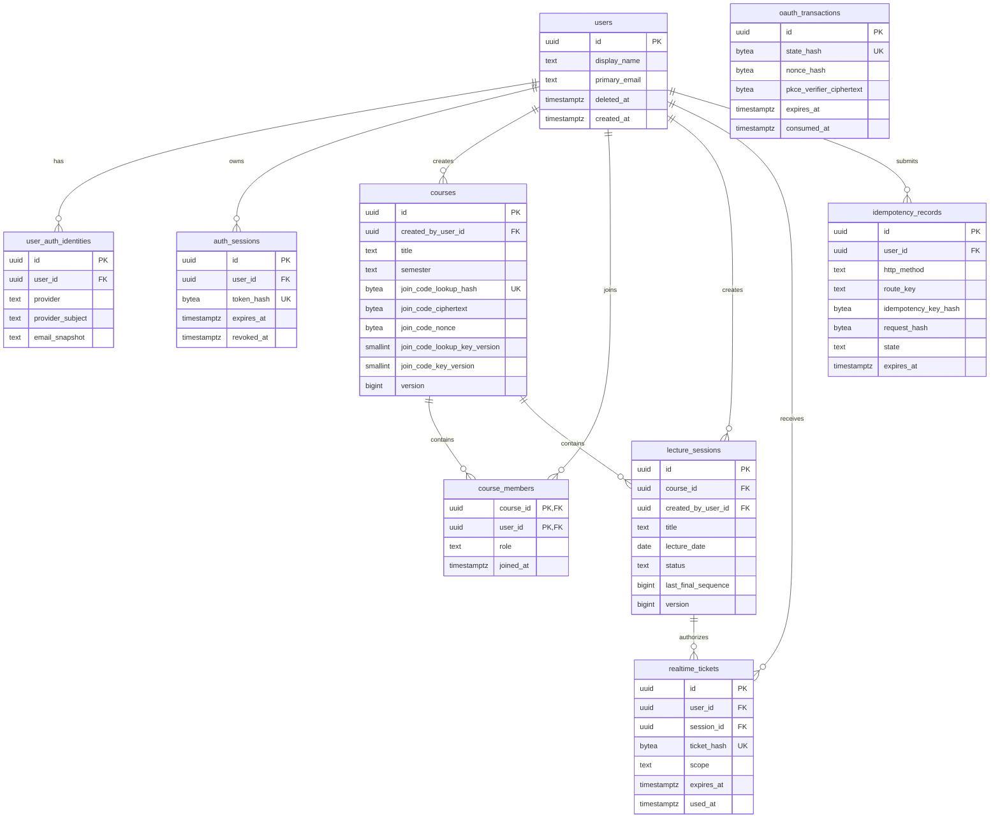
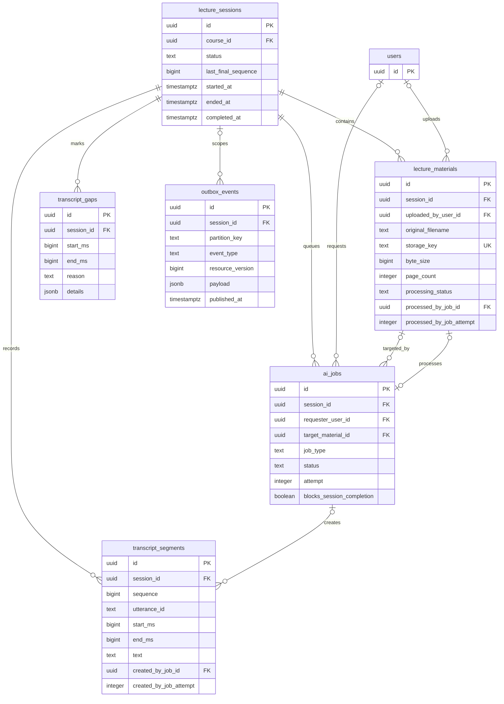
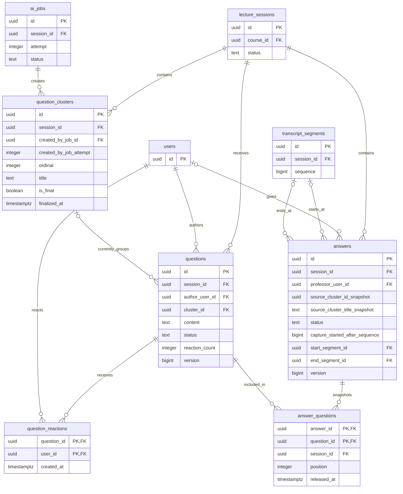
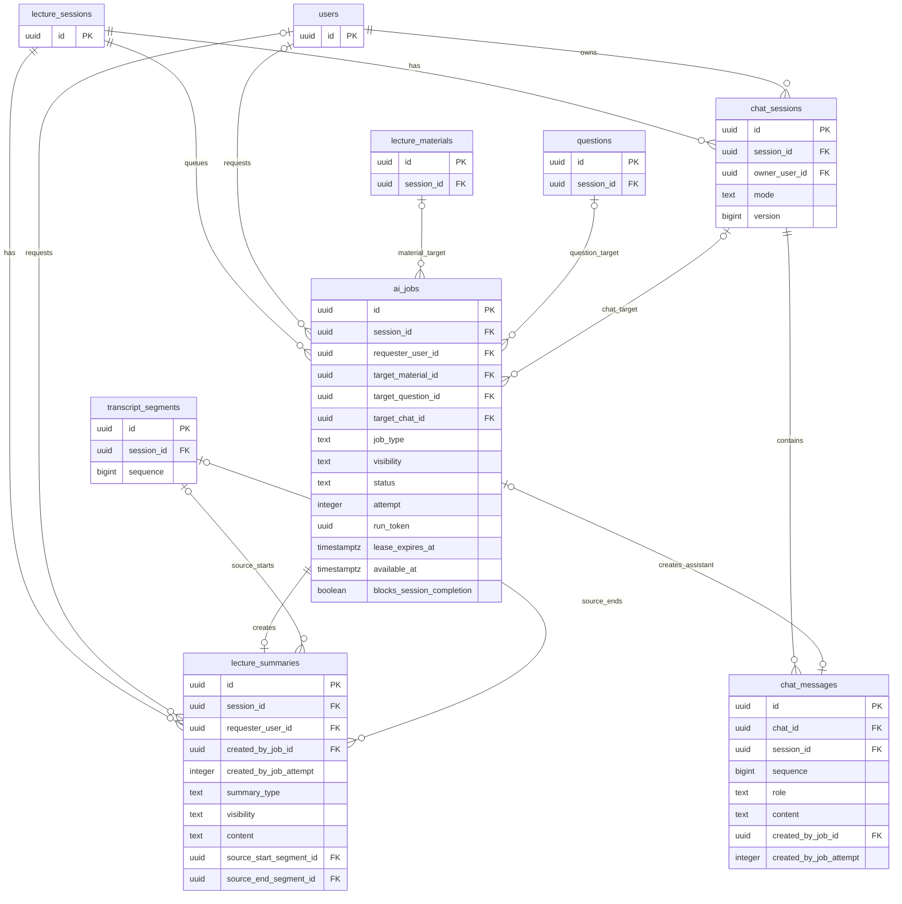
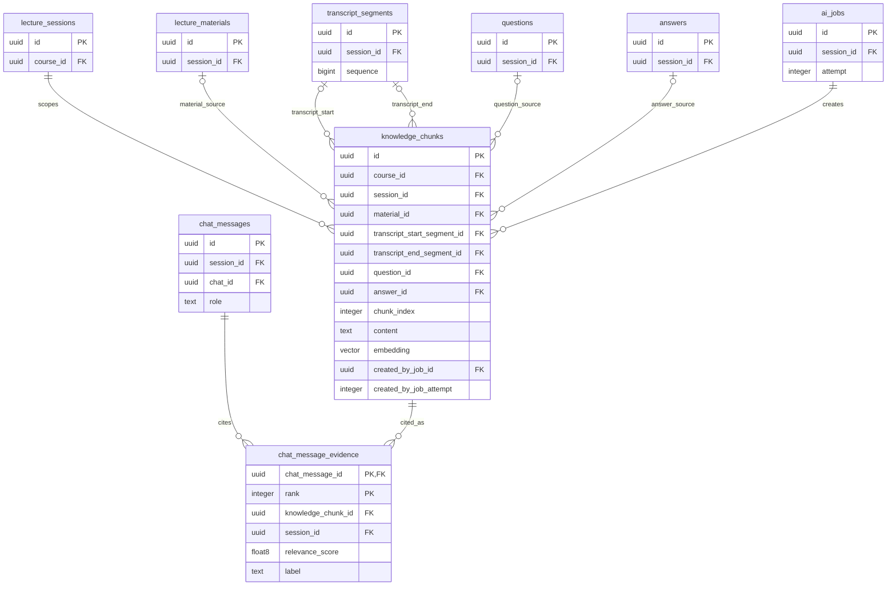

# GOAL 데이터베이스 ERD

> 상태: Draft v0.1
>
> 작성 기준일: 2026-07-11
>
> 상세 컬럼·제약·트랜잭션: [DB_스키마.md](./DB_스키마.md)

## 1. 범위와 표기

전체 물리 모델은 24개 테이블로 구성된다. 한 그림에 모두 넣으면 핵심 관계가 흐려지므로 인증·Course, 수업 기록, 질문·답변, AI 요약·Chat, 공통 Knowledge의 다섯 도메인으로 나눴다. 같은 테이블이 여러 그림에 반복되며 모두 동일한 실제 테이블을 뜻한다.

- `PK`: Primary Key
- `FK`: Foreign Key
- `UK`: Unique Key
- `||`: 정확히 1개
- `o|`: 0개 또는 1개
- `o{`: 0개 이상

ERD는 관계와 핵심 컬럼을 빠르게 검토하기 위한 문서다. 전체 컬럼, `NULL`, 기본값, `CHECK`, partial UNIQUE, 복합 FK와 `ON DELETE` 정책은 [DB 스키마](./DB_스키마.md)를 기준으로 한다.

## 2. 사용자·인증·Course

사용자의 역할은 전역 속성이 아니라 Course membership에 저장한다. 참여 코드는 Course에 AES-256-GCM 암호문과 조회용 HMAC을 함께 보관한다.

`oauth_transactions`는 callback 성공 전에는 User가 확정되지 않으므로 의도적으로 User FK를 갖지 않는다.

## 3. class·자료·Transcript·이벤트

한 class에 PDF를 여러 개 연결할 수 있다. streaming STT의 partial 결과와 음성 원본은 이 모델에 없고, 확정된 final Transcript와 복구 불가능한 gap metadata만 저장한다.

`lecture_sessions(course_id) WHERE status = 'LIVE'`의 partial UNIQUE가 Course당 동시 LIVE class를 하나로 제한한다. `lecture_materials.session_id`에는 UNIQUE를 두지 않는다. Transcript는 `(session_id, sequence)`와 `(session_id, utterance_id)`가 각각 UNIQUE다.

## 4. 질문·클러스터·Answer

Question은 현재 Cluster FK만 가진다. 일반 클러스터 membership 변경 이력 테이블은 없으며, 수업 종료 후 확정된 Cluster 행만 `is_final = true`로 보관한다. 교수자가 답변을 시작하면 당시 질문 membership을 `answer_questions`에 snapshot한다.

실제 질문–Answer lifetime 관계는 취소 snapshot 때문에 1:N일 수 있다. `CANCELLED` 시도는 Answer 개수에서 제외하며, `answer_questions(question_id) WHERE released_at IS NULL` partial UNIQUE가 취소되지 않은 활성·완료 Answer를 질문당 최대 하나로 제한한다. Answer의 두 Segment 경계와 AnswerQuestion 연결은 복합 FK·constraint trigger로 같은 Session인지 확인한다.

## 5. AIJob·요약·Chat

AIJob은 재시도마다 새 행을 만들지 않고 같은 행의 `attempt`를 증가시킨다. AI가 생성한 결과는 Job이 generic result ID를 들고 있지 않으며, 각 결과 테이블의 `created_by_job_id`가 원인 Job을 가리킨다.

`created_by_job_attempt`는 변경되는 Job 행에 FK로 걸지 않고 생성 당시 attempt snapshot으로 보관한다. 결과 삽입과 Job `SUCCEEDED` 전환은 같은 transaction이며, `(job_id, attempt, run_token)`이 현재 실행과 일치할 때만 commit한다.

## 6. 공통 KnowledgeChunk·Chat 근거

PDF, final Transcript, Question, Answer를 `knowledge_chunks`로 통합한다. source별 nullable 컬럼은 모두 실제 FK이고, generic `source_type + source_id` 관계는 없다. Chat 근거는 오직 KnowledgeChunk를 참조한다.

`knowledge_chunks`에는 다음 무결성 규칙을 둔다.

- `material_id`, `transcript_start_segment_id`, `question_id`, `answer_id` 중 정확히 하나만 값이 있다.
- Transcript source는 시작·끝 Segment가 둘 다 있거나 둘 다 없다.
- 모든 typed source, Chunk, Chat Message, Evidence는 복합 FK로 같은 Session임을 검증한다.
- Transcript 시작 sequence는 끝 sequence보다 작거나 같아야 한다.
- vector 검색은 SQL에서 `course_id`와 `session_id` 범위를 먼저 제한한다.

## 7. ERD 밖의 핵심 제약

Mermaid cardinality만으로 표현할 수 없는 규칙은 다음과 같다.

| 규칙                                 | DB 보장 방식                                                                    |
| ------------------------------------ | ------------------------------------------------------------------------------- |
| Course의 교수자 owner 정확히 1명     | 교수자 partial UNIQUE + owner 일치 deferrable constraint trigger                |
| Course당 active class 합계 최대 1개  | `UNIQUE (course_id) WHERE status IN ('READY', 'LIVE', 'PROCESSING')`            |
| 같은 날짜 class 순차 생성·조회       | 날짜 UNIQUE 없음 + `(lecture_date DESC, started_at DESC, id DESC)` index        |
| 제목 수정·날짜와 lifecycle 시각 불변 | 빈 제목은 Course 제목·날짜·시각 포함, 상태 전이 trigger와 제한된 update command |
| class당 PDF 여러 개                  | `lecture_materials.session_id`에 UNIQUE 없음                                    |
| 질문당 취소되지 않은 Answer 최대 1개 | `UNIQUE (question_id) WHERE released_at IS NULL`                                |
| Session당 캡처 중 Answer 최대 1개    | `UNIQUE (session_id) WHERE status = 'CAPTURING'`                                |
| 클러스터 generation·순서·provenance  | `(session_id, generation, ordinal)` UNIQUE + Job attempt constraint trigger     |
| 클러스터 변경 이력 미보관            | 현재 `questions.cluster_id`를 교체하고 대체된 Cluster 삭제                      |
| 종료 후 최종 클러스터 보관           | `question_clusters.is_final`, `finalized_at`                                    |
| Answer 대표 질문 snapshot            | 선택 당시 Cluster `title` exact text를 `source_cluster_title_snapshot` 저장     |
| AIJob 같은 행 재시도                 | `attempt + 1`, 새 `run_token`, lease·현재 attempt 검증                          |
| AI 결과 provenance                   | 결과의 `created_by_job_id`, `created_by_job_attempt`                            |
| 멱등 응답 정확히 24시간              | `expires_at = completed_at + interval '24 hours'` CHECK                         |
| Knowledge source 정확히 한 종류      | typed nullable FK 조합 `CHECK`                                                  |
| Chat 근거 source 통합                | `chat_message_evidence.knowledge_chunk_id` FK                                   |
| 서로 다른 Session의 행 연결 금지     | `(resource_id, session_id)` 복합 FK                                             |

## 8. 삭제 관계 요약

- Course 삭제는 불변 owner만 요청할 수 있고 CourseMember와 LectureSession aggregate를 삭제한다. active class가 있을 때의 허용 여부와 삭제 후 복구 유예는 아직 미정이다.
- LectureSession 삭제는 owner가 `READY`, `COMPLETED`에서만 실행한다. Material, Transcript, Gap, Question, Cluster, Answer, Summary, Chat, KnowledgeChunk, AIJob을 같은 transaction에서 삭제하며 `LIVE`, `PROCESSING`에서는 거부한다.
- User 탈퇴는 공유 학습 기록을 지우지 않고 User 행을 익명화한다. 인증 정보와 개인 Chat·LIVE Summary는 제거한다.
- Cluster 삭제 시 Question의 현재 Cluster FK만 `NULL` 처리한다. Answer의 선택 Cluster ID·AI 대표 질문 exact text와 AnswerQuestion membership snapshot은 FK 없이 유지한다.
- 결과→AIJob과 Evidence→KnowledgeChunk는 deferred `NO ACTION`으로 독립 삭제를 막되 aggregate 전체 삭제는 허용한다.
- 삭제는 `Course → Session → AIJob` 잠금 순서를 사용하고, Session 단독 삭제는 `Session → AIJob` 순서를 사용한다. 삭제된 Job의 늦은 결과는 attempt·run token·상태 fence에서 폐기한다.
- PDF object 삭제는 DB 행 삭제 전에 key를 수집하고 transactional outbox의 멱등 스토리지 정리 task로 처리한다.
- Course owner 탈퇴 시 aggregate와 owner membership을 어떻게 처리할지는 미정이며, 현재는 공유 참조를 보존하는 User tombstone 원칙만 있다.
