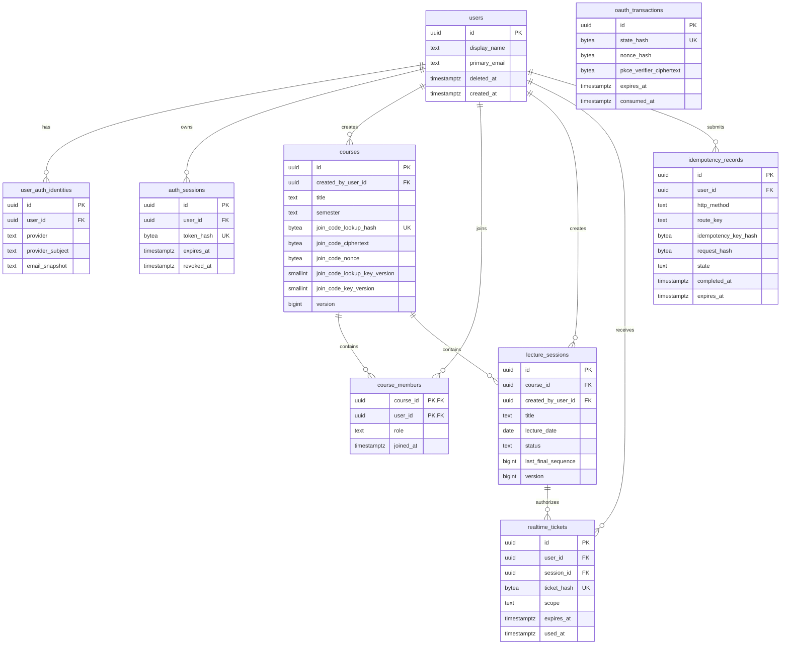
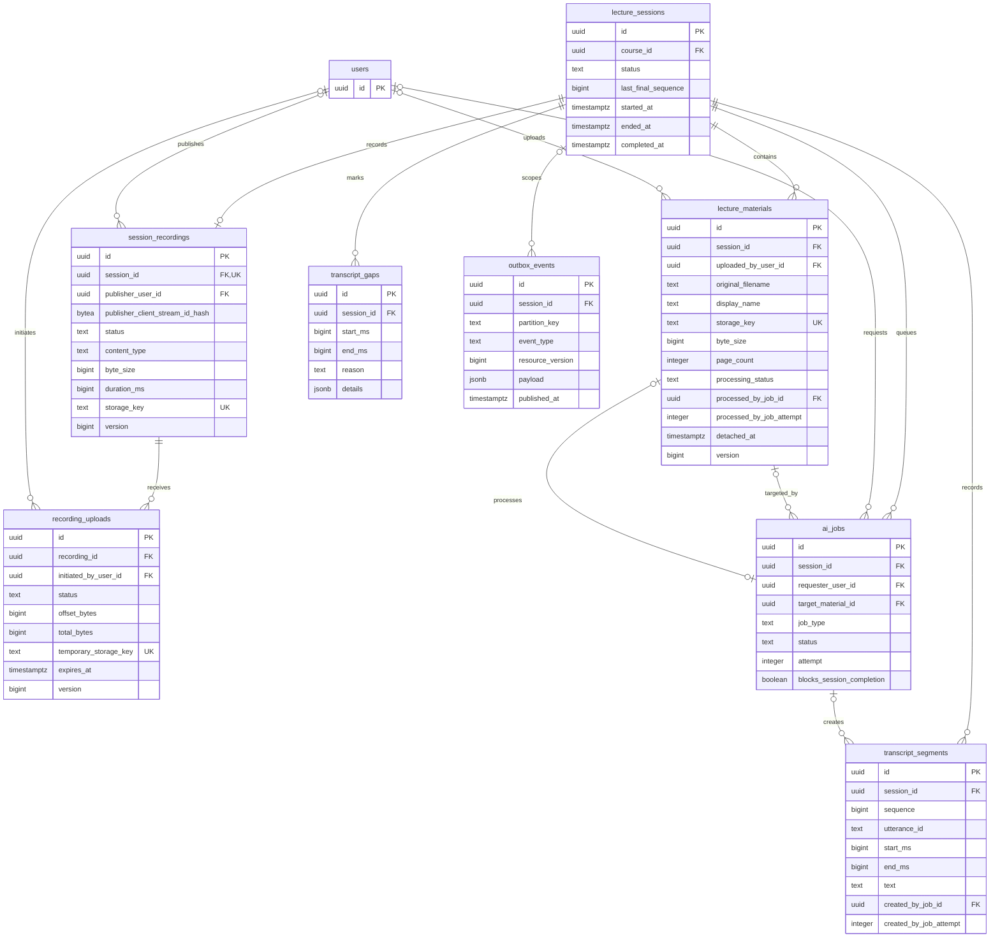
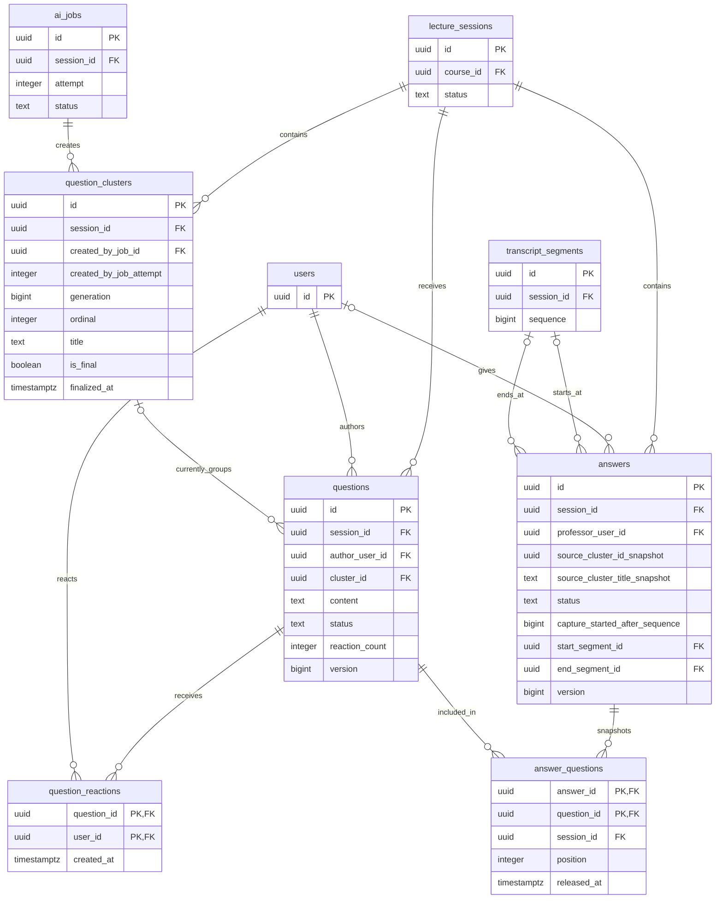
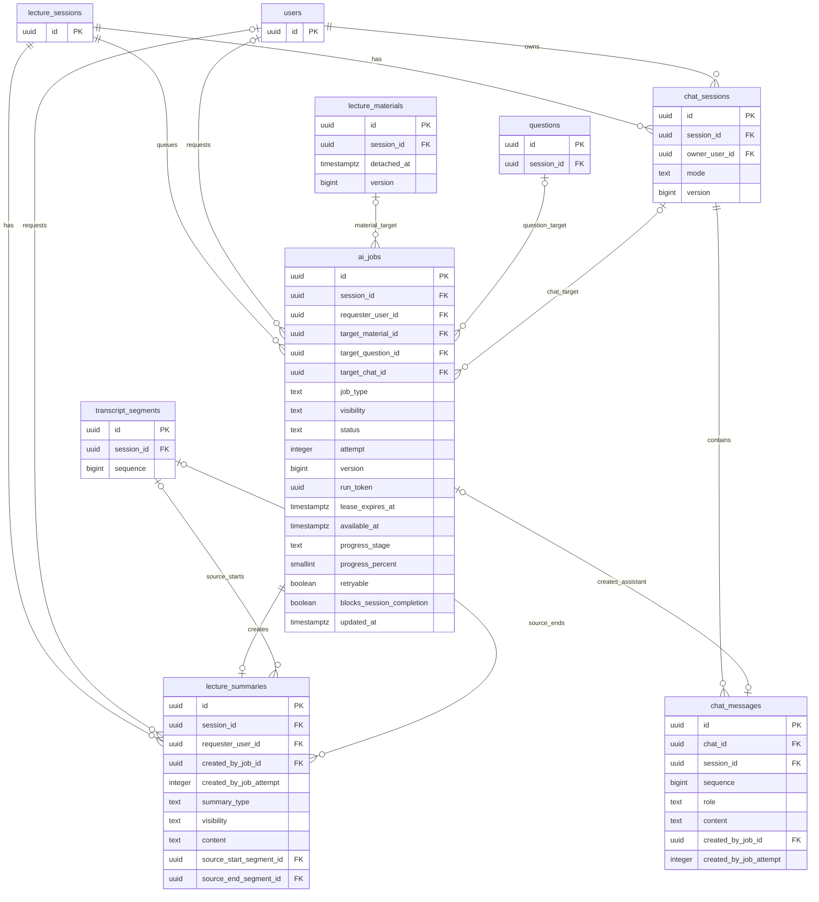
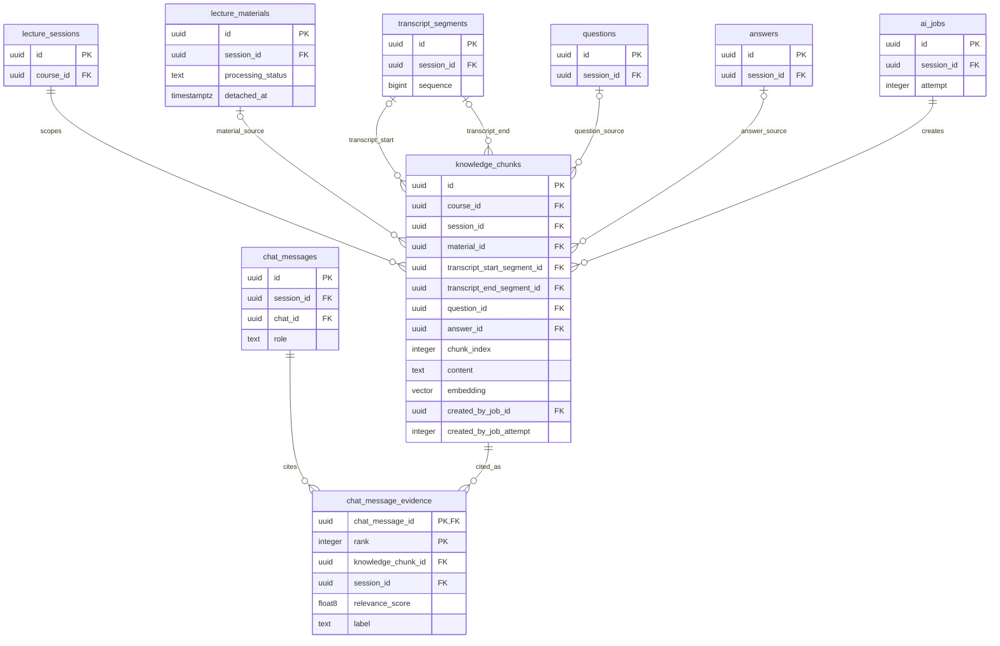

# GOAL 데이터베이스 ERD

> 상태: Draft v0.1
>
> 작성 기준일: 2026-07-11
>
> 상세 컬럼·제약·트랜잭션: [DB\_스키마.md](./DB_스키마.md)

## 1. 범위와 표기

전체 물리 모델은 26개 테이블로 구성된다. 한 그림에 모두 넣으면 핵심 관계가 흐려지므로 인증·Course, 수업 기록, 질문·답변, AI 요약·Chat, 공통 Knowledge의 다섯 도메인으로 나눴다. 같은 테이블이 여러 그림에 반복되며 모두 동일한 실제 테이블을 뜻한다.

- `PK`: Primary Key
- `FK`: Foreign Key
- `UK`: Unique Key
- `||`: 정확히 1개
- `o|`: 0개 또는 1개
- `o{`: 0개 이상

ERD는 관계와 핵심 컬럼을 빠르게 검토하기 위한 문서다. 전체 컬럼, `NULL`, 기본값, `CHECK`, partial UNIQUE, 복합 FK와 `ON DELETE` 정책은 [DB 스키마](./DB_스키마.md)를 기준으로 한다.

## 2. 사용자·인증·Course

사용자의 역할은 전역 속성이 아니라 Course membership에 저장한다. Course 생성자는 불변 owner이자 정확히 한 명인 `PROFESSOR`이며 추가 교수자와 owner 이전은 없다. 참여 코드는 Course에 AES-256-GCM 암호문과 조회용 HMAC을 함께 보관한다. 정규화 값은 `[A-Z]{6}`이고 자동 만료하지 않으며 owner 회전 시 이전 값을 즉시 교체하고 이력을 남기지 않는다.

`oauth_transactions`는 callback 성공 전에는 User가 확정되지 않으므로 의도적으로 User FK를 갖지 않는다. `course_members(course_id) WHERE role = 'PROFESSOR'` partial UNIQUE와 deferrable constraint trigger가 Course마다 owner와 일치하는 교수자 membership이 정확히 하나인지 transaction 종료 시 검증한다. `idempotency_records`의 terminal 행은 `expires_at = completed_at + interval '24 hours'`다.

## 3. class·자료·녹음·Transcript·이벤트

한 class에 연결 상태인 PDF를 최대 10개까지 둘 수 있다. `detached_at IS NULL`인 Material만 현재 연결된 행이며 PDF가 0개여도 class를 시작할 수 있다. streaming STT의 partial 결과는 저장하지 않지만 첫 `audio.start`의 논리 Recording, publisher claim, 종료 후 resumable Upload은 영구 원장에 남긴다. live gap을 HQ STT가 보정하는 canonical 계약은 PR4 범위다.

`lecture_sessions(course_id) WHERE status IN ('READY', 'LIVE', 'PROCESSING')`의 partial UNIQUE가 Course당 active class를 합계 하나로 제한한다. 이 행이 API의 `current_session`이며 없으면 `null`이다. 같은 날짜의 완료 class는 `lecture_date DESC, started_at DESC, id DESC`로 구분한다. `lecture_materials.session_id`에는 UNIQUE를 두지 않되 Session 잠금과 trigger가 연결된 행을 최대 10개로 제한한다. `session_recordings.session_id` UNIQUE는 Session당 논리 Recording을 최대 하나로, `recording_uploads(recording_id) WHERE status = 'ACTIVE'` partial UNIQUE는 active Upload을 최대 하나로 제한한다. 첫 Recording insert는 publisher `client_stream_id` HMAC claim과 원자적으로 commit하고 같은 claim만 reconnect·resume한다. Material·Recording final·Upload temp storage key는 API·공유 event·로그에 노출하지 않는다. Recording의 논리 storage locator가 단일 파일인지 fragment·manifest 집합인지는 미정이다. Transcript는 `(session_id, sequence)`와 `(session_id, utterance_id)`가 각각 UNIQUE다.

## 4. 질문·클러스터·Answer

Question은 현재 Cluster FK만 가진다. 일반 클러스터 membership 변경 이력 테이블은 없으며, 수업 종료 후 확정된 Cluster 행만 `is_final = true`로 보관한다. Cluster `title`은 AI 대표 질문의 정확한 text다. 교수자가 답변을 시작하면 당시 Cluster ID·title과 질문 membership을 snapshot한다.

같은 Job attempt의 Cluster는 하나의 `generation`을 공유하고 서로 다른 `ordinal`을 사용한다. generation은 Session 안에서 새 결과 세트마다 증가하고 재사용하지 않지만, 정확한 원자 할당과 최신 generation watermark·late-result fence는 후속 클러스터링 계약에서 확정한다. `generation`, `ordinal`, `is_final`, `finalized_at`, `created_by_job_id`, `created_by_job_attempt`는 Cluster 공개 lifecycle/provenance다.

실제 질문–Answer lifetime 관계는 취소 snapshot 때문에 1:N일 수 있다. `CANCELLED` 시도는 Answer 개수에서 제외하며, `answer_questions(question_id) WHERE released_at IS NULL` partial UNIQUE가 취소되지 않은 활성·완료 Answer를 질문당 최대 하나로 제한한다. `source_cluster_title_snapshot`은 선택 당시 Cluster `title`, 즉 AI 대표 질문 exact text이며 현재 Cluster를 다시 join하지 않는다. Answer의 두 Segment 경계와 AnswerQuestion 연결은 복합 FK·constraint trigger로 같은 Session인지 확인한다.

## 5. AIJob·요약·Chat

AIJob은 재시도마다 새 행을 만들지 않고 같은 행의 `attempt`를 증가시킨다. AI가 생성한 결과는 Job이 generic result ID를 들고 있지 않으며, 각 결과 테이블의 `created_by_job_id`가 원인 Job을 가리킨다.

`created_by_job_attempt`는 변경되는 Job 행에 FK로 걸지 않고 생성 당시 attempt snapshot으로 보관한다. 재시도는 같은 Job 행을 `attempt + 1`, `version + 1`, `PENDING`으로 바꾸고 현재 progress·error·실행 시각·run token을 초기화한다. 결과 삽입과 Job `SUCCEEDED` 전환은 같은 transaction이며, `(job_id, attempt, run_token, RUNNING)`이 현재 실행과 일치할 때만 commit해 이전 attempt의 늦은 결과를 차단한다. Material 처리 결과는 여기에 Material 현재 `version`과 `detached_at IS NULL` 조건을 더해 연결 해제 뒤의 늦은 결과도 폐기한다. API는 `visibility`, `attempt`, `version`, progress, `retryable`, `blocks_session_completion`, `updated_at`을 안전한 lifecycle로 공개한다.

## 6. 공통 KnowledgeChunk·Chat 근거

PDF, final Transcript, Question, Answer를 `knowledge_chunks`로 통합한다. source별 nullable 컬럼은 모두 실제 FK이고, generic `source_type + source_id` 관계는 없다. Chat 근거는 오직 KnowledgeChunk를 참조한다.

`knowledge_chunks`에는 다음 무결성 규칙을 둔다.

- `material_id`, `transcript_start_segment_id`, `question_id`, `answer_id` 중 정확히 하나만 값이 있다.
- Transcript source는 시작·끝 Segment가 둘 다 있거나 둘 다 없다.
- 모든 typed source, Chunk, Chat Message, Evidence는 복합 FK로 같은 Session임을 검증한다.
- Transcript 시작 sequence는 끝 sequence보다 작거나 같아야 한다.
- vector 검색은 SQL에서 `course_id`와 `session_id` 범위를 먼저 제한한다. Material source는 `processing_status = 'READY' AND detached_at IS NULL`도 같은 SQL에서 강제한다.

## 7. ERD 밖의 핵심 제약

Mermaid cardinality만으로 표현할 수 없는 규칙은 다음과 같다.

| 규칙                                 | DB 보장 방식                                                                              |
| ------------------------------------ | ----------------------------------------------------------------------------------------- |
| Course의 교수자 owner 정확히 1명     | 교수자 partial UNIQUE + owner 일치 deferrable constraint trigger                          |
| Course당 active class 합계 최대 1개  | `UNIQUE (course_id) WHERE status IN ('READY', 'LIVE', 'PROCESSING')`                      |
| 같은 날짜 class 순차 생성·조회       | 날짜 UNIQUE 없음 + `(lecture_date DESC, started_at DESC, id DESC)` index                  |
| 제목 수정·날짜와 lifecycle 시각 불변 | 빈 제목은 Course 제목·날짜·시각 포함, 상태 전이 trigger와 제한된 update command           |
| Session당 연결 Material 최대 10개    | Session 행 잠금 + `detached_at IS NULL` count trigger                                     |
| 연결 Material 표시 이름 유일·안정    | `(session_id, display_name) WHERE detached_at IS NULL` partial UNIQUE + suffix allocation |
| PDF 파일 크기 최대 decimal 100 MB    | `CHECK (byte_size BETWEEN 1 AND 100000000)`                                               |
| class 시작 Material 조건             | Session→Material 잠금 + 연결된 `PROCESSING` 존재 조건부 거부                              |
| Material 업로드·연결 해제 상태       | Session 잠금 + `READY`·`LIVE`·`COMPLETED` 허용, `PROCESSING` 거부                         |
| Session당 논리 Recording 최대 1개    | `session_recordings.session_id` UNIQUE                                                    |
| Recording당 active Upload 최대 1개   | `UNIQUE (recording_id) WHERE status = 'ACTIVE'`                                           |
| 첫 audio publisher claim             | Session 잠금 + `client_stream_id` HMAC; 같은 claim만 reconnect·resume                     |
| resumable offset·finalize            | `offset_bytes <= total_bytes` + expected-offset 조건부 update·terminal state fence        |
| HQ STT 시작 gate                     | Recording `UPLOADED` commit 후 내부 outbox; Job·Transcript 계약은 PR4                     |
| Recording·Upload 내부 key 비공개     | API·공유 event·로그에서 final·temp·fragment·manifest key 제외                             |
| 질문당 취소되지 않은 Answer 최대 1개 | `UNIQUE (question_id) WHERE released_at IS NULL`                                          |
| Session당 캡처 중 Answer 최대 1개    | `UNIQUE (session_id) WHERE status = 'CAPTURING'`                                          |
| 클러스터 generation·순서·provenance  | `(session_id, generation, ordinal)` UNIQUE + Job attempt constraint trigger               |
| 클러스터 변경 이력 미보관            | 현재 `questions.cluster_id`를 교체하고 대체된 Cluster 삭제                                |
| 종료 후 최종 클러스터 보관           | `question_clusters.is_final`, `finalized_at`                                              |
| Answer 대표 질문 snapshot            | 선택 당시 Cluster `title` exact text를 `source_cluster_title_snapshot` 저장               |
| AIJob 같은 행 재시도                 | `attempt + 1`, 새 `run_token`, lease·현재 attempt 검증                                    |
| AI 결과 provenance                   | 결과의 `created_by_job_id`, `created_by_job_attempt`                                      |
| 멱등 응답 정확히 24시간              | `expires_at = completed_at + interval '24 hours'` CHECK                                   |
| Knowledge source 정확히 한 종류      | typed nullable FK 조합 `CHECK`                                                            |
| Chat 근거 source 통합                | `chat_message_evidence.knowledge_chunk_id` FK                                             |
| 서로 다른 Session의 행 연결 금지     | `(resource_id, session_id)` 복합 FK                                                       |

## 8. 삭제 관계 요약

- Course 삭제는 불변 owner만 요청할 수 있고 CourseMember와 LectureSession aggregate를 삭제한다. active class가 있을 때의 허용 여부와 삭제 후 복구 유예는 아직 미정이다.
- LectureSession 삭제는 owner가 `READY`, `COMPLETED`에서만 실행한다. Material, Recording, Upload, Transcript, Gap, Question, Cluster, Answer, Summary, Chat, KnowledgeChunk, AIJob을 같은 transaction에서 삭제하며 `LIVE`, `PROCESSING`에서는 거부한다.
- Material 연결 해제는 교수자가 Session `READY`, `LIVE`, `COMPLETED`에서 `detached_at`을 기록하는 tombstone 처리다. `PROCESSING`에서는 거부하고, 결과가 없는 `PENDING`·`RUNNING`·`FAILED` Material Job을 함께 제거한 뒤 commit 즉시 목록·상세·content·RAG에서 제외한다. 결과 provenance로 참조되는 `SUCCEEDED` Job은 보존한다.
- User 탈퇴는 공유 학습 기록을 지우지 않고 User 행을 익명화한다. 인증 정보와 개인 Chat·LIVE Summary는 제거한다.
- Cluster 삭제 시 Question의 현재 Cluster FK만 `NULL` 처리한다. Answer의 선택 Cluster ID·AI 대표 질문 exact text와 AnswerQuestion membership snapshot은 FK 없이 유지한다.
- 결과→AIJob과 Evidence→KnowledgeChunk는 deferred `NO ACTION`으로 독립 삭제를 막되 aggregate 전체 삭제는 허용한다.
- 삭제는 `Course → Session → Material → Recording → Upload → AIJob` 잠금 순서를 사용하고, Session 단독 삭제도 `Session → Material → Recording → Upload → AIJob`을 사용한다. Material lifecycle은 기존 `Session → Material → AIJob`, Recording lifecycle은 `Session → Recording → Upload → AIJob` 순서를 사용한다. 삭제·연결 해제된 Material의 늦은 결과는 attempt·run token·상태와 Material version·tombstone fence에서 폐기한다.
- PDF·Recording final object와 Upload temp object는 DB 행 삭제 전 key를 수집해 같은 transaction의 내부 outbox task로 background 정리한다. object 삭제는 멱등 재시도하고 정리 실패가 삭제된 aggregate를 다시 노출하지 않는다.
- 연결 해제 Material의 원문 content link는 제공하지 않는다. Evidence가 참조하는 Material source Chunk의 보관, snapshot 또는 FK 변경, 과거 Evidence label·source 표시 방식과 Material·Chunk hard delete 시점은 미정이다. 결정 전에는 deferred `NO ACTION` FK와 Material tombstone을 유지하고 참조 행을 임의로 삭제하지 않는다.
- Recording이 없어도 Session 종료는 허용한다. 그 경우 HQ source·fallback과
  `SESSION_POSTPROCESSING` 완료 predicate, Recording `FAILED`·Upload 만료·timeout 전이는
  PR4 범위다. 녹음 동의·접근·보관·삭제와 quota·backup·RPO·RTO도 미정이며,
  물리 file·fragment·manifest cardinality를 추가 테이블로 굳히지 않는다.
- Course owner 탈퇴 시 aggregate와 owner membership을 어떻게 처리할지는 미정이며, 현재는 공유 참조를 보존하는 User tombstone 원칙만 있다.
